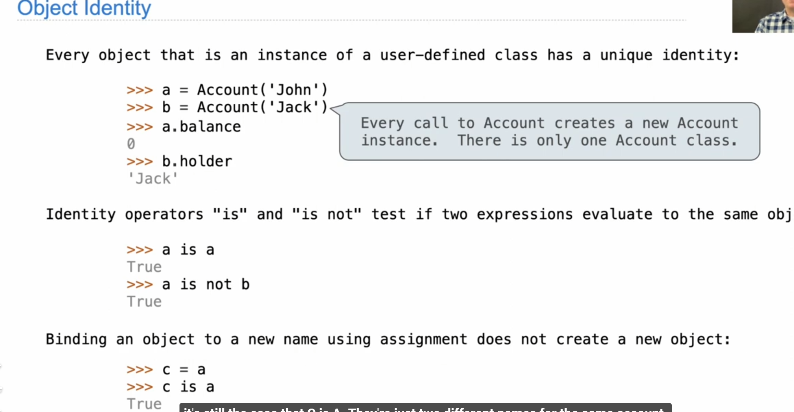
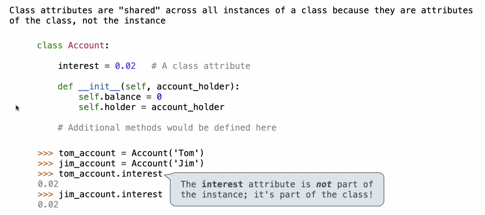
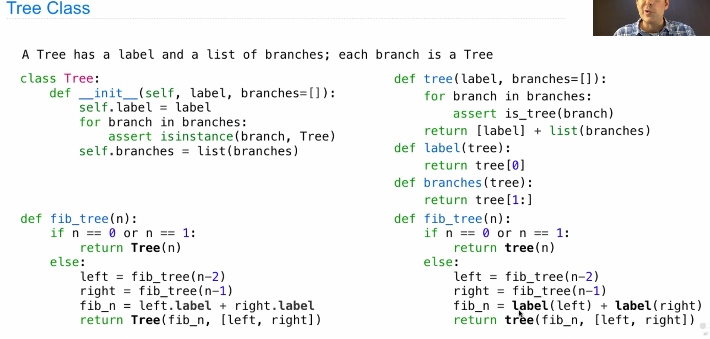

### 1. Functions

#### 定义函数

```python
def <name>(<formal parameters>):
    return <return expression>
```

#### choose function name

1. Function names are lowercase, with words separated by underscores. Descriptive names are encouraged.
2. Function names typically evoke operations applied to arguments by the interpreter (e.g., `print`, `add`, `square`) or the name of the quantity that results (e.g., `max`, `abs`, `sum`).
3. Parameter names are lowercase, with words separated by underscores. Single-word names are preferred.
4. Parameter names should evoke the role of the parameter in the function, not just the kind of argument that is allowed.
5. Single letter parameter names are acceptable when their role is obvious, but avoid "l" (lowercase ell), "O" (capital oh), or "I" (capital i) to avoid confusion with numerals.

####  // 等价于 floordiv

```python
>>> 5 // 4
1
>>> -5 // 4
-2
>>> floordiv(5, 4)
1
```


#### Keyboard Shortcuts

- `Ctrl-`` : open an integrated terminal in VS Code
- `Ctrl-s` : saves the current file
- `Ctrl-x` : cuts the entire line your cursor is on
- `Ctrl-v` : pastes the entire line you cut in the line above your cursor OR pastes the selected text in place
- `Ctrl-z` : undo
- `Ctrl-shift-z` : redo
- `tab` : indent a line or a group of lines
- `shift-tab` : dedent a line or a group of lines
- `Ctrl-d` : highlights the current word. For every `Ctrl-d` you type after this first word, it will highlight every next instance of the word. This allows you to easily rename variables with multiple cursors! (Play around with this one, it's fun and very practical!)
- `Ctrl-tab` : moves you to the next tab (`Ctrl` on Mac as well)
- `Ctrl-shift-tab` : moves you to the previous tab (`Ctrl` on Mac as well)
- `Ctrl-f` : search for a word
- `Ctrl-shift-f` : searches through all tabs
- `Ctrl+shift+x` : browse extensions

#### shell

* `code .` open vs code in the current directory

* Using no command-line options will run the code in the file you provide and return you to the command line. If your file just contains function definitions, you'll see no output unless there is a syntax error.

  ```
  python3 lab00.py
  ```

* **`-i`**: The `-i` option runs the code in the file you provide, then opens an interactive session (with a `>>>` prompt). You can then evaluate expressions, for example calling functions you defined. To exit, type `exit()`. You can also use the keyboard shortcut `Ctrl-D` on Linux/Mac machines or `Ctrl-Z Enter` on Windows.

  If you edit the Python file while running it interactively, you will need to exit and restart the interpreter in order for those changes to take effect.

  Here's how we can run `lab00.py` interactively:

  ```shell
  python3 -i lab00.py
  ```

  If you are using the `ok` autograder, the `-i` option starts an interactive session in the environment of a failing test case:

  ```
  python3 ok -q ### Q1: name -i
  ```

  You can then evaluate expressions related to the test to see what is going wrong.

* **`-m doctest`**: Runs the doctests in a file, which are the examples in the docstrings of functions.

  Each test in the file consists of `>>>` followed by some Python code and the expected output.

  Here's how we can run the doctests in `lab00.py`:

  ```
   python3 -m doctest lab00.py
  ```

  When our code passes all of the doctests, no output is displayed. Otherwise, information about the tests that failed will be displayed.

  The command line tool has a `-v` option that stands for *verbose*.

  ```
  python3 -m doctest file.py -v
  ```

  In addition to telling you which doctests you failed, it will also tell you which doctests passed.

  Usually, we will provide doctests for you in the starter files. You can add more tests by following the same format. It is often helpful to write additional tests to uncover more details about the shape of the inputs and the expected outputs of the problem, in addition to helping with the implementation of the program itself. A little time spent upfront writing tests can save a lot of time down the line.

* .py 运行命令

  ```python
  python -i welcome.py
  ```

  This command does the following:

  1. `python` is the command that starts Python
  2. The `-i` flag tells Python to start in **interactive mode**, which allows you to type in Python commands from your terminal
  3. `welcome.py` is the name of the Python file we want to run
  
* `ls` : **l**i**s**t

* `cd` : **c**hange **d**irectory 

* `cd ~` : cd home directory

* `mkdir` : **m**a**k**es a new **dir**ectory

* `cd ..` : `..` means "the parent directory"

  

#### CLI vs GUI

**CLI**：**c**ommand **l**ine **i**nterface

**GUI**：**g**raphical **u**ser **i**nterface


#### Non-Pure print 

```python
>>> print(print(1), print(2))
1
2
None None
```


#### DRY principle

*Don't repeat yourself* is a central tenet of software engineering. 


#### help

```python
>>> def pressure(v, t, n):
        """Compute the pressure in pascals of an ideal gas.

        Applies the ideal gas law: http://en.wikipedia.org/wiki/Ideal_gas_law

        v -- volume of gas, in cubic meters
        t -- absolute temperature in degrees kelvin
        n -- particles of gas
        """
        k = 1.38e-23  # Boltzmann's constant
        return n * k * t / v
```

When you call `help` with the name of a function as an argument, you see its docstring (type `q` to quit Python help).

```python
>>> help(pressure)
```


#### Comments

Comments in Python can be attached to the end of a line following the `#` symbol. For example, the comment `Boltzmann's constant` above describes `k`. These comments don't ever appear in Python's `help`, and they are ignored by the interpreter. They exist for humans alone.


#### Default Argument Values

```python
>>> def pressure(v, t, n=6.022e23):
        """Compute the pressure in pascals of an ideal gas.

        v -- volume of gas, in cubic meters
        t -- absolute temperature in degrees kelvin
        n -- particles of gas (default: one mole)
        """
        k = 1.38e-23  # Boltzmann's constant
        return n * k * t / v
```

The `=` symbol means two different things in this example, depending on the context in which it is used. In the `def` statement header, `=` does not perform assignment, but instead indicates a default value to use when the `pressure` function is called. By contrast, the assignment statement to `k` in the body of the function binds the name `k` to an approximation of Boltzmann's constant.

```python
>>> pressure(1, 273.15)
2269.974834
>>> pressure(1, 273.15, 3 * 6.022e23)
6809.924502
```

The `pressure` function is defined to take three arguments, but only two are provided in the first call expression above. In this case, the value for `n` is taken from the `def` statement default. If a third argument is provided, the default is ignored.

As a guideline, most data values used in a function's body should be expressed as default values to named arguments, so that they are easy to inspect and can be changed by the function caller. Some values that never change, such as the fundamental constant `k`, can be bound in the function body or in the global frame.


### 2. Control

#### Compound Statements

```python
<header>:
    <statement>
    <statement>
    ...
<separating header>:
    <statement>
    <statement>
    ...
...
```


#### **Conditional statements**

```python
if <expression>:
    <suite>
elif <expression>:
    <suite>
else:
    <suite>
```


#### Iteration

A `while` clause contains a header expression followed by a suite:

```python
while <expression>:
    <suite>
```

To execute a `while` clause:

1. Evaluate the header's expression.
2. If it is a true value, execute the suite, then return to step 1.

In step 2, the entire suite of the `while` clause is executed before the header expression is evaluated again.

In order to prevent the suite of a `while` clause from being executed indefinitely, the suite should always change some binding in each pass.

A `while` statement that does not terminate is called an infinite loop. Press `<Control>-C` to force Python to stop looping.


#### **Assertions**

Programmers use `assert` statements to verify expectations, such as the output of a function being tested. An `assert` statement has an expression in a boolean context, followed by a quoted line of text (single or double quotes are both fine, but be consistent) that will be displayed if the expression evaluates to a false value.

```
>>> assert fib(8) == 13, 'The 8th Fibonacci number should be 13'
```

When the expression being asserted evaluates to a true value, executing an assert statement has no effect. When it is a false value, `assert` causes an error that halts execution.

A test function for `fib` should test several arguments, including extreme values of `n`.

```python
>>> def fib_test():
        assert fib(2) == 1, 'The 2nd Fibonacci number should be 1'
        assert fib(3) == 1, 'The 3rd Fibonacci number should be 1'
        assert fib(50) == 7778742049, 'Error at the 50th Fibonacci number'
```

When writing Python in files, rather than directly into the interpreter, tests are typically written in the same file or a neighboring file with the suffix `_test.py`.


#### **Doctests**

 Python provides a convenient method for placing simple tests directly in the docstring of a function. The first line of a docstring should contain a one-line description of the function, followed by a blank line. A detailed description of arguments and behavior may follow. In addition, the docstring may include a sample interactive session that calls the function:

```python
>>> def sum_naturals(n):
        """Return the sum of the first n natural numbers.

        >>> sum_naturals(10)
        55
        >>> sum_naturals(100)
        5050
        """
        total, k = 0, 1
        while k <= n:
            total, k = total + k, k + 1
        return total
```


To verify the doctest interactions for only a single function, we use a `doctest` function called `run_docstring_examples`. This function is (unfortunately) a bit complicated to call. Its first argument is the function to test. The second should always be the result of the expression `globals()`, a built-in function that returns the global environment. The third argument is `True` to indicate that we would like "verbose" output: a catalog of all tests run.

```python
>>> from doctest import run_docstring_examples
>>> run_docstring_examples(sum_naturals, globals(), True)
Finding tests in NoName
Trying:
    sum_naturals(10)
Expecting:
    55
ok
Trying:
    sum_naturals(100)
Expecting:
    5050
ok
```

When the return value of a function does not match the expected result, the `run_docstring_examples` function will report this problem as a test failure.

```shell
python -m doctest <python_source_file>
```

The key to effective testing is to write (and run) tests immediately after implementing new functions. It is even good practice to write some tests before you implement, in order to have some example inputs and outputs in your mind. A test that applies a single function is called a *unit test*. Exhaustive unit testing is a hallmark of good program design.


#### print与return

```python
>>> print('big')
big
>>> return 'big'
'big'
```


####  Debug

```shell
Traceback (most recent call last):
    File "temp.py", line 10, in <module>
      f("hi")
    File "temp.py", line 2, in f
      return g(x + x, x)
    File "temp.py", line 5, in g
      return h(x + y * 5)
    File "temp.py", line 8, in h
      return x + 0
  TypeError: must be str, not int
  
  
0) g(x + x, x)
1) h(x + y * 5)
2) f("hi")
```

`1) h(x + y * 5)`is the most recent function call.The traceback is organized with the **most recent call last**.

在编写代码时，如果你希望在测试代码时使用 `print` 语句进行调试，而又不希望这些 `print` 语句被 ok autograder 解释为输出，你可以在每个 `print` 语句的输出前添加 'DEBUG:'。

```python
print('DEBUG: This is a debug message')
```


```shel
Q: What is the best way to open an interactive terminal to investigate a failing test for question sum_digits in assignment lab01?
Choose the number of the correct choice:
0) python3 ok -q sum_digits --trace
1) python3 -i lab01.py
2) python3 ok -q sum_digits -i
3) python3 ok -q sum_digits
? 2
-- OK! --
```


```shel	
Q: What is the best way to look at an environment diagram to investigate a failing test for question sum_digits in assignment lab01?
Choose the number of the correct choice:
0) python3 ok -q sum_digits
1) python3 ok -q sum_digits --trace
2) python3 ok -q sum_digits -i
3) python3 -i lab01.py
? 1
-- OK! --
```


```shell
Q: Which of the following is NOT true?
Choose the number of the correct choice:
0) It is generally bad practice to release code with debugging print statements left in
1) Debugging is not a substitute for testing
2) It is generally good practice to release code with assertion statements left in
3) Code that returns a wrong answer instead of crashing is generally better as it at least works fine
4) Testing is very important to ensure robust code

? 3
-- OK! --
```


#### Error Types

1. `SyntaxError` 语法错误 	

   1. **Cause**: code syntax mistake
   2. **Example**:

   ```shell
     File "file name", line number
       def incorrect(f)
                       ^
   SyntaxError: invalid syntax
   ```

   3. **Solution**: the `^` symbol points to the code that contains invalid syntax. The error message doesn't tell you *what* is wrong, but it does tell you *where*.
   4. **Notes**: Python will check for `SyntaxErrors` before executing any code. This is different from other errors, which are only raised during runtime.

2. `IndentationError` 缩进错误

   1. **Cause**: improper indentation
   2. **Example**:

   ```
     File "file name", line number
       print('improper indentation')
   IndentationError: unindent does not match any outer indentation level
   ```

   3. **Solution**: The line that is improperly indented is displayed. Simply re-indent it.
   4. **Notes**: If you are inconsistent with tabs and spaces, Python will raise one of these. Make sure you use spaces! (It's just less of a headache in general in Python to use spaces and all cs61a content uses spaces).

3. `TypeError` 类型错误

   1. **Cause 1**:

      1. Invalid operand types for primitive operators. You are probably trying to add/subract/multiply/divide incompatible types.
      2. **Example**:

      ```
      TypeError: unsupported operand type(s) for +: 'function' and 'int'
      ```

   2. **Cause 2**:

      1. Using non-function objects in function calls.
      2. **Example**:

      ```
      >>> square = 3
      >>> square(3)
      Traceback (most recent call last):
        ...
      TypeError: 'int' object is not callable
      ```

   3. **Cause 3**:

      1. Passing an incorrect number of arguments to a function.
      2. **Example**:

      ```
      >>> add(3)
      Traceback (most recent call last):
        ...
      TypeError: add expected 2 arguments, got 1
      ```

4. `NameError` 名字错误

   1. **Cause**: variable not assigned to anything OR it doesn't exist. This includes function names.
   2. **Example**:

   ```
   File "file name", line number
     y = x + 3
   NameError: global name 'x' is not defined
   ```

   3. **Solution**: Make sure you are initializing the variable (i.e. assigning the variable to a value) before you use it.

   4. **Notes**: The reason the error message says "global name" is because Python will start searching for the variable from a function's local frame. If the variable is not found there, Python will keep searching the parent frames until it reaches the global frame. If it still can't find the variable, Python raises the error.

5. `IndexError` 索引错误

   1. **Cause**: trying to index a sequence (e.g. a tuple, list, string) with a number that exceeds the size of the sequence.

   2. **Example**:

   ```
   File "file name", line number
     x[100]
   IndexError: tuple index out of range
   ```

   3. **Solution**: Make sure the index is within the bounds of the sequence. If you're using a variable as an index (e.g. `seq[x]`, make sure the variable is assigned to a proper index.

**Missing Parentheses**

A common bug is to leave off the closing parenthesis. This will show up as a `SyntaxError`. Consider the following code:

```shell
def fun():
    return foo(bar()   # missing a parenthesis here

fun()
```

Python will raise a `SyntaxError`, but will point to the line *after* the missing parenthesis:

```shell
File "file name", line "number"
    fun()
      ^
SyntaxError: invalid syntax
```

In general, if Python points a `SyntaxError` to a seemingly correct line, you are probably forgetting a parenthesis somewhere.


#### if 和 elif

```python
def ab(c, d):
    if c > 5:
        print(c)
    elif c > 7:
        print(d)
    print('foo')

ab(10, 20)
```


首先，函数 `ab` 被调用，传入参数 `c = 10` 和 `d = 20`。

函数内部执行 `if` 语句，检查 `c > 5` 是否为真。由于 `c = 10`，该条件为真，因此执行 `print(c)`，输出 `10`。

由于 `if` 条件为真，`elif` 分支不会执行，所以 `print(d)` 不会被执行。

最后，执行 `print('foo')`，输出 `foo`。

因此，输出结果为：

```shell
10
foo
```


#### and or not

```python
>>> 2 and 3
3
>>> 2 or 3
2
>>> False or 0
0
>>> 0 or False
False
```

除此之外，and和or还会短接。

对于 `and` 运算符，如果第一个操作数是 `False`（包括所有假值，如 `0`、空字符串、空列表等），它直接返回第一个操作数，否则返回第二个操作数。

对于 `or` 运算符，如果第一个操作数是 `True`，它直接返回第一个操作数，否则返回第二个操作数。

If `and` and `or` do not *short-circuit*, they just return the last value; another way to remember this is that `and` and `or` always return the last thing they evaluate, whether they short circuit or not. Keep in mind that `and` and `or` don't always return booleans when using values other than `True` and `False`.

```python
# 示例 1：and
result = 0 and 5
print(result)  # 输出 0，因为 0 被评估为 False，所以 and 运算直接返回第一个操作数 0

result = 3 and 5
print(result)  # 输出 5，因为 3 被评估为 True，所以 and 运算返回第二个操作数 5

# 示例 2：or
result = 0 or 5
print(result)  # 输出 5，因为 0 被评估为 False，所以 or 运算返回第二个操作数 5

result = 3 or 5
print(result)  # 输出 3，因为 3 被评估为 True，所以 or 运算直接返回第一个操作数 3
```

**注：**其实就是返回运算完（包括短路）的最后一步的值

#### ** 

```python
10 ** 100 """10的100次方"""
```


#### 函数会先在参数位置进行赋值运算

```python
def if_(c, t, f):
    if c:
        return t
    else: 
        return f

from math import sqrt
def real_sqrt(x):
    return if_(x >= 0, sqrt(x), 0)

>>>reak_sqrt(-1)
ValueError: math domain error
```

这是因为执行`if_(x >= 0, sqrt(x), 0)`时，会先将每个参数执行一遍，再赋值给`if_(c, t, f)`里面的`c`,`t`,`f`。


#### assert

```python
assert approx_eq(phi, approx_phi), 'phi differs from its approximation'
```

测试`approx_eq(phi, approx_phi)`  结果为`True`则什么也不做，为`false` 则打印后面的字符串

### 3. Higher-Order Functions

#### What is it？

To express certain general patterns as named concepts, we will need to construct functions that can accept other functions as arguments or return functions as values

#### Functions as Arguments

```python
>>> def summation(n, term):
        total, k = 0, 1
        while k <= n:
            total, k = total + term(k), k + 1
        return total
>>> def identity(x):
        return x
>>> def sum_naturals(n):
        return summation(n, identity)
>>> sum_naturals(10)
55
```


#### 黄金分割率算法(golden ratio)

```python
def improve(update, close, guess=1):
    while not close(guess):
        guess = update(guess)
	    return guess
	
def golden_update(guess):
    return 1/guess + 1	

def square_close_to_successor(guess):
    return approx_eq(guess * guess, guess + 1)

def approx_eq(x, y, tolerance=1e-3):
    return abs(x - y) < tolerance
    phi = improve(golden_update,             square_close_to_successor)

```


#### Nested Definitions--求平方根算法

```python
def average(x, y):
    return (x + y)/2

def improve(update, close, guess=1):
    while not close(guess):
        guess = update(guess)
    return guess

def approx_eq(x, y, tolerance=1e-3):
    return abs(x - y) < tolerance

def sqrt(a):
    def sqrt_update(x):
        return average(x, a/x)
    def sqrt_close(x):
        return approx_eq(x * x, a)
    return improve(sqrt_update, sqrt_close)
```


#### Functions as Returned Values

```python
def square(x):
    return x * x

def successor(x):
    return x + 1

def compose1(f, g):
    def h(x):
        return f(g(x))
    return h

def f(x):
    """Never called."""
    return -x

square_successor = compose1(square, successor)
result = square_successor(12)
```


### 4. Environments


#### 牛顿迭代法--求某个数的n次方根

Generalizing to roots of arbitrary degree $n$, we compute $f(x) = x^n - a$ and its derivative $df(x) = n \cdot x^{n-1}$

```python
>>> def improve(update, close, guess=1):
        while not close(guess):
            guess = update(guess)
        return guess
   
>>> def approx_eq(x, y, tolerance=1e-15):
        return abs(x - y) < tolerance

>>> def newton_update(f, df):
        def update(x):
            return x - f(x) / df(x)
        return update

>>> def find_zero(f, df):
        def near_zero(x):
            return approx_eq(f(x), 0)
        return improve(newton_update(f, df), near_zero)
    
>>> def power(x, n):
        """Return x * x * x * ... * x for x repeated n times."""
        product, k = 1, 0
        while k < n:
            product, k = product * x, k + 1
        return product
    
>>> def nth_root_of_a(n, a):
        def f(x):
            return power(x, n) - a
        def df(x):
            return n * power(x, n-1)
        return find_zero(f, df)
    
>>> nth_root_of_a(2, 64)
8.0
>>> nth_root_of_a(3, 64)
4.0
>>> nth_root_of_a(6, 64)
2.0
```


**牛顿迭代法（牛顿-拉弗森方法）原理：**

1. **牛顿-拉弗森方法的几何直觉**


随便找一个曲线上的A点（为什么随便找，根据切线是切点附近的曲线的近似，应该在根点附近找，但是很显然我们现在还不知道根点在哪里），做一个切线，切线的根（就是和x轴的交点）与曲线的根，还有一定的距离。牛顿、拉弗森们想，没关系，我们从这个切线的根出发，做一根垂线，和曲线相交于B点，继续重复刚才的工作：


之前说过，B点比之前A点更接近曲线的根点，牛顿、拉弗森们很兴奋，继续重复刚才的工作： 


第四次就已经很接近曲线的根了


经过多次迭代后会越来越接近曲线的根（下图进行了50次迭代，哪怕经过无数次迭代也只会更接近曲线的根，用数学术语来说就是，迭代收敛了）：


2. **牛顿-拉弗森方法的代数解法**

已知曲线方程$f(x)$，在$x_n$点做切线，求$x_{n+1}$：


已知直线斜率$k$,经过点$(a,b)$,则直线方程为 $y-b=k(x-a)$。容易得出$(x_n,f(x_n))$点的切线方程为: $y-f(x_n)=f'(x_n)(x-x_n)$，要求$x_{n+1}$，代入 $(x_{n+1},0)$ 即相当于求$f(x_n)+f'(x_n)(x-x_n)=0$ 方程的解，解得 $x_{n+1}=x_n-\frac{f(x_n)}{f'(x_n)}$ 。

**注：若$f$二阶可导，那么在待求的零点 $x$ 周围存在一个区域，只要起始点 $x_0$位于这个邻近区域内，那么牛顿-拉弗森方法必定收敛。**


#### Currying

We can use higher-order functions to convert a function that takes multiple arguments into a chain of functions that each take a single argument. More specifically, given a function `f(x, y)`, we can define a function `g` such that `g(x)(y)` is equivalent to `f(x, y)`. Here, `g` is a higher-order function that takes in a single argument `x` and returns another function that takes in a single argument `y`. This transformation is called *currying*.

```python
>>> def curried_pow(x):
        def h(y):
            return pow(x, y)
        return h
>>> curried_pow(2)(3)
8
```

```python
>>> def curry2(f):
        """Return a curried version of the given two-argument function."""
        def g(x):
            def h(y):
                return f(x, y)
            return h
        return g
>>> def uncurry2(g):
        """Return a two-argument version of the given curried function."""
        def f(x, y):
            return g(x)(y)
        return f
>>> pow_curried = curry2(pow)
>>> pow_curried(2)(5)
32
>>> map_to_range(0, 10, pow_curried(2))
1
2
4
8
16
32
64
128
256
512
```

The `curry2` function takes in a two-argument function `f` and returns a single-argument function `g`. When `g` is applied to an argument `x`, it returns a single-argument function `h`. When `h` is applied to `y`, it calls `f(x, y)`. Thus, `curry2(f)(x)(y)` is equivalent to `f(x, y)`. The `uncurry2` function reverses the currying transformation, so that `uncurry2(curry2(f))` is equivalent to `f`.

```python
>>> uncurry2(pow_curried)(2, 5)
32
```


#### Lambda Expressions

A lambda expression evaluates to a function that has a single return expression as its body. Assignment and control statements are not allowed.

```python
>>> def compose1(f, g):
        return lambda x: f(g(x))
```

We can understand the structure of a `lambda` expression by constructing a corresponding English sentence:

```
     lambda            x            :          f(g(x))
"A function that    takes x    and returns     f(g(x))"
```

The result of a lambda expression is called a lambda function. It has no intrinsic name (and so Python prints `<lambda>` for the name), but otherwise it behaves like any other function.

```python
>>> s = lambda x: x * x
>>> s
<function <lambda> at 0xf3f490>
>>> s(12)
144
```

In an environment diagram, the result of a lambda expression is a function as well, named with the greek letter λ (lambda). Our compose example can be expressed quite compactly with lambda expressions.


#### Abstractions and First-Class(一流) Functions

In general, programming languages impose restrictions on the ways in which computational elements can be manipulated. Elements with the fewest restrictions are said to have first-class status. Some of the "rights and privileges" of first-class elements are:

1. They may be bound to names.
2. They may be passed as arguments to functions.
3. They may be returned as the results of functions.
4. They may be included in data structures.

Python awards functions full first-class status, and the resulting gain in expressive power is enormous.


#### Function Decorators

Python provides special syntax to apply higher-order functions as part of executing a `def` statement, called a decorator. Perhaps the most common example is a trace.

```python
>>> def trace(fn):
        def wrapped(x):
            print('-> ', fn, '(', x, ')')
            return fn(x)
        return wrapped
>>> @trace
    def triple(x):
        return 3 * x
>>> triple(12)
->  <function triple at 0x102a39848> ( 12 )
36
```

In code, this decorator is equivalent to:

```python
>>> def triple(x):
        return 3 * x
>>> triple = trace(triple)
```

**Extra for experts.** The decorator symbol `@` may also be followed by a call expression. The expression following `@` is evaluated first (just as the name `trace` was evaluated above), the `def` statement second, and finally the result of evaluating the decorator expression is applied to the newly defined function, and the result is bound to the name in the `def` statement.

### 5.Functional Abstraction

#### return

一个例子：

```python
def search(f):
    x = 0
    while not f(x):
        x += 1
    return x  

def square(x):
    return x * x

def inverse(f):
    """Return g(y) such that g(f(x)) -> x."""
    return lambda y: search(lambda x: f(x) == y)

>>> sqrt = inverse(square)
>>> sqrt(256)
16
```


1. `sqrt(256)`实际上是调用 `search(lambda x: square(x) == 256)`

2. `def search(f)`中的`f`绑定为`lambda x: square(x) == 256`
3. 执行

```python
x = 0
while not lambda x: square(x) == 256(0): #这里看做完整lambda表达式，接收一个参数x，即定义中f(x) 等价于 lambda x: square(x) == 256
    x += 1
return x
```


#### 最大公约数与最小公倍数--欧几里得算法

**最大公约数**

  377÷319=1（余58）

（377，319）=（319，58）；

  319÷58=5（余29）

（319，58）=（58，29）；

  58÷29=2（余0）

（58，29）= 29；

 （319，377）=29。

```c++
int gcd(int x, int y) 
{
    return y ? gcd(y, x%y) : x;
}
```

```python
def divisor(a, b):
    return divisor(b, a%b) if b else a 
```


**最小公倍数：** a * b / 最大公约数

```python
a * b // divisor(a, b)
```


#### 三目运算符

c++:

```c++
a > b ? c : d
```

python:

```python
c if a > b else d
```


### 6.Function Examples

#### 一个例子--delay

```python
def delay(arg):
    print('delayed')
    def g():
        return arg
    return g
>>>delay(delay)()(6)()
```

1. `delay(delay)`    参数`arg`绑定为`delay`函数 打印`delayed`,`delay` 返回嵌套函数 `g`，这个 `g` 函数在闭包(closure)中捕获了 `arg`，即函数 `delay` 本身。所以 `delay(delay)` 相当于 `g`，它是一个函数,不带括号。
2. `delay(delay)()`    现在调用 `g()`，`g` 函数返回它捕获的 `arg`，即 `delay` 函数本身。所以 `delay(delay)()` 的结果是 `delay` 函数。
3. `delay(delay)()(6)`     相当于调用 `delay(6)`。`arg` 参数是 `6`。打印 `'delayed'`。`delay` 返回嵌套函数 `g`，这个 `g` 函数在闭包中捕获了 `arg`，即 `6`。所以 `delay(delay)()(6)` 相当于 `g`，它是一个函数。
4. `delay(delay)()(6)()`   现在调用 `g()`，`g` 函数返回它捕获的 `arg`，即 `6`。所以 `delay(delay)()(6)()` 的结果是 `6`
5. 最后显示

```python
delayed
delayed
6
```


#### 闭包

闭包（closure）是指在一个函数内部定义的另一个函数，这个内部函数引用了外部函数的变量。当这个内部函数被返回并在外部调用时，它仍然能够访问和使用那些被引用的变量。这个特性使得内部函数能够“记住”其创建时的环境，即使在外部函数已经执行完毕之后。

**捕获变量的例子**

通过一个具体的例子来说明捕获变量的概念：

```python
def outer(x):
    def inner():
        return x
    return inner
```

在这个例子中：

1. **定义 `outer` 函数**：
   - `outer` 函数接受一个参数 `x`。
   - 在 `outer` 函数内部定义了一个嵌套函数 `inner`。
2. **定义 `inner` 函数**：
   - `inner` 函数没有参数，但它使用了外部函数 `outer` 的参数 `x`。
3. **返回 `inner` 函数**：
   - `outer` 函数返回嵌套的 `inner` 函数。

**捕获变量的工作原理**

当我们调用 `outer` 并将其返回的 `inner` 函数赋给一个变量时：

```python
closure = outer(10)
```

此时，`closure` 是 `inner` 函数，但它“记住”了 `x` 的值为 `10`。即使 `outer` 函数已经执行完毕，`inner` 函数仍然可以访问 `x`。

当我们调用 `closure` 时：

```python
result = closure()  # result 现在是 10
```

`closure` 函数返回了 `x` 的值 `10`，因为它在创建时捕获了 `x` 的值。

**回到 `delay` 函数的例子**

再来看你提到的代码：

```python
def delay(arg):
    print('delayed')
    def g():
        return arg
    return g
```

当我们调用 `delay(delay)` 时：

1. **传递 `delay` 函数作为参数**：
   - `arg` 现在是 `delay` 函数本身。
2. **定义 `g` 函数**：
   - 在 `delay` 函数内部定义了 `g` 函数。
   - `g` 函数返回 `arg`，即 `delay` 函数。
3. **返回 `g` 函数**：
   - `delay` 函数返回 `g` 函数。
   - `g` 函数在其闭包中捕获了 `arg`（即 `delay` 函数）。

因此，当我们调用 `delay(delay)` 时，返回的 `g` 函数捕获了 `arg` 的值，即 `delay` 函数本身。这意味着 `g` 函数“记住”了 `delay` 函数，并且在调用 `g` 时会返回 `delay` 函数。

```python
delayed_function = delay(delay)
# delayed_function 是 g 函数，它捕获了 delay 函数

result = delayed_function()  # result 现在是 delay 函数
```

`delayed_function` 调用时返回的是 `delay` 函数本身，因为 `g` 捕获了 `arg`，而 `arg` 是 `delay` 函数。


#### 一个例子--pirate

```python
def pirate(arggg):
    print('matey')
    def plunder(arggg):
        return arggg
    return plunder

>>>pirate(pirate(pirate))(5)(7)
```

1. 首先调用最里面的 `pirate(pirate(pirate))`。
   - 调用 `pirate` 函数，这会打印 'matey' 并返回 `plunder` 函数。
   - 所以 `pirate(pirate(pirate))` 相当于 `pirate(plunder)`。
2. 接着调用 `pirate(plunder)`。
   - 再次调用 `pirate` 函数，打印 'matey' 并返回 `plunder` 函数。
   - 所以现在变成 `plunder(5)`。
3. 最后调用 `plunder(5)`。
   - `plunder` 函数只是简单地返回它的参数，所以 `plunder(5)` 返回 5。
4. 整个表达式最后是 `5(7)`，这个会引发错误，因为 5 不是一个可调用的函数。
5. 最后结果为

```shell
matey
matey
Error
```


#### 一个例子--horse mask


```python
def horse(mask):
    horse = mask
    def mask(horse):
        return horse
    return horse(mask)

mask = lambda horse: horse(2)

horse(mask)
```


在 `horse(mask)` 调用中：

- `mask` 是一个 `lambda` 函数 `lambda horse: horse(2)`。
- 所以 `horse = mask` 相当于 `horse = lambda horse: horse(2)`。

接下来定义一个内部函数 `mask`，但是这个 `mask` 函数的定义不影响外部的 `mask`。

然后调用 `horse(mask)`，此时的 `horse` 是 `lambda horse: horse(2)`，所以：

```python
horse(mask)  # 等价于 (lambda horse: horse(2))(mask)
```

这相当于调用 `mask(2)`，而 `mask` 是 `lambda horse: horse(2)`：

```python
(lambda horse: horse(2))(mask)
```

调用 `lambda horse: horse(2)` 时，将 `mask` 传递给它：

```python
mask(2)
```

`mask` 是内部定义的函数 `def mask(horse): return horse`，它返回传入的参数 `horse`，所以：

```python
mask(2)  # 结果是 2
```

最终，`horse(mask)` 的结果是 `2`。


### 7.hog

#### 求一个数的因数个数

**定理1：**一个数n的小于等于其算数平方根$\sqrt{x}$的因数个数为a，则n的因数个数为2a。（若$\sqrt{x}$为整数，即遇到 $6*6=36$这种情况，n的因数要减去1）

**定理2（乘法原理）：**$n=p_1^{e_1}*p_2^{e_2}*...*p_s^{e_s}$，其中$p_i$为质因数，$e_i$为$p_i$个数，对于$p_i$，有$e_i + 1$种选择（0到$e_i$个$p_i$），所以n共有$\prod_{i=1}^s(e_i+1)$个因数。

**代码实现如下：**将奇偶分开，减少循环次数。

```python
def num_factors(n):
    """Return the number of factors of N, including 1 and N itself."""
    # BEGIN PROBLEM 4
    "*** YOUR CODE HERE ***"
    if n <= 1:
        return 1 if n == 1 else 0
    count = 1
    exponent = 0
    while n % 2 == 0:
        n //= 2
        exponent += 1
    count *= exponent + 1
    for i in range(3, int(n ** 0.5) + 1, 2):  #convert to integer and add 1
        exponent = 0
        while n % i == 0:
            n //= i
            exponent += 1
        count *= exponent + 1
    if n > 2:
        count *= 2
    return count
    # END PROBLEM 4
```

#### for循环

```python
numbers = [1, 2, 3, 4, 5]
for number in numbers:
    print(number)

text = "hello"
for char in text:
    print(char)

for i in range(5):  # 从0到4
    print(i)

for i in range(1, 6):  # 从1到5
    print(i)

for i in range(0, 10, 2):  # 从0到9，每次增加2
    print(i)
    
dictionary = {'a': 1, 'b': 2, 'c': 3}
for key in dictionary:
    print(key, dictionary[key])

for key, value in dictionary.items():  # 同时获取键和值
    print(key, value)
```


### 8.Recursive Functions

Recursion takes practice. Please don't get discouraged if you're struggling to write recursive functions. Instead, every time you do solve one (even with help or in a group), make note of what you had to realize to make progress. Students improve through practice and reflection. --CS 61A

#### base case

A common pattern can be found in the body of many recursive functions. The body begins with a *base case*, a conditional statement that defines the behavior of the function for the inputs that are simplest to process. 


#### recursive leap of faith

While we can unwind the recursion using our model of computation, it is often clearer to think about recursive calls as functional abstractions. That is, we should not care about how `fact(n-1)` is implemented in the body of `fact`; we should simply trust that it computes the factorial of `n-1`. Treating a recursive call as a functional abstraction has been called a *recursive leap of faith*. We define a function in terms of itself, but simply trust that the simpler cases will work correctly when verifying the correctness of the function. In this example, we trust that `fact(n-1)` will correctly compute `(n-1)!`; we must only check that `n!` is computed correctly if this assumption holds. In this way, verifying the correctness of a recursive function is a form of proof by induction.

```python
def fact(n):
    if n == 1:
        return 1
    else:
        return n * fact(n-1)
```

这种思想与数学归纳法类似，可以见[汉诺塔（Towers of Hanoi）](#Towers of Hanoi)

#### Iteration is a special case of recursion

#### Tree Recursion

A function with multiple recursive calls is said to be *tree recursive* because each call branches into multiple smaller calls, each of which branches into yet smaller calls, just as the branches of a tree become smaller but more numerous as they extend from the trunk.

#### Example: Partitions

The number of partitions of a positive integer `n`, using parts up to size `m`, is the number of ways in which `n` can be expressed as the sum of positive integer parts up to `m` in increasing order. For example, the number of partitions of 6 using parts up to 4 is 9.

1. `6 = 2 + 4`
2. `6 = 1 + 1 + 4`
3. `6 = 3 + 3`
4. `6 = 1 + 2 + 3`
5. `6 = 1 + 1 + 1 + 3`
6. `6 = 2 + 2 + 2`
7. `6 = 1 + 1 + 2 + 2`
8. `6 = 1 + 1 + 1 + 1 + 2`
9. `6 = 1 + 1 + 1 + 1 + 1 + 1`

We will define a function `count_partitions(n, m)` that returns the number of different partitions of `n` using parts up to `m`. This function has a simple solution as a tree-recursive function, based on the following observation:

The number of ways to partition `n` using integers up to `m` equals

1. the number of ways to partition `n-m` using integers up to `m`, and
2. the number of ways to partition `n` using integers up to `m-1`.

To see why this is true, observe that all the ways of partitioning `n` can be divided into two groups: those that include at least one `m` and those that do not. Moreover, each partition in the first group is a partition of `n-m`, followed by `m` added at the end. In the example above, the first two partitions contain 4, and the rest do not.

Therefore, we can recursively reduce the problem of partitioning `n` using integers up to `m` into two simpler problems: (1) partition a smaller number `n-m`, and (2) partition with smaller components up to `m-1`.

To complete the implementation, we need to specify the following base cases:

1. There is one way to partition 0: include no parts.
2. There are 0 ways to partition a negative `n`.
3. There are 0 ways to partition any `n` greater than 0 using parts of size 0 or less.

```
>>> def count_partitions(n, m):
        """Count the ways to partition n using parts up to m."""
        if n == 0:
            return 1
        elif n < 0:
            return 0
        elif m == 0:
            return 0
        else:
            return count_partitions(n-m, m) + count_partitions(n, m-1)
>>> count_partitions(6, 4)
9
>>> count_partitions(5, 5)
7
>>> count_partitions(10, 10)
42
>>> count_partitions(15, 15)
176
>>> count_partitions(20, 20)
627
```

We can think of a tree-recursive function as exploring different possibilities. In this case, we explore the possibility that we use a part of size `m` and the possibility that we do not. The first and second recursive calls correspond to these possibilities.

**这个递归实现的关键：**

1. 划分 n-m，我们相信`count_partitions(n-m, m) + count_partitions(n, m-1)`是正确的且包含所有情况，*recursive leap of faith*

2. 观察`count_partitions(n-m, m) + count_partitions(n, m-1)`，前面是`n-m`，后面是`m-1`，以此确定base case，当`n-m`为负数或0，`m-1`为0时作为base case；

#### Towers of Hanoi

```python
def move_stack(n, start, end):
    """Print the moves required to move n disks on the start pole to the end
    pole without violating the rules of Towers of Hanoi.
    n -- number of disks
    start -- a pole position, either 1, 2, or 3
    end -- a pole position, either 1, 2, or 3
    There are exactly three poles, and start and end must be different. Assume
    that the start pole has at least n disks of increasing size, and the end
    pole is either empty or has a top disk larger than the top n start disks.

    >>> move_stack(1, 1, 3)
    Move the top disk from rod 1 to rod 3
    >>> move_stack(2, 1, 3)
    Move the top disk from rod 1 to rod 2
    Move the top disk from rod 1 to rod 3
    Move the top disk from rod 2 to rod 3
    >>> move_stack(3, 1, 3)
    Move the top disk from rod 1 to rod 3
    Move the top disk from rod 1 to rod 2
    Move the top disk from rod 3 to rod 2
    Move the top disk from rod 1 to rod 3
    Move the top disk from rod 2 to rod 1
    Move the top disk from rod 2 to rod 3
    Move the top disk from rod 1 to rod 3
    """
    assert 1 <= start <= 3 and 1 <= end <= 3 and start != end, "Bad start/end"
    "*** YOUR CODE HERE ***"
    if(n == 1):
        return print_move(start, end)
    other = 6 - start - end
    move_stack(n - 1, start, other)
    print_move(start, end)
    move_stack(n - 1, other, end)
```

汉诺塔问题理解：A(start),B(other),C(end)个柱子，

1. 一个盘子，A -> C
2. 两个盘子，A -> B  A - > C  B - > C
3. 三个盘子，我们先把最上面两个盘子移到B，再将最下面的盘子移到C，最后把B上的两个盘子移到C。

这里的关键是为什么我们可以把最上面两个盘子移到B且C柱子没有盘子，这是因为最大的那个盘子我们可以暂时忽略，只考虑两个盘子，而两个盘子移动到B还是C是完全等价的。

这样就推导出一个逻辑链：

三个盘子情况：如果我们可以把两个盘子从A移到C，那么我们也同样可以把两个盘子从A移动到B或者从B移动到C；如果我们可以把两个盘子移动到B，那么我们就可以把最大的盘子移动到C，然后把B上的两个盘子移动到C；

四个盘子情况：如果我们可以把三个盘子从A移到C，那么我们也同样可以把三个盘子从A移动到B或者从B移动到C；如果我们可以把三个盘子移动到B，那么我们就可以把最大的盘子移动到C，然后把B上的三个盘子移动到C。

这样一个盘子成立可以推导出两个盘子成立......一直推导到n个盘子成立，这就是数学归纳法。

那么递归是数学归纳法的应用，只不过反了过来，考虑n个盘子，只要能搬n-1个盘子，那么就可以搬n个盘子；考虑n-1个盘子，只要能搬n-2个盘子，那么就可以搬n-1个盘子，以此类推，一直到1个盘子，一个盘子显然可以搬。

所以n个盘子做法：先把n-1个盘子搬到B，最大的搬到C，再将n-1个搬到C。再分解成n-1个盘子做法，n-2个盘子做法...1个盘子做法。

```python
 other = 6 - start - end
    move_stack(n - 1, start, other)
```

这句有个细节，递归过程中start没变一直是A,other一直在变，变化规律是C,B,C,B,C,B,C,B....这样就可以找到1个盘子的时候是搬到B还是C了。这种做法跟不使用%判断一个数奇偶有异曲同工之妙,即一直减2，直到减到1或0的时候返回结果。

**注：**当我们确定了这种递归的可行性，就不用再想每一步的递归过程了，我们需要做的是**recursive leap of faith**，如果能理解递归是基于数学归纳法的，那么就不用担心出错。只需要考虑到达base情况的返回结果就行了。这种相信是，n个盘子，我们相信能把n-1个搬到B，不管使用什么方法，反正能搬到B， 我们也能够把n-2个盘子搬到C，不管使用什么方法。所以从这可以看出，递归的参数变化和base情况是我们该考虑的。

在补充两点：

1. 数学归纳法在递归中是用来证明可行性
2. 递归往下找方法，往上是按照方法执行。


#### 匿名递归函数

```python
def make_anonymous_factorial():
    """Return the value of an expression that computes factorial.

    >>> make_anonymous_factorial()(5)
    120
    """
    return  (lambda f: lambda n: f(f, n))(lambda fact, n: 1 if n == 0 else n * fact(fact, n - 1))
```

1. **外层函数：** `make_anonymous_factorial`

 	这个函数不接收任何参数，直接返回一个匿名函数（即 `lambda` 函数）。这个匿名函数是通过 `lambda f: lambda n: f(f, n)` 的方式定义的。

2. **匿名函数 `lambda f: lambda n: f(f, n)`：**

- `lambda f: lambda n: f(f, n)` 是一个高阶函数，它接受一个函数 `f` 作为输入参数，返回一个新的函数，这个新的函数接受一个整数 `n` 作为输入。最终返回的是 `f(f, n)`。
- 这里的 `f(f, n)` 实际上会调用传入的函数 `f`，并将 `f` 本身和 `n` 作为参数传递给它。
- 这个结构的作用是实现递归调用。递归是通过函数引用自身来实现的，而这个匿名函数提供了一个递归框架。

3. **内层匿名函数：** `(lambda fact, n: 1 if n == 0 else n * fact(fact, n - 1))`

- 这个内层的匿名函数定义了阶乘的计算方法。
- 它接受两个参数：`fact` 和 `n`。
  - `fact` 是函数本身（传递给它的是 `f`），用于递归调用。
  - `n` 是当前的数字，表示要计算阶乘的数。
- 当 `n == 0` 时，返回 `1`，这是阶乘的基准情况（0! = 1）。
- 否则，它返回 `n * fact(fact, n - 1)`，即计算 `n` 与 `n-1` 的阶乘乘积。这是递归部分，`fact(fact, n - 1)` 会再次调用 `fact` 来计算更小的阶乘。

4. **函数的返回值：**

- `make_anonymous_factorial` 返回的是 `(lambda f: lambda n: f(f, n))(lambda fact, n: 1 if n == 0 else n * fact(fact, n - 1))`。
- 它将 `lambda fact, n: 1 if n == 0 else n * fact(fact, n - 1)` 作为参数传递给外层的 `lambda f: lambda n: f(f, n)`，这样就得到了一个可以计算阶乘的匿名函数。

**补充：**

1. `(lambda fact, n: 1 if n == 0 else n * fact(fact, n - 1))` 理解时将该函数视为有名函数。
2. `f(f, n)`是函数引用自身，这是为了实现递归。因为f是参数，是可变的，要把f传递到递归的下一层。

#### 两个递归函数

```python
def max_product(s):
    """Return the maximum product of non-consecutive elements of s.
    >>> max_product([10, 3, 1, 9, 2])   # 10 * 9
    90
    >>> max_product([5, 10, 5, 10, 5])  # 5 * 5 * 5
    125
    >>> max_product([])                 # The product of no numbers is 1
    1
    """
    if s == []:
        return 1
    if len(s) == 1:
        return s[0]
    else:
        return max(s[0] * max_product(s[2:]), max_product(s[1:]))
        # OR
        return max(s[0] * max_product(s[2:]), s[1] * max_product(s[3:]))
```


```python
def sums(n, m):
    """Return lists that sum to n containing positive numbers up to m that
    have no adjacent repeats.

    >>> sums(5, 1)
    []
    >>> sums(5, 2)
    [[2, 1, 2]]
    >>> sums(5, 3)
    [[1, 3, 1], [2, 1, 2], [2, 3], [3, 2]]
    >>> sums(5, 5)
    [[1, 3, 1], [1, 4], [2, 1, 2], [2, 3], [3, 2], [4, 1], [5]]
    >>> sums(6, 3)
    [[1, 2, 1, 2], [1, 2, 3], [1, 3, 2], [2, 1, 2, 1], [2, 1, 3], [2, 3, 1], [3, 1, 2], [3, 2, 1]]
    """
    if n < 0:
        return []
    if n == 0:
        sums_to_zero = []     # The only way to sum to zero using positives
        return [sums_to_zero] # Return a list of all the ways to sum to zero
    result = []
    for k in range(1, m + 1):
        result = result + [[k] + rest for rest in sums(n-k, m) if rest == [] or rest[0] != k]
    return result
```


### 9.Native Data Types

Python includes three native numeric types: integers (`int`), real numbers (`float`), and complex numbers (`complex`).

### 10. Sequences

A sequence is an ordered collection of values

they all share common behavior

1. **Length**
2. **Element selection**

#### Lists

```python
>>> digits = [1, 8, 2, 8]
>>> len(digits)
4
>>> [2, 7] + digits * 2
[2, 7, 1, 8, 2, 8, 1, 8, 2, 8]
>>> digits[-1]
8
>>>digits.append(3)
>>>digits
[1, 8, 2, 8, 3]
```

For sequences, addition and multiplication do not add or multiply elements, but instead combine and replicate the sequences themselves. That is, the `add` function in the `operator` module (and the `+` operator) yields a list that is the concatenation of the added arguments.

```python
s = [6, 7, 8]
print(s.append(6))  # 这将打印 
s.insert(0, 9) #在0索引插入9
s.pop(1) #删除1索引数据
s.remove(6) #删除第一个出现的6

```

append()操作本身并不会产生一个可以被打印出来的值。它的“返回值”是 None


There are many other list mutation methods:

- `append(elem)`: Add `elem` to the end of the list. Return `None`.
- `extend(s)`: Add all elements of iterable `s` to the end of the list. Return `None`.
- `insert(i, elem)`: Insert `elem` at index `i`. If `i` is greater than or equal to the length of the list, then `elem` is inserted at the end. This does not replace any existing elements, but only adds the new element `elem`. Return `None`.
- `remove(elem)`: Remove the first occurrence of `elem` in list. Return `None`. Errors if `elem` is not in the list.
- `pop(i)`: Remove and return the element at index `i`.
- `pop()`: Remove and return the last element.


```python
my_number = 10
single_element_list = [my_number]
print(single_element_list)  # 输出: [10]

my_string = "hello"
another_list = [my_string]
print(another_list)  # 输出: ['hello']

my_list = [42]
[value] = my_list # 将列表中的单个元素解包到变量 value
print(value) # 输出: 42
```


#### Sequence Iteration

A `for` statement consists of a single clause with the form:

```python
for <name> in <expression>:
    <suite>
```

A `for` statement is executed by the following procedure:

1. Evaluate the header `<expression>`, which must yield an iterable value.
2. For each element value in that iterable value, in order:
   1. Bind `<name>` to that value in the current frame.
   2. Execute the `<suite>`.

This execution procedure refers to *iterable values*.

An important consequence of this evaluation procedure is that `<name>` will be bound to the last element of the sequence after the `for` statement is executed.

**注：**当你使用 `for item in s:` 迭代列表时，`item` 实际上是列表中元素的**拷贝**，而不是对元素本身的引用。所以，当你将 `item` 重新赋值为 `f(item)` 时，你仅仅改变了这个局部拷贝。列表 `s` 中原始的元素并没有被改变。

```python
my_list = [1, 2, 3]
for num in my_list:
    num = num * 2 # 这只改变了局部的 'num' 变量
print(my_list) # 输出: [1, 2, 3] - 原始列表未受影响
```


#### **Sequence unpacking**

A common pattern in programs is to have a sequence of elements that are themselves sequences, but all of a fixed length. A `for` statement may include multiple names in its header to "unpack" each element sequence into its respective elements.

```python
>>> pairs = [[1, 2], [2, 2], [2, 3], [4, 4]]
>>> for x, y in pairs:
        if x == y:
            same_count = same_count + 1
```

This pattern of binding multiple names to multiple values in a fixed-length sequence is called *sequence unpacking*; it is the same pattern that we see in assignment statements that bind multiple names to multiple values.

#### **Ranges**

 A `range` is another built-in type of sequence in Python, which represents a range of integers. Ranges are created with `range`, which takes two integer arguments: the first number and one beyond the last number in the desired range.

```pyth	
>>> range(1, 10)  # Includes 1, but not 10
range(1, 10)
```

Calling the `list` constructor on a range evaluates to a list with the same elements as the range, so that the elements can be easily inspected.

```python
>>> list(range(5, 8))
[5, 6, 7]
```

If only one argument is given, it is interpreted as one beyond the last value for a range that **starts at 0.**

```
>>> for _ in range(3):
        print('Go Bears!')
```

This underscore is just another name in the environment as far as the interpreter is concerned, but has a conventional meaning among programmers that indicates the name will not appear in any future expressions.


#### **List Comprehensions**

a list comprehension is an expression that performs such a computation.

```python
>>> odds = [1, 3, 5, 7, 9]
>>> [x+1 for x in odds]
[2, 4, 6, 8, 10]
>>> [x for x in odds if 25 % x == 0]
[1, 5]
```

The general form of a list comprehension is:

```python
[<map expression> for <name> in <sequence expression> if <filter expression>]
```

To evaluate a list comprehension, Python evaluates the `<sequence expression>`, which must return an iterable value. Then, for each element in order, the element value is bound to `<name>`, the filter expression is evaluated, and if it yields a true value, the map expression is evaluated. The values of the map expression are collected into a list.

#### Aggregation

The built-in functions sum, min, and max are all examples of aggregation functions.

A perfect number is a positive integer that is equal to the sum of its divisors. 

```python
>>> def divisors(n):
        return [1] + [x for x in range(2, n) if n % x == 0]
>>> divisors(4)
[1, 2]
>>> divisors(12)
[1, 2, 3, 4, 6]
>>> [n for n in range(1, 1000) if sum(divisors(n)) == n]
[6, 28, 496]
```

#### **Higher-Order Functions**

```python
>>> def apply_to_all(map_fn, s):
        return [map_fn(x) for x in s]
>>> def keep_if(filter_fn, s):
        return [x for x in s if filter_fn(x)]
>>> def reduce(reduce_fn, s, initial):
        reduced = initial
        for x in s:
            reduced = reduce_fn(reduced, x)
        return reduced
>>> def divisors_of(n):
        divides_n = lambda x: n % x == 0
        return [1] + keep_if(divides_n, range(2, n))
>>> divisors_of(12)
[1, 2, 3, 4, 6]
>>> from operator import add
>>> def sum_of_divisors(n):
        return reduce(add, divisors_of(n), 0)
>>> def perfect(n):
        return sum_of_divisors(n) == n
>>> keep_if(perfect, range(1, 1000))
[1, 6, 28, 496]
```

**Conventional Names.** In the computer science community, the more common name for `apply_to_all` is `map` and the more common name for `keep_if` is `filter`. In Python, the built-in `map` and `filter` are generalizations of these functions that do not return lists. The definitions above are equivalent to applying the `list` constructor to the result of built-in `map` and `filter` calls.

```python
>>> apply_to_all = lambda map_fn, s: list(map(map_fn, s))
>>> keep_if = lambda filter_fn, s: list(filter(filter_fn, s))
```

The `reduce` function is built into the `functools` module of the Python standard library. In this version, the `initial` argument is optional.

```python
>>> from functools import reduce
>>> from operator import mul
>>> def product(s):
        return reduce(mul, s)
>>> product([1, 2, 3, 4, 5])
120
```

In Python programs, it is more common to use list comprehensions directly rather than higher-order functions, but both approaches to sequence processing are widely used.

#### round函数

```python
>>> round(3.5)
4
>>> round(3.4)
3
```


#### Sequence Aggregation


#### bool

```python
>>> bool(0)
False
>>> bool('')
False
>>> bool([])
False
>>> bool(False)
False
```

#### Strings

String literals can express arbitrary text, surrounded by either single or double quotation marks.

```python	
>>> 'I am string!'
'I am string!' 
>>> "I've got an apostrophe" 
"I've got an apostrophe"
>>> 'curry = lambda f: lambda x: lambda y: f(x, y)'
'curry = lambda f: lambda x: lambda y: f(x, y)'
>>> exec('curry = lambda f: lambda x: lambda y: f(x, y)')
>>> curry
<function <lambda> at 0x000001E78C5D2340>
```

Strings satisfy the two basic conditions of a sequence that we introduced at the beginning of this section: they have a length and they support element selection. The elements of a string are themselves strings that have only a single character

```python
>>> city = 'Berkeley'
>>> len(city)
8
>>> city[3]
'k'
```

Like lists, strings can also be combined via addition and multiplication.

```python
>>> 'Berkeley' + ', CA'
'Berkeley, CA'
>>> 'Shabu ' * 2
'Shabu Shabu '
>>> 'here' in "Where's Waldo?"
True
```

In particular, the membership operator `in` applies to strings, but has an entirely different behavior than when it is applied to sequences. It matches substrings rather than elements.

**Multiline Literals.** Strings aren't limited to a single line. Triple quotes delimit string literals that span multiple lines. We have used this triple quoting extensively already for docstrings.

```python
>>> """The Zen of Python
claims, Readability counts.
Read more: import this."""
'The Zen of Python\nclaims, "Readability counts."\nRead more: import this.'
```

**String Coercion.** A string can be created from any object in Python by calling the `str` constructor function with an object value as its argument.

```python
>>> str(2) + ' is an element of ' + str(digits)
'2 is an element of [1, 8, 2, 8]'
```

#### Limitations on Dictionaries


```python
>>> numerals = {'I': 1, 'V': 5, 'X': 10}
>>> numerals
{'I': 1, 'V': 5, 'X': 10}
>>> list(numerals)
['I', 'V', 'X']
>>> numerals.values()
dict_values([1, 5, 10])
>>> sum(numerals.values())
16
>>> list(numerals.values())
[1, 5, 10]
```

Dictionaries also have item assignment (often used) and `pop` (rarely used).

```
>>> d = {2: 3, 4: 16}
>>> d[2] = 4
>>> d[3] = 9
>>> d
{2: 4, 4: 16, 3: 9}
>>> d.pop(4)
16
>>> d
{2: 4, 3: 9}
```

#### **Membership**和**Slicing**

**Membership.** A value can be tested for membership in a sequence. Python has two operators `in` and `not in` that evaluate to `True` or `False` depending on whether an element appears in a sequence.

**Slicing.** the first integer indicates the starting index of the slice and the second indicates one beyond the ending index,using square brackets.

```python
>>> digits = [1, 8, 2, 8]
>>> 2 in digits
True
>>> 1828 not in digits
True
>>> digits[0:2]
[1, 8]
>>> digits[1:]
[8, 2, 8]
>>> digits[:]
[1, 8, 2, 8]
>>> digits[-1:]
[8]
>>> digits[-4:]
[1, 8, 2, 8]
>>> digits[-4:0]
[]
>>> digits[-4:-3]
[1]
>>> digits[-4:-1]
[1, 8, 2]
```


### 11. project--cats

#### 第一阶段

1. **split():** `split()` 是 Python 字符串对象的一个方法，用于将字符串分割成多个子字符串，默认按照空白字符（空格、制表符、换行符等）分割。

```python
string.split(sep=None, maxsplit=-1)
```

`sep`: 分割符，指定以什么字符来分割字符串。如果省略，默认按空白字符分割。

`maxsplit`: 最大分割次数，默认为 -1，表示没有限制。

2.  **lower():**`lower()` 是 Python 字符串对象的方法，用于将字符串中的所有字符转换为小写字母。

3. **remove_punctuation():**

```python
import string
text = "Hello, world! How's it going?"
# 创建一个删除标点的转换表
translator = str.maketrans('', '', string.punctuation)
# 使用 translate 方法移除标点
result = text.translate(translator)
print(result)
Hello world Hows it going
```

`string.punctuation` 是 Python 标准库 `string` 模块中的一个字符串常量，它包含了所有常见的标点符号字符

```python
import string
print(string.punctuation)
!"#$%&'()*+,-./:;<=>?@[\\]^_`{|}~
```

`str.translate()` 方法可以根据传入的映射表对字符串中的字符进行转换或删除。映射表是通过 `str.maketrans()` 方法来创建的，`str.maketrans()` 方法接受三个参数：

- **第一个参数**：字符映射的源字符（要替换或删除的字符）。
- **第二个参数**：字符映射的目标字符（替换源字符的字符）。
- **第三个参数**：需要删除的字符。

如果目标字符为空字符串，表示删除源字符中的相应字符。

`strip()` 是 Python 字符串对象的一个常用方法，用于移除字符串两端的空白字符或指定字符。它不会修改原字符串，而是返回一个新的字符串。

使用 `split()` 方法分割字符串时，如果分隔符是空白字符（默认行为），`split()` 会按所有类型的空白字符进行分割，包括空格、制表符（`\t`）、换行符（`\n`）等。如果你传递给 `split()` 一个特定的字符作为分隔符，例如 `\t`，那么字符串就会仅在遇到该字符时进行分割。

`zip()` 是 Python 内置的一个函数，用于将多个可迭代对象（如列表、元组、字符串等）打包成一个个元组，并返回一个迭代器。每个元组包含来自每个输入可迭代对象的对应元素。

- `zip()` 会根据最短的可迭代对象的长度来生成元组。如果某个可迭代对象比其他的短，`zip()` 会在其他对象的元素消耗完后停止。
- 它返回一个迭代器，因此需要用 `list()` 或 `for` 循环来查看结果。

`zip()` 还可以用于解压：如果你有一个由元组组成的可迭代对象，想要将它们分别解压到多个变量中，可以使用 `*` 操作符。

#### 第二阶段

1. **min函数高阶用法**

```python
# 用 min 函数来找出最小差异的单词
best_word = min(word_list, key=compute_diff, default=typed_word)
```

2. **minimum_mewtations**

这个函数用于计算从 `typed` 到 `source` 的编辑距离（也称为 Levenshtein 距离），即通过插入、删除和替换操作将 `typed` 转化为 `source`，并且限制了最大编辑次数（`limit`）。

当时主要疑问是怎么知道什么时候删除、修改、新增，其实是遍历所有可能。

```python
def minimum_mewtations(typed, source, limit):
    """
    >>> big_limit = 10
    >>> minimum_mewtations("cats", "scat", big_limit)       # cats -> scats -> scat
    2
    >>> minimum_mewtations("purng", "purring", big_limit)   # purng -> purrng -> purring
    2
    >>> minimum_mewtations("ckiteus", "kittens", big_limit) # ckiteus -> kiteus -> kitteus -> kittens
    3
    """
    if limit == 0 and typed != source: # Base cases should go here, you may add more base cases as needed.
        # BEGIN
        "*** YOUR CODE HERE ***"
        return limit + 1
        # END
    if not typed or not source:
        return abs(len(typed) - len(source))
    # Recursive cases should go below here
    if typed[0] == source[0]: # Feel free to remove or add additional cases
        # BEGIN
        "*** YOUR CODE HERE ***"
        return minimum_mewtations(typed[1:], source[1:], limit)
        # END
    else:
        add = minimum_mewtations(typed, source[1:], limit - 1) # Fill in these lines
        remove = minimum_mewtations(typed[1:], source, limit - 1)
        substitute = minimum_mewtations(typed[1:], source[1:], limit - 1)
        # BEGIN
        "*** YOUR CODE HERE ***"
        # END
    return 1 + min(add, remove, substitute)
```

3. **zip**

`zip` 是 Python 内置的一个非常有用的函数，用于将多个可迭代对象（如列表、元组、字符串等）逐一配对，生成一个由元组组成的迭代器。每个元组中的元素来自于每个输入的可迭代对象，且每个元组中的元素位置是对应的。

```python
zip(iterable1, iterable2, ...)
```

iterable1, iterable2, ...：一个或多个可迭代对象（例如列表、元组、字符串等）。zip 会并行地迭代这些可迭代对象。

`zip` 返回一个 **迭代器**，该迭代器生成由元组组成的序列，每个元组包含来自每个输入可迭代对象的对应元素。

如果输入的可迭代对象长度不一致，`zip` 会按照最短的可迭代对象来配对元素，剩下的多余元素会被忽略。

```python
a = [1, 2, 3]
b = ['a', 'b', 'c']
c = [True, False, True]

result = zip(a, b, c)

# 打印输出
print(list(result))  # [(1, 'a', True), (2, 'b', False), (3, 'c', True)]

a = [1, 2, 3]
b = ['a', 'b', 'c']

zipped = zip(a, b)

# 解包
unzipped = list(zip(*zipped))
#这里 zip(*zipped) 会将已配对的元组“解压”，返回两个列表：一个包含所有第一个元素，另一个包含所有第二个元素。

print(unzipped)  # [(1, 2, 3), ('a', 'b', 'c')]

```

#### 第三阶段

1. **缓存器的实现**

```python
def memo(f):
    """A general memoization decorator."""
    cache = {}

    def memoized(*args):
        immutable_args = deep_convert_to_tuple(args)  # convert *args into a tuple representation
        if immutable_args not in cache:
            result = f(*immutable_args)
            cache[immutable_args] = result
            return result
        return cache[immutable_args]

    return memoized


def memo_diff(diff_function):
    """A memoization function."""
    cache = {}

    def memoized(typed, source, limit):
        # BEGIN PROBLEM EC
        "*** YOUR CODE HERE ***"
        if (typed, source) in cache:
            cache_value, cache_limit = cache[(typed, source)]
            if limit <= cache_limit:
                return cache_value
        result = diff_function(typed, source, limit)
        cache[(typed, source)] = (result, limit)
        return result
        # END PROBLEM EC

    return memoized
```


### 12. Data Abstraction

#### *wishful thinking*

a powerful strategy for designing programs.

#### getitem

```python
pair = [10, 20]
>>> from operator import getitem
>>> getitem(pair, 0)
10
```

#### Abstraction Barriers

| **Parts of the program that...**                  | **Treat rationals as...**   | **Using only...**                                            |
| :------------------------------------------------ | :-------------------------- | :----------------------------------------------------------- |
| Use rational numbers to perform computation       | whole data values           | `add_rational, mul_rational, rationals_are_equal, print_rational` |
| Create rationals or implement rational operations | numerators and denominators | `rational, numer, denom`                                     |
| Implement selectors and constructor for rationals | two-element lists           | list literals and element selection                          |


### 13. Trees

#### sum

If you `sum` a list of lists, you get a list containing the elements of those lists

```python 
>>> sum([ [1], [2, 3], [4] ], [])
[1, 2, 3, 4]
>>> sum([ [[1]], [2] ], [])
[[1], 2]
```

常用在`Tree`递归:

```python
>>> def count_leaves(tree):
      if is_leaf(tree):
          return 1
      else:
          branch_counts = [count_leaves(b) for b in branches(tree)]
          return sum(branch_counts)
```


#### closure property

Our ability to use lists as the elements of other lists provides a new means of combination in our programming language. This ability is called a *closure property* of a data type

#### Definition of Tree

```python
>>> def tree(root_label, branches=[]):
        for branch in branches:
            assert is_tree(branch), 'branches must be trees'
        return [root_label] + list(branches)
>>> def label(tree):
        return tree[0]
>>> def branches(tree):
        return tree[1:]
>>> def is_tree(tree):
        if type(tree) != list or len(tree) < 1:
            return False
        for branch in branches(tree):
            if not is_tree(branch):
                return False
        return True
>>> def is_leaf(tree):
        return not branches(tree)
```

#### Maximum Path Sum

```python
def max_path_sum(t):
    """Return the maximum root-to-leaf path sum of a tree.
    >>> t = tree(1, [tree(5, [tree(1), tree(3)]), tree(10)])
    >>> max_path_sum(t) # 1, 10
    11
    >>> t2 = tree(5, [tree(4, [tree(1), tree(3)]), tree(2, [tree(10), tree(3)])])
    >>> max_path_sum(t2) # 5, 2, 10
    17
    """
    "*** YOUR CODE HERE ***"
    if is_leaf(t):
        return label(t)
    else:
        return label(t) + max([max_path_sum(b) for b in branches(t)])
```

#### sprout_leaves函数帮助理解tree的"[]"结构

```python
def sprout_leaves(t, leaves):
    """Sprout new leaves containing the labels in leaves at each leaf of
    the original tree t and return the resulting tree.

    >>> t1 = tree(1, [tree(2), tree(3)])
    >>> print_tree(t1)
    1
      2
      3
    >>> new1 = sprout_leaves(t1, [4, 5])
    >>> print_tree(new1)
    1
      2
        4
        5
      3
        4
        5

    >>> t2 = tree(1, [tree(2, [tree(3)])])
    >>> print_tree(t2)
    1
      2
        3
    >>> new2 = sprout_leaves(t2, [6, 1, 2])
    >>> print_tree(new2)
    1
      2
        3
          6
          1
          2
    """
    "*** YOUR CODE HERE ***"
    if is_leaf(t):
        return tree(label(t), [tree(leaf) for leaf in leaves])
    return tree(label(t), [sprout_leaves(branch, leaves) for branch in branches(t)]) 
```


### 14. Linked Lists

#### Definition of Linked Lists

```python
>>> empty = 'empty'
>>> def is_link(s):
        """s is a linked list if it is empty or a (first, rest) pair."""
        return s == empty or (len(s) == 2 and is_link(s[1]))
>>> def link(first, rest):
        """Construct a linked list from its first element and the rest."""
        assert is_link(rest), "rest must be a linked list."
        return [first, rest]
>>> def first(s):
        """Return the first element of a linked list s."""
        assert is_link(s), "first only applies to linked lists."
        assert s != empty, "empty linked list has no first element."
        return s[0]
>>> def rest(s):
        """Return the rest of the elements of a linked list s."""
        assert is_link(s), "rest only applies to linked lists."
        assert s != empty, "empty linked list has no rest."
        return s[1]
```

### 15. Mutability

#### Objects


#### ASCII


```python
>>> a = 'A'
>>> ord(a)
65
>>> hex(ord(a))
'0x41'
```

#### Unicode


#### Objects Change


#### Tuple

A tuple, an instance of the built-in `tuple` type, is an immutable sequence. Tuples are created using a tuple literal that separates element expressions by commas. Parentheses are optional but used commonly in practice. Any objects can be placed within tuples.

```python
>>> 1, 2 + 3
(1, 5)
>>> ("the", 1, ("and", "only"))
('the', 1, ('and', 'only'))
>>> type( (10, 20) )
<class 'tuple'>
```

Empty and one-element tuples have special literal syntax.

```python
>>> ()    # 0 elements
()
>>> (10,) # 1 element
(10,)
```

Like lists, tuples have a finite length and support element selection. They also have a few methods that are also available for lists, such as `count` and `index`.

```python
>>> code = ("up", "up", "down", "down") + ("left", "right") * 2
>>> len(code)
8
>>> code[3]
'down'
>>> code.count("down")
2
>>> code.index("left")
4
```

Tuples are used implicitly in multiple assignment. An assignment of two values to two names creates a two-element tuple and then unpacks it.


#### x, y = y, x原理

`x, y = y, x` 是 Python 中一个非常简洁且常用的交换变量值的方法。它的原理是利用了 **元组（tuple）的打包（packing）和解包（unpacking）** 特性。

我们一步步来理解它的工作原理：

1. **右侧的表达式 `y, x`：**
   - 首先，Python 会计算 `y` 的当前值和 `x` 的当前值。
   - 然后，它会将这两个值打包成一个 **元组**。例如，如果 `y` 是 `5`，`x` 是 `10`，那么 `y, x` 会被评估为元组 `(5, 10)`。
   - **重要点：** 这个元组的创建是“原子性”的，这意味着在创建这个元组的时候，`x` 和 `y` 的原始值都被捕获了，不会因为后续的赋值而改变。
2. **左侧的表达式 `x, y`：**
   - 左侧的 `x, y` 表示两个变量。
   - Python 解释器看到右侧是一个元组，左侧是同样数量的变量时，就会执行 **元组解包**。
3. **赋值过程（解包）：**
   - 元组 `(5, 10)` 中的第一个元素 `5` 会被赋值给左侧的第一个变量 `x`。
   - 元组 `(5, 10)` 中的第二个元素 `10` 会被赋值给左侧的第二个变量 `y`。

**举例说明：**

假设初始状态： `x = 10` `y = 5`

执行 `x, y = y, x`：

1. **右侧 `y, x` 求值：** `y` 当前是 `5`，`x` 当前是 `10`。所以，右侧创建了一个元组 `(5, 10)`。
2. 左侧 `x, y` 解包：
   - 元组的第一个元素 `5` 赋值给 `x`。此时 `x` 变为 `5`。
   - 元组的第二个元素 `10` 赋值给 `y`。此时 `y` 变为 `10`。

**对于list：**

```python
s[start], s[end] = s[end], s[start]
```


### 16. Mutable Default Arguments


### 17. Mutable Data

#### some objects'method

```python
>>> tues = date(2014, 5, 13)
>>> tues.strftime('%A, %B %d')
'Tuesday, May 13'
>>> '1234'.isnumeric()
True
>>> 'rOBERT dE nIRO'.swapcase()
'Robert De Niro'
>>> 'eyes'.upper().endswith('YES')
True
```

#### is

Python includes two comparison operators, called `is` and `is not`, that test whether two expressions in fact evaluate to the identical object. Two objects are identical if they are equal in their current value, and any change to one will always be reflected in the other.

```python
>>> nest[0] = suits
>>> suits
['heart', 'diamond', 'spade', 'club']
>>> suits is nest[0]
True
>>> suits is ['heart', 'diamond', 'spade', 'club']
False
>>> suits == ['heart', 'diamond', 'spade', 'club']
True
```

####  Dictionaries

```python
>>> numerals['I'] = 1
>>> numerals['L'] = 50
>>> numerals
{'I': 1, 'X': 10, 'L': 50, 'V': 5}
```

Notice that `'L'` was not added to the end of the output above. Dictionaries are unordered collections of key-value pairs. When we print a dictionary, the keys and values are rendered in some order, but as users of the language we cannot predict what that order will be. The order may change when running a program multiple times.

The dictionary type also supports various methods of iterating over the contents of the dictionary as a whole. The methods `keys`, `values`, and `items` all return iterable values.

```python
>>> sum(numerals.values())
66
```

A list of key-value pairs can be converted into a dictionary by calling the `dict` constructor function.

```python
>>> dict([(3, 9), (4, 16), (5, 25)])
{3: 9, 4: 16, 5: 25}
```

Dictionaries do have some restrictions:

- A key of a dictionary cannot be or contain a mutable value.
- There can be at most one value for a given key.

A useful method implemented by dictionaries is `get`, which returns either the value for a key, if the key is present, or a default value. The arguments to `get` are the key and the default value.

```python
>>> numerals.get('A', 0)
0
>>> numerals.get('V', 0)
5
```

Dictionaries also have a comprehension syntax analogous to those of lists. A key expression and a value expression are separated by a colon. Evaluating a dictionary comprehension creates a new dictionary object.

```python
>>> {x: x*x for x in range(3,6)}
{3: 9, 4: 16, 5: 25}
```

#### Local State

**nonlocal:**

```python
>>> def make_withdraw(balance):
        """Return a withdraw function that draws down balance with each call."""
        def withdraw(amount):
            nonlocal balance                 # Declare the name "balance" nonlocal
            if amount > balance:
                return 'Insufficient funds'
            balance = balance - amount       # Re-bind the existing balance name
            return balance
        return withdraw
wd = make_withdraw(20)
wd(5)
wd(3)
```

The `nonlocal` statement declares that whenever we change the binding of the name `balance`, the binding is changed in the first frame in which `balance` is already bound. Recall that without the `nonlocal` statement, an assignment statement would always bind a name in the first frame of the current environment. The `nonlocal` statement indicates that the name appears somewhere in the environment other than the first (local) frame or the last (global) frame.

The first def statement has the usual effect: it creates a new user-defined function and binds the name `make_withdraw` to that function in the global frame. The subsequent call to `make_withdraw` creates and returns a locally defined function `withdraw`. The name `balance` is bound in the parent frame of this function. Crucially, there will only be this single binding for the name `balance` throughout the rest of this example.

Next, we evaluate an expression that calls this function, bound to the name `wd`, on an amount 5. The body of `withdraw` is executed in a new environment that extends the environment in which `withdraw` was defined. Tracing the effect of evaluating `withdraw` illustrates the effect of a `nonlocal` statement in Python: a name outside of the first local frame can be changed by an assignment statement.

The `nonlocal` statement changes all of the remaining assignment statements in the definition of `withdraw`. After executing `nonlocal balance`, any assignment statement with `balance` on the left-hand side of `=` will not bind `balance` in the first frame of the current environment. Instead, it will find the first frame in which `balance` was already defined and re-bind the name in that frame. If `balance` has not previously been bound to a value, then the `nonlocal` statement will give an error.

By virtue of changing the binding for `balance`, we have changed the `withdraw` function as well. The next time it is called, the name `balance` will evaluate to 15 instead of 20. Hence, when we call `withdraw` a second time, we see that its return value is 12 and not 17. The change to `balance` from the first call affects the result of the second call.

The second call to `withdraw` does create a second local frame, as usual. However, both `withdraw` frames have the same parent. That is, they both extend the environment for `make_withdraw`, which contains the binding for `balance`. Hence, they share that particular name binding. Calling `withdraw` has the side effect of altering the environment that will be extended by future calls to `withdraw`. The `nonlocal` statement allows `withdraw` to change a name binding in the `make_withdraw` frame.

Ever since we first encountered nested `def` statements, we have observed that a locally defined function can look up names outside of its local frames. No `nonlocal` statement is required to *access* a non-local name. By contrast, only after a `nonlocal` statement can a function *change* the binding of names in these frames.

By introducing `nonlocal` statements, we have created a dual role for assignment statements. Either they change local bindings, or they change nonlocal bindings. In fact, assignment statements already had a dual role: they either created new bindings or re-bound existing names. Assignment can also change the contents of lists and dictionaries. The many roles of Python assignment can obscure the effects of executing an assignment statement. It is up to you as a programmer to document your code clearly so that the effects of assignment can be understood by others.

**Python Particulars.** This pattern of non-local assignment is a general feature of programming languages with higher-order functions and lexical scope. Most other languages do not require a `nonlocal` statement at all. Instead, non-local assignment is often the default behavior of assignment statements.

Python also has an unusual restriction regarding the lookup of names: within the body of a function, all instances of a name must refer to the same frame. As a result, Python cannot look up the value of a name in a non-local frame, then bind that same name in the local frame, because the same name would be accessed in two different frames in the same function. This restriction allows Python to pre-compute which frame contains each name before executing the body of a function. When this restriction is violated, a confusing error message results. To demonstrate, the `make_withdraw` example is repeated below with the `nonlocal` statement removed.

```python
1	def make_withdraw(balance):
2	    def withdraw(amount):
3	        if amount > balance:
4	            return 'Insufficient funds'
5	        balance = balance - amount
6	        return balance
7	    return withdraw
8	
9	wd = make_withdraw(20)
10	wd(5)
UnboundLocalError: local variable 'balance' referenced before assignment
```

This `UnboundLocalError` appears because `balance` is assigned locally in line 5, and so Python assumes that all references to `balance` must appear in the local frame as well. This error occurs *before* line 5 is ever executed, implying that Python has considered line 5 in some way before executing line 3. As we study interpreter design, we will see that pre-computing facts about a function body before executing it is quite common. In this case, Python's pre-processing restricted the frame in which `balance` could appear, and thus prevented the name from being found. Adding a `nonlocal` statement corrects this error. The `nonlocal` statement did not exist in Python 2.

**总结**

这段文本详细解释了 Python 中 **`nonlocal` 关键字**的作用，特别是在闭包（`make_withdraw` 和 `withdraw` 这样的嵌套函数）中管理状态的重要性。

主要观点如下：

- **函数可以有局部状态**：与列表和字典类似，函数也可以通过修改其外部（非全局）作用域中的变量来维护状态。

- **非纯函数**：当函数调用不仅返回一个值，而且有副作用（例如改变外部变量）时，它被称为非纯函数。`withdraw` 函数就是这种类型，它通过改变账户余额来体现其状态。

- `nonlocal` 的作用

  ：

  - 它允许嵌套函数**修改**其直接封闭作用域（而非全局作用域）中的变量。
  - 如果没有 `nonlocal`，对外部变量的赋值会在局部作用域中创建一个新的同名变量，而不是修改外部的变量。

- **`UnboundLocalError`**：这是 `nonlocal` 最常见的原因之一。当 Python 看到函数内部对某个变量的赋值时，它会默认该变量是局部变量。如果在赋值之前尝试**引用**同一个变量，Python 就会抛出 `UnboundLocalError`，因为它认为你在引用一个尚未赋值的局部变量。`nonlocal` 明确告诉 Python，这个变量不是局部的，而是要修改一个外部（非全局）作用域中的变量。

- **赋值语句的多重角色**：Python 中的赋值语句可以创建新绑定、重新绑定现有名称，或者（通过 `nonlocal`）修改非局部绑定，这增加了代码的复杂性，因此需要清晰的文档。

总之，`nonlocal` 关键字是 Python 中一个关键的工具，它使闭包能够以可控的方式维护和修改其外部（但非全局）的状态，从而实现像银行账户那样具有记忆功能的函数。


#### nonlocal

`nonlocal` 关键字是 Python 中一个非常重要的概念，它主要用于**嵌套函数（闭包）\**中，允许内部函数修改其\**直接封闭作用域**（即父函数的作用域，但不是全局作用域）中的变量。

1. **变量作用域 (Scope) 的基础回顾**

在 Python 中，变量的查找和修改遵循**LEGB 规则**：

- **L (Local)**：当前函数内部的作用域。
- **E (Enclosing function locals)**：外部（封闭）函数的作用域（非局部非全局）。
- **G (Global)**：模块级别的全局作用域。
- **B (Built-in)**：Python 内置名称的作用域。

当你在一个函数内部引用一个变量时，Python 会按照 LEGB 的顺序去查找它。

2. **赋值操作的默认行为**

**如果没有 `nonlocal` 或 `global` 关键字，当你在函数内部对一个变量进行赋值操作（例如 `x = 10`）时，Python 的默认行为是：**

- **如果该变量已经在当前局部作用域中存在**，则修改它的值。
- **如果该变量在当前局部作用域中不存在**，则会在当前局部作用域中**创建**一个新的同名局部变量，并给它赋值。

**关键点：** 这个默认行为意味着，即使有一个同名的变量存在于外部（封闭）作用域或全局作用域中，赋值操作也只会影响或创建一个**局部变量**，而不会改变外部的变量。

3. **`nonlocal` 出现的原因和作用**

考虑以下情况：

```python
def outer():
    x = 10  # 这是 outer 函数的局部变量

    def inner():
        # 如果我想在这里修改 outer 函数中的 x，而不是创建一个新的局部 x，该怎么办？
        # x = x + 1  # 这样会报错！

    inner()
    print(x)
```

在上面的 `inner` 函数中，如果你直接写 `x = x + 1`，Python 会在执行 `x = x + 1` 这一行时，首先试图**读取**`x`的值（为了执行 `x + 1`），但同时它发现后面有对 `x` 的**赋值**操作 (`x = ...`)。根据第 2 点提到的默认行为，Python 会预判 `x` 将是一个**局部变量**。因此，当它试图读取 `x` 时，会发现这个局部 `x` 还没有被赋值（因为它还不存在），从而抛出 `UnboundLocalError`（未绑定局部变量错误）。

**`nonlocal` 关键字正是为了解决这个问题而生。它的作用是：**

- **明确声明一个变量不是局部变量**：当你在内部函数中使用 `nonlocal variable_name` 时，你是在告诉 Python 解释器：“`variable_name` 这个变量不是我 `inner` 函数的局部变量，它在我的**直接封闭作用域**中。”
- **允许修改封闭作用域的变量**：一旦声明为 `nonlocal`，对 `variable_name` 的赋值操作将不再创建局部变量，而是会去寻找并在**最近的、非全局的、封闭作用域**中修改同名变量的值。

4. **示例分析**

```python
def make_withdraw(balance):  # balance 存在于 make_withdraw 的局部作用域
    def withdraw(amount):
        nonlocal balance      # 声明 balance 为 nonlocal
        if amount > balance:
            return 'Insufficient funds'
        balance = balance - amount # 现在这条语句会修改 make_withdraw 作用域中的 balance
        return balance
    return withdraw

wd = make_withdraw(20)
print(wd(5)) # 输出：15
print(wd(3)) # 输出：12
```

1. **`make_withdraw(20)` 被调用**：
   - 在 `make_withdraw` 的帧中，`balance` 被绑定到 `20`。
   - `make_withdraw` 定义并返回了 `withdraw` 函数。这个 `withdraw` 函数“记住”了它被创建时的环境，包括 `make_withdraw` 的帧，这就是**闭包**。
2. **`wd(5)` 被调用**：
   - `withdraw` 函数被执行。
   - 遇到 `nonlocal balance`：Python 知道 `balance` 不是 `withdraw` 自己的局部变量，它应该去其封闭作用域（即 `make_withdraw` 的帧）查找 `balance`。
   - `if amount > balance` (5 > 20) 为假。
   - `balance = balance - amount`：因为 `balance` 被声明为 `nonlocal`，这个赋值语句会找到并修改 `make_withdraw` 帧中的 `balance`。`balance` 从 `20` 变为 `15`。
   - `withdraw` 返回 `15`。
3. **`wd(3)` 被调用**：
   - `withdraw` 函数再次被执行。
   - 遇到 `nonlocal balance`：再次去 `make_withdraw` 的帧中查找 `balance`。此时，`balance` 的值已经是上一次调用后修改的 `15`。
   - `if amount > balance` (3 > 15) 为假。
   - `balance = balance - amount`：再次修改 `make_withdraw` 帧中的 `balance`。`balance` 从 `15` 变为 `12`。
   - `withdraw` 返回 `12`。

5. **`nonlocal` vs `global`**

- **`nonlocal`**：用于修改**非全局的、最近的**外部（封闭）作用域中的变量。
- **`global`**：用于修改**全局作用域**中的变量。

如果一个变量既不在局部作用域，也不在任何封闭作用域，那么 `nonlocal` 会报错。

6. **为什么 Python 需要 `nonlocal`？**

正如原文所述，许多其他语言（例如 JavaScript）不需要 `nonlocal`，它们默认赋值就可以修改非局部变量。Python 引入 `nonlocal` 的原因主要有两点：

1. **清晰和显式**：Python 的哲学是“显式优于隐式”。`nonlocal` 明确地表明了你的意图是修改外部变量，而不是创建新的局部变量。这有助于代码的可读性，避免意外的副作用。
2. **避免 `UnboundLocalError`**：由于 Python 的编译器会在执行函数体之前预先分析，确定哪些变量是局部变量。如果一个变量被赋值（即使赋值操作在后面），Python 就会将其视为局部变量。如果在赋值之前尝试读取这个“预定”的局部变量，就会触发 `UnboundLocalError`。`nonlocal` 告诉 Python 这个变量不是局部变量，从而避免了这种冲突。

**总结**

`nonlocal` 关键字是 Python 中处理闭包状态管理的关键工具。它允许内部函数修改其直接封闭作用域中的变量，而不会创建新的局部变量或错误地引用未绑定的局部变量。理解 `nonlocal` 对于编写更复杂、具有持久状态和副作用的函数至关重要的。


#### 闭包

在 Python（以及许多其他支持函数式编程范式的语言）中，**闭包 (Closure)** 是一个非常重要的概念。简单来说，**闭包是指一个函数（内部函数）记住了它被创建时的环境，即使这个环境（外部函数）已经执行完毕并返回了，内部函数仍然可以访问和操作外部函数作用域中的变量。**

为了更好地理解闭包，我们把它分解成几个关键点：

**1. 嵌套函数 (Nested Functions)**

闭包的第一个前提是**函数嵌套**，即在一个函数内部定义另一个函数。

Python

```
def outer_function(x):
    def inner_function(y):
        return x + y
    return inner_function
```

在这个例子中，`inner_function` 就是 `outer_function` 内部的一个嵌套函数。

2. **外部函数返回内部函数**

闭包的第二个关键点是，外部函数（`outer_function`）**返回了它的内部函数**（`inner_function`），而不是内部函数的执行结果。

Python

```
add_five = outer_function(5) # add_five 现在就是 inner_function
print(add_five(3))           # 输出 8 (5 + 3)
```

在这里，`add_five` 实际上就是 `inner_function` 的一个实例。

**3. 记住并访问外部作用域的变量（自由变量）**

这是闭包最核心的特性。当 `outer_function(5)` 被调用时，`x` 被绑定到 `5`。然后 `inner_function` 被定义并返回。尽管 `outer_function` 已经执行完毕并从栈中移除，但 `inner_function` 仍然“记住了” `x` 的值。这个 `x` 对于 `inner_function` 来说，是一个**自由变量 (Free Variable)**，因为它既不是 `inner_function` 的局部变量，也不是全局变量，而是来自其封闭作用域（`outer_function`）。

当 `add_five(3)` 被调用时，`inner_function` 能够成功访问到 `x` 的值 `5`，并执行 `x + y`，即 `5 + 3`。

4. **闭包的特点**

- **持久化外部变量**：即使外部函数已经执行完毕并其栈帧被销毁，闭包仍然能够访问和持有外部函数的局部变量。这些变量的生命周期被延长了。
- **私有性**：外部函数的局部变量对于外部是不可直接访问的。只有通过闭包（内部函数）才能间接访问和操作它们。
- **状态保持**：闭包可以用来保存特定状态，就像你的 `make_withdraw` 例子一样，`balance` 的值就是由 `withdraw` 闭包保存的状态。每次调用 `withdraw` 都会操作这个共享的 `balance`。
- **非纯函数 (Non-pure function) 的实现**：闭包常常导致非纯函数，因为它们会产生副作用（修改外部变量），使得多次用相同参数调用闭包会产生不同的结果。

5. **闭包的用例**

- **封装状态**：如 `make_withdraw` 例子，用于模拟账户余额等具有状态的对象。
- **延迟执行**：在某个条件满足时才执行特定操作。
- **工厂函数**：创建一系列具有相似行为但不同配置的函数。
- **装饰器 (Decorators)**：Python 装饰器是闭包的经典应用，它们在不修改原函数代码的情况下为其添加功能。
- **事件处理**：在 GUI 编程中，闭包可以用于创建事件回调函数，这些函数能够访问创建它们时的数据。

**总结**

**闭包**可以看作是一个“带记忆”的函数。它不仅仅是函数本身，还包含了它被定义时所处的**环境**。这个环境包含了它所引用的那些非局部（但非全局）的变量。当这个内部函数作为外部函数的返回值被调用时，它依然可以访问并操作这些变量，从而实现一种状态的封装和持久化。

简而言之： **闭包 = 函数 + 记住的外部环境（包含自由变量）**

理解闭包对于理解 Python 中许多高级特性（如装饰器）以及编写更灵活、更具状态管理能力的函数至关重要。

#### Implementing Lists and Dictionaries

using functions with local state, we are able to implement mutable data types

```python
>>> def mutable_link():
        """Return a functional implementation of a mutable linked list."""
        contents = empty
        def dispatch(message, value=None):
            nonlocal contents
            if message == 'len':
                return len_link(contents)
            elif message == 'getitem':
                return getitem_link(contents, value)
            elif message == 'push_first':
                contents = link(value, contents)
            elif message == 'pop_first':
                f = first(contents)
                contents = rest(contents)
                return f
            elif message == 'str':
                return join_link(contents, ", ")
        return dispatch
```

```python
>>> def to_mutable_link(source):
        """Return a functional list with the same contents as source."""
        s = mutable_link()
        for element in reversed(source):
            s('push_first', element)
        return s
```

```python
>>> def dictionary():
        """Return a functional implementation of a dictionary."""
        records = []
        def getitem(key):
            matches = [r for r in records if r[0] == key]
            if len(matches) == 1:
                key, value = matches[0]
                return value
        def setitem(key, value):
            nonlocal records
            non_matches = [r for r in records if r[0] != key]
            records = non_matches + [[key, value]]
        def dispatch(message, key=None, value=None):
            if message == 'getitem':
                return getitem(key)
            elif message == 'setitem':
                setitem(key, value)
        return dispatch
```

#### 序列解包

```python
u, v, w, x, y = [connector() for _ in range(5)]
```

**`u, v, w, x, y = ...`**: 这是 **序列解包** (sequence unpacking)。Python 允许你将一个可迭代对象（比如列表）的元素一次性赋值给多个变量，前提是左侧变量的数量与右侧可迭代对象中元素的数量相匹配。

#### Propagating Constraints

For example, we know that the relationship between Fahrenheit and Celsius temperatures is:

```mathematica
9 * c = 5 * (f - 32)
```

核心思想就是一个值变化通知其他相关约束的值变化。

```python
from operator import add, sub, mul, truediv

# 辅助函数：通知所有连接器除了某个源
def inform_all_except(source, message, constraints):
    """Inform all constraints of the message, except source."""
    for c in constraints:
        if c != source:
            c[message]()

# 连接器（Connector）的实现
def connector(name=None):
    """A connector between constraints."""
    informant = None  # 记录是谁（哪个约束）设置了当前值
    constraints = []  # 记录所有连接到此连接器的约束

    def set_value(source, value):
        """处理设置值的请求"""
        nonlocal informant # 声明 informant 是外部作用域的变量，可以修改
        val = connector['val'] # 获取当前连接器的值

        if val is None:  # 如果当前没有值
            informant, connector['val'] = source, value  # 设置值并记录设置者
            if name is not None:
                print(name, '=', value) # 如果有名字，打印信息
            inform_all_except(source, 'new_val', constraints) # 通知所有其他约束有新值了
        else:  # 如果已经有值
            if val != value:  # 并且新值与旧值不同，则发生矛盾
                print('Contradiction detected:', val, 'vs', value)

    def forget_value(source):
        """处理忘记值的请求"""
        nonlocal informant # 声明 informant 是外部作用域的变量，可以修改
        if informant == source:  # 只有当初设置值的人才能让它忘记
            informant, connector['val'] = None, None  # 值设为None，并清空设置者
            if name is not None:
                print(name, 'is forgotten') # 如果有名字，打印信息
            inform_all_except(source, 'forget', constraints) # 通知所有其他约束值被遗忘了

    # 连接器本身是一个字典，包含了它的状态和行为
    connector = {
        'val': None,  # 当前值，默认为None
        'set_val': set_value,  # 处理设置值的函数
        'forget': forget_value,  # 处理忘记值的函数
        'has_val': lambda: connector['val'] is not None,  # 检查是否有值
        'connect': lambda source: constraints.append(source) # 将约束添加到连接器列表
    }
    return connector

# 通用的三元约束（Ternary Constraint）的实现
def make_ternary_constraint(a, b, c, ab, ca, cb):
    """
    一个通用的三元约束，表示 ab(a,b)=c, ca(c,a)=b, cb(c,b)=a。
    例如：
    对于加法器：ab 是 add，ca 是 sub (c-a)，cb 是 sub (c-b)
    对于乘法器：ab 是 mul，ca 是 truediv (c/a)，cb 是 truediv (c/b)
    """
    def new_value():
        """当任何一个连接器有新值时，尝试计算其他连接器的值"""
        # 检查三个连接器是否有值
        av, bv, cv = [conn['has_val']() for conn in (a, b, c)]

        if av and bv:  # 如果a和b都有值，则尝试计算c
            c['set_val'](constraint, ab(a['val'], b['val']))
        elif av and cv:  # 如果a和c都有值，则尝试计算b
            b['set_val'](constraint, ca(c['val'], a['val']))
        elif bv and cv:  # 如果b和c都有值，则尝试计算a
            a['set_val'](constraint, cb(c['val'], b['val']))

    def forget_value():
        """当某个连接器值被遗忘时，通知所有连接器也忘记"""
        for conn in (a, b, c):
            conn['forget'](constraint) # 请求连接器忘记它们的值（只有由当前约束设置的值才会被真正遗忘）

    # 约束本身也是一个字典，包含了它的行为
    constraint = {'new_val': new_value, 'forget': forget_value}

    # 将这个约束连接到它所约束的三个连接器上
    for conn in (a, b, c):
        conn['connect'](constraint)
    return constraint

# 特定约束类型：加法器
def adder(a, b, c):
    """约束：a + b = c"""
    return make_ternary_constraint(a, b, c, add, sub, sub)

# 特定约束类型：乘法器
def multiplier(a, b, c):
    """约束：a * b = c"""
    return make_ternary_constraint(a, b, c, mul, truediv, truediv)

# 特定约束类型：常量
def constant(connector, value):
    """约束：connector = value。它在构造时就设置连接器的值。"""
    constraint = {} # 常量约束自身不需要复杂的消息处理，因为它的值是固定的
    connector['set_val'](constraint, value) # 直接设置连接器的值，并将自身作为设置源
    return constraint

# 温度转换器网络的组装函数
def converter(c, f):
    """
    通过约束将摄氏度 (c) 连接到华氏度 (f)
    方程式：9 * c = 5 * (f - 32)
    分解为：
    u = 9 * c
    u = 5 * v
    f = v + 32
    """
    # 创建5个内部连接器
    u, v, w, x, y = [connector() for _ in range(5)]

    # 建立约束网络
    multiplier(c, w, u)  # c * w = u  (即 c * 9 = u)
    multiplier(v, x, u)  # v * x = u  (即 v * 5 = u)
    adder(v, y, f)       # v + y = f  (即 v + 32 = f)

    # 设置常量
    constant(w, 9)
    constant(x, 5)
    constant(y, 32)

# --- 使用示例 ---
if __name__ == "__main__":
    print("--- 初始设置 ---")
    celsius = connector('Celsius')
    fahrenheit = connector('Fahrenheit')
    converter(celsius, fahrenheit)

    print("\n--- 设置摄氏度为 25 ---")
    celsius['set_val']('user', 25)

    print("\n--- 尝试设置华氏度为 212（会引发矛盾）---")
    fahrenheit['set_val']('user', 212) # 会检测到矛盾

    print("\n--- 忘记摄氏度的值 ---")
    celsius['forget']('user') # 忘记摄氏度，华氏度也会被忘记

    print("\n--- 设置华氏度为 212 ---")
    fahrenheit['set_val']('user', 212)
```


### 18. Iterators

#### Iterators


```python
>>> a = iter(s)
>>> list(a)
[3, 4, 5]

```

```python
>>> next(iterator)
Traceback (most recent call last):
  File "<stdin>", line 1, in <module>
StopIteration
>>> try:
        next(iterator)
    except StopIteration:
        print('No more values')
No more values
```


#### Iterators of Dictionary


Even unordered collections such as dictionaries must define an ordering over their contents when they produce iterators. Dictionaries and sets are unordered because the programmer has no control over the order of iteration, but Python does guarantee certain properties about their order in its specification.

If a dictionary changes in structure because a key is added or removed, then all iterators become invalid and future iterators may exhibit arbitrary changes to the order their contents. On the other hand, changing the value of an existing key does not change the order of the contents or invalidate iterators.

#### For statement

The `for` statement in Python operates on iterators. Objects are *iterable* (an interface) if they have an `__iter__` method that returns an *iterator*. Iterable objects can be the value of the `<expression>` in the header of a `for` statement:

```
for <name> in <expression>:
    <suite>
```

To execute a `for` statement, Python evaluates the header `<expression>`, which must yield an iterable value. Then, the `__iter__` method is invoked on that value. Until a `StopIteration` exception is raised, Python repeatedly invokes the `__next__` method on that iterator and binds the result to the `<name>` in the `for` statement. Then, it executes the `<suite>`.

```python
>>> counts = [1, 2, 3]
>>> for item in counts:
        print(item)
1
2
3
>>> items = counts.__iter__()
>>> try:
        while True:
            item = items.__next__()
            print(item)
    except StopIteration:
        pass
1
2
3
```


#### Built-in Functions for Iteration

The `map` function is lazy: calling it does not perform the computation required to compute elements of its result. Instead, an iterator object is created that can return results if queried using `next`.


#### Zip Function


### 19. Generators

#### Generators


A generator object has `__iter__` and `__next__` methods, and each call to `__next__` continues execution of the generator function from wherever it left off previously until another `yield` statement is executed.

```python
>>> letters = letters_generator()
>>> type(letters)
<class 'generator'>
>>> letters.__next__()
'a'
>>> letters.__next__()
'b'
>>> letters.__next__()
'c'
>>> letters.__next__()
'd'
>>> letters.__next__()
Traceback (most recent call last):
  File "<stdin>", line 1, in <module>
StopIteration
```

#### Yield from


```python
>>> def countdown(k):
    	if k > 0:
            yield k
            yield countdown(k-1)
>>> t = countdown(3)
>>> next(t)
3
>>> next(t)
<generator object countdown at 0x101379fc0>
```

```python
>>> def countdown(k):
    	if k > 0:
            yield k
            for x in countdown(k-1):
                yield x
//等价于
>>> def countdown(k):
    	if k > 0:
            yield k
            yield from countdown(k-1)          
>>> t = countdown(3)
>>> next(t)
3
>>> next(t)
2
>>> next(t)
1
```

我们来详细解释为什么这两种 `countdown` 函数在行为上会有如此大的差异。

核心在于 `yield` 和 `yield from` 的不同作用。

**第一个 `countdown` 函数 (使用 `yield countdown(k-1)`)**

Python

```
def countdown(k):
    if k > 0:
        yield k
        yield countdown(k-1) # 重点在这里
```

**分析 `t = countdown(3)` 的执行过程：**

1. **`t = countdown(3)`**：
   - 调用 `countdown(3)`。
   - `k` 是 3 (`k > 0` 为 True)。
   - 执行 `yield k`，所以第一次 `next(t)` 会返回 `3`。
   - **暂停执行。**
2. **`next(t)` (第一次)**：
   - 恢复 `countdown(3)` 的执行。
   - 执行到 `yield countdown(k-1)`，即 `yield countdown(2)`。
   - 这里 `yield` 后面跟着的是一个**生成器对象本身** (`countdown(2)` 的调用会返回一个生成器对象)。
   - `yield` 关键字会**直接将这个生成器对象作为值产出**。它不会进入这个生成器对象内部去逐个产出其元素。
   - 所以，第二次 `next(t)` 会得到 `<generator object countdown at 0x...>`。
   - **再次暂停执行。**
3. 如果你继续 `next(t)`，会遇到 `StopIteration` 错误，因为 `countdown(3)` 这个生成器已经产出了它的所有值（`3` 和 `countdown(2)` 这个生成器对象）。

**总结第一个函数：** 它产生一个数字，然后产生一个“生成器对象”，而不是生成器对象所能迭代出来的数字。它没有真正实现递归地“扁平化”地产出所有倒数。

**第二个 `countdown` 函数 (使用 `for x in countdown(k-1): yield x` 或 `yield from countdown(k-1)`)**

这两种写法是等价的，`yield from` 是 `for x in iterable: yield x` 的语法糖，它专门用于将一个生成器（或其他可迭代对象）中的所有元素“委托”给当前的生成器进行产出。

Python

```
# 等价于 for x in countdown(k-1): yield x
def countdown(k):
    if k > 0:
        yield k
        yield from countdown(k-1) # 重点在这里
```

**分析 `t = countdown(3)` 的执行过程：**

1. **`t = countdown(3)`**：
   - 调用 `countdown(3)`。
   - `k` 是 3 (`k > 0` 为 True)。
   - 执行 `yield k`，所以第一次 `next(t)` 会返回 `3`。
   - **暂停执行。**
2. **`next(t)` (第一次)**：
   - 恢复 `countdown(3)` 的执行。
   - 执行到 `yield from countdown(k-1)`，即 `yield from countdown(2)`。
   - `yield from` 意味着：**将控制权委托给 `countdown(2)` 这个生成器。当前 `countdown(3)` 的执行会暂停，直到 `countdown(2)` 完全耗尽所有元素。**
3. **现在，`countdown(2)` 开始执行：**
   - `k` 是 2 (`k > 0` 为 True)。
   - 执行 `yield k`，所以 `countdown(2)` 产出 `2`。
   - **这个 `2` 会通过 `yield from` 传递给 `countdown(3)`，并最终由 `t` (也就是 `countdown(3)`) 产出。**
   - **暂停执行 `countdown(2)`。**
4. **`next(t)` (第二次)**：
   - 恢复 `countdown(2)` 的执行（因为它是被 `yield from` 委托的）。
   - 执行到 `yield from countdown(k-1)`，即 `yield from countdown(1)`。
   - **控制权再次委托给 `countdown(1)`。**
5. **现在，`countdown(1)` 开始执行：**
   - `k` 是 1 (`k > 0` 为 True)。
   - 执行 `yield k`，所以 `countdown(1)` 产出 `1`。
   - **这个 `1` 会通过 `yield from` 传递给 `countdown(2)`，再通过 `yield from` 传递给 `countdown(3)`，并最终由 `t` 产出。**
   - **暂停执行 `countdown(1)`。**
6. **`next(t)` (第三次)**：
   - 恢复 `countdown(1)` 的执行。
   - 执行到 `yield from countdown(k-1)`，即 `yield from countdown(0)`。
   - **控制权再次委托给 `countdown(0)`。**
7. **现在，`countdown(0)` 开始执行：**
   - `k` 是 0 (`k > 0` 为 False)。
   - `if k > 0:` 条件不满足，函数体没有任何 `yield` 语句被执行。
   - `countdown(0)` **直接返回（完成）**，没有产出任何值。
8. **`countdown(1)` 完成：**
   - 因为 `countdown(0)` 已经完成，`countdown(1)` 中 `yield from countdown(0)` 这一行也完成了。
   - `countdown(1)` 也没有其他代码可执行，于是 **`countdown(1)` 完成。**
9. **`countdown(2)` 完成：**
   - 因为 `countdown(1)` 已经完成，`countdown(2)` 中 `yield from countdown(1)` 这一行也完成了。
   - `countdown(2)` 也没有其他代码可执行，于是 **`countdown(2)` 完成。**
10. **`countdown(3)` 完成：**
    - 因为 `countdown(2)` 已经完成，`countdown(3)` 中 `yield from countdown(2)` 这一行也完成了。
    - `countdown(3)` 也没有其他代码可执行，于是 **`countdown(3)` 完成。**
11. **`next(t)` (第四次)**：
    - 此时 `t` (`countdown(3)` 生成器) 已经耗尽了所有值。
    - 调用 `next(t)` 会抛出 `StopIteration` 错误。

**总结第二个函数：** `yield from` 语句允许一个生成器将它的一部分操作委托给另一个生成器。它有效地“扁平化”了嵌套的生成器，使得所有由子生成器产出的值都能直接被主生成器产出，就像它们是在主生成器中直接 `yield` 出来的一样。这使得递归的生成器函数能够像你期望的那样，逐个产出序列中的所有值。

```python
def prefixes(s):
    """
    生成一个字符串s的所有前缀。
    例如: prefixes('tops') 应该产出 't', 'to', 'top', 'tops'
    """
    if s:  # 如果字符串s非空
        yield from prefixes(s[:-1]) # 递归调用，先产出s[:-1]的所有前缀
        yield s                     # 然后产出s自身

def substrings(s):
    """
    生成一个字符串s的所有子串。
    例如: substrings('tops') 应该产出 't', 'to', 'top', 'tops', 'o', 'op', 'ops', 'p', 'ps', 's'
    """
    if s:  # 如果字符串s非空
        yield from prefixes(s)        # 先产出s本身的所有前缀
        yield from substrings(s[1:])  # 递归调用，处理s[1:] (s去掉第一个字符后的子串)
```

#### 老朋友count_partitions的几种变体

**list版本**

```python
def list_partitions(n, m):
    """
    List partitions.

    >>> for p in list_partitions(6, 4): print(p)
    [2, 4]
    [1, 1, 4]
    [3, 3]
    [1, 2, 3]
    [1, 1, 1, 3]
    [2, 2, 2]
    [1, 1, 2, 2]
    [1, 1, 1, 1, 2]
    [1, 1, 1, 1, 1, 1]
    """
    if n < 0 or m == 0:
        # 基本情况 1：
        # 如果 n 小于 0，表示我们尝试从一个负数中划分，这是不可能的。
        # 如果 m 等于 0，表示我们不允许使用任何数（最小的数必须大于0），
        # 此时除了 n=0 的空划分，否则无法构成 n。
        # 在这个特定的算法中，当m=0时，除了n=0的情况，其他都会导致无法找到有效划分。
        return []
    else:
        exact_match = []
        # 情况 1: 恰好使用 m 凑成 n
        # 如果 n 等于 m，那么 [m] 自身就是一个有效的划分。
        # 例如，list_partitions(3, 3) 应该包含 [3]。
        if n == m:
            exact_match = [[m]]

        # 情况 2: 使用 m，然后从 n-m 中继续划分
        # 我们决定使用数 m 作为划分的一部分。
        # 那么剩下的问题就是如何从 (n - m) 中进行划分，并且继续允许使用最大值为 m 的数。
        # list_partitions(n - m, m) 会返回所有这些划分。
        # 然后，我们将 m 添加到每个返回的划分中。
        with_m = [p + [m] for p in list_partitions(n - m, m)]

        # 情况 3: 不使用 m，从 n 中使用比 m 小的数进行划分
        # 我们决定不使用数 m 作为划分的一部分（或者说 m 太大不适合）。
        # 那么，我们只能使用最大值为 (m - 1) 的数来划分 n。
        without_m = list_partitions(n, m - 1)

        # 结合所有找到的划分
        # 注意：这里的返回顺序 (exact_match + with_m + without_m) 决定了结果的排列顺序
        # 可能会影响输出的直观性，但最终会包含所有有效的划分。
        return exact_match + with_m + without_m
```

**string版本**

```python
def partitions(n, m):
    """
    List partitions.

    >>> for p in partitions(6, 4): print(p)
    2 + 4
    1 + 1 + 4
    3 + 3
    1 + 2 + 3
    1 + 1 + 1 + 3
    2 + 2 + 2
    1 + 1 + 2 + 2
    1 + 1 + 1 + 1 + 2
    1 + 1 + 1 + 1 + 1 + 1
    """
    if n < 0 or m == 0:
        return []
    else:
        exact_match = []
        if n == m:
            exact_match = [str(m)] # 注意这里，将 m 转换为字符串并放入列表中

        # 注意这里，将字符串 p 和 str(m) 通过 ' + ' 连接
        with_m = [p + ' + ' + str(m) for p in partitions(n - m, m)]
        
        without_m = partitions(n, m - 1)
        
        return exact_match + with_m + without_m
```


**yield版本**

```python
def partitions(n, m):
    """
    Yield partitions.

    >>> for p in partitions(6, 4): print(p)
    2 + 4
    1 + 1 + 4
    3 + 3
    1 + 2 + 3
    1 + 1 + 1 + 3
    2 + 2 + 2
    1 + 1 + 2 + 2
    1 + 1 + 1 + 1 + 2
    1 + 1 + 1 + 1 + 1 + 1
    """
    # 基本情况：如果 n 小于 0 或 m 等于 0，则无法构成有效划分。
    # 对于生成器，这意味着不产出任何值，函数直接结束。
    if n > 0 and m > 0: # 修正条件，确保 n 和 m 都为正才进入递归
        # 情况 1: 恰好使用 m 凑成 n
        # 如果 n 等于 m，那么 str(m) 自身就是一个有效的划分。
        # 例如，partitions(3, 3) 应该产出 '3'。
        if n == m:
            yield str(m)

        # 情况 2: 使用 m，然后从 n-m 中继续划分
        # 我们决定使用数 m 作为划分的一部分。
        # 那么剩下的问题就是如何从 (n - m) 中进行划分，并且继续允许使用最大值为 m 的数。
        # partitions(n - m, m) 会产出所有这些划分。
        # 然后，我们将 ' + ' 和 str(m) 添加到每个产出的划分中。
        for p in partitions(n - m, m):
            yield p + ' + ' + str(m)

        # 情况 3: 不使用 m，从 n 中使用比 m 小的数进行划分
        # 我们决定不使用数 m 作为划分的一部分（或者说 m 太大不适合）。
        # 那么，我们只能使用最大值为 (m - 1) 的数来划分 n。
        # yield from 会将 partitions(n, m - 1) 产出的所有划分直接转交给当前生成器产出。
        yield from partitions(n, m - 1)
```

这段代码同样实现了整数划分问题，但与之前的版本不同的是，它使用了 Python 的**生成器 (Generator)** 特性。这意味着函数不会一次性计算并返回所有划分，而是**逐个产出 (yield)** 划分字符串，从而在处理大量划分时更加高效，因为它不需要将所有结果存储在内存中。

**主要区别和 `yield` 的作用：**

1. **`yield` 关键字：**
   - 当函数中包含 `yield` 关键字时，它就变成了一个生成器函数。
   - 调用生成器函数（例如 `partitions(6, 4)`）不会立即执行函数体，而是返回一个**生成器对象**。
   - 每次调用生成器对象的 `next()` 方法（或在 `for` 循环中使用），函数会从上次暂停的地方继续执行，直到遇到下一个 `yield` 语句，产出一个值，然后再次暂停。

**总结生成器版本的优势：**

- **内存效率：** 生成器一次只产生一个值，而不是将所有结果存储在列表中，这对于计算大量划分的情况非常有用，可以避免内存溢出。
- **惰性计算：** 划分只在需要时才生成。如果你只关心前几个划分，那么只有前几个划分会被计算出来。

这种生成器模式是 Python 中处理大数据集或无限序列时非常强大的工具。

使用生成器（`yield` 和 `yield from`）来替代直接返回完整列表（如 `list_partitions`）确实有很多优势，特别是内存效率和惰性计算。然而，任何设计选择都有其权衡，生成器也不例外。

使用生成器的主要**代价**或**局限性**包括：

1. **只能单次迭代 (One-time Iteration)：**

   - 生成器是**一次性的迭代器**。一旦你遍历完一个生成器，它就“耗尽”了，你不能再次从头开始迭代它。如果你需要多次遍历同一组结果，你需要重新创建一个生成器对象。

   - 示例：

     Python

     ```
     gen = partitions(6, 4)
     for p in gen:
         print(p) # 第一次遍历，生成器耗尽
     
     print("\n尝试再次遍历:")
     for p in gen: # 这次循环不会有任何输出
         print(p)
     ```

   - **解决办法：** 如果确实需要多次遍历，你需要每次都重新调用生成器函数来获取一个新的生成器对象，或者在第一次遍历时将结果存储到列表中（这又失去了部分内存优势）。

2. **不支持随机访问 (No Random Access)：**

   - 你不能像列表那样通过索引（例如 `my_list[5]`）直接访问生成器中的特定元素。你只能按顺序从头开始获取元素。
   - 如果你需要频繁地跳到特定位置或在结果中进行随机查询，那么生成器不是最佳选择。

3. **调试相对复杂 (Slightly More Complex Debugging)：**

   - 由于生成器的惰性执行和状态保存机制，调试时追踪其内部流程可能比调试普通函数和列表稍微复杂一些。堆栈跟踪可能只显示生成器当前暂停的位置，而不是其整个历史调用链。
   - 理解 `yield` 和 `yield from` 的工作方式需要一些练习，尤其是在复杂的递归场景中。

4. **性能开销（微小，通常可忽略）：**

   - 创建生成器对象、暂停和恢复执行以及管理状态会有微小的额外开销，通常这在实际应用中远低于存储大量数据到列表的内存开销。对于非常小的结果集，直接返回列表可能在绝对时间上略快，但对于大型数据集，生成器的优势则非常明显。

5. **不可逆转的副作用 (Potential for Irreversible Side Effects)：**

   - 如果你的生成器在产出值的过程中有副作用（例如修改了外部变量或执行了文件 I/O），那么每次迭代都会触发这些副作用。由于生成器是按需执行的，这些副作用的发生时间可能不那么直观。

**总结来说，使用生成器的主要代价是失去了** **"即时可用" 和 "可重复访问"** **的便利性。** 你用内存效率和惰性计算换取了这些。在大多数情况下，尤其是在处理可能非常大或无限的数据序列时，生成器的优势远大于其代价。

------

#### 可迭代对象 (Iterable) 和迭代器 (Iterator) 接口

**可迭代对象 (Iterable)**

- **定义：** 一个对象如果通过调用其 `__iter__` 方法能返回一个迭代器，那么它就是可迭代的。可迭代对象代表着一个数据集合，它本身是固定的，但可以产生多个迭代器。
- 特性：
  - 它们代表数据的集合，并且通常提供一个**固定不变**的数据视图。
  - 每次调用 `__iter__` 方法，都会返回一个新的迭代器实例。这使得可迭代对象可以被**多次**遍历。
  - 示例中的 `Letters` 类和 `LettersWithYield` 类都属于可迭代对象。
- **内置函数：** Python 的 `iter()` 函数会调用可迭代对象的 `__iter__` 方法来获取一个迭代器。`map()` 等许多内置函数也接受可迭代对象作为参数。
- 创建方式：
  - 通过定义一个类并实现 `__iter__` 方法，该方法返回一个新的迭代器实例。
  - 使用 `yield` 关键字在 `__iter__` 方法中创建**生成器函数**。生成器函数返回一个生成器对象（一种特殊类型的迭代器），每次调用 `__iter__` 都会创建一个新的生成器。

------

**迭代器 (Iterator)**

- **定义：** 迭代器通过其 `__next__` 方法返回序列中的下一个元素。
- 特性：
  - 它们是**可变**的，每次调用 `__next__` 都会改变其内部状态，以跟踪在序列中的当前位置。
  - 迭代器只能进行**单次遍历**。一旦遍历结束（即 `__next__` 方法抛出 `StopIteration` 异常），该迭代器就“用尽”了，不能再重新开始遍历。要再次遍历，需要从可迭代对象中获取一个新的迭代器。
  - 当序列结束时，`__next__` 方法会抛出 `StopIteration` 异常。
  - 迭代器也可以用来表示**无限序列**，此时 `__next__` 方法永远不会抛出 `StopIteration` 异常（例如 `Positives` 类）。
- **内置函数：** Python 的 `next()` 函数会调用迭代器的 `__next__` 方法。
- **创建方式：** 通过定义一个类并实现 `__next__` 方法，在该方法中返回下一个元素并更新迭代器的内部状态。

------

**关键区别**

- **可变性：** **可迭代对象**通常是**不可变**的，它们代表着数据本身；而**迭代器**是**可变**的，它们跟踪遍历数据的进度。
- **遍历次数：** **可迭代对象**可以被**多次**遍历，每次都生成一个新的迭代器；而**迭代器**只能被**单次**遍历。
- **方法：** 可迭代对象主要实现 `__iter__` 方法；迭代器主要实现 `__next__` 方法。

Many built-in functions in Python take iterable arguments and return iterators. The `map` function, for example, takes a function and an iterable. It returns an iterator over the result of applying the function argument to each element in the iterable argument.

```python
>>> caps = map(lambda x: x.upper(), b_to_k)
>>> next(caps)
'B'
>>> next(caps)
'C'
```

#### Stair Ways

上楼梯 一步一个或两个台阶，关键是递归配合yield

```python
def stair_ways(n):
    """
    Yield all the ways to climb a set of n stairs taking
    1 or 2 steps at a time.

    >>> list(stair_ways(0))
    [[]]
    >>> s_w = stair_ways(4)
    >>> sorted([next(s_w) for _ in range(5)])
    [[1, 1, 1, 1], [1, 1, 2], [1, 2, 1], [2, 1, 1], [2, 2]]
    >>> list(s_w) # Ensure you're not yielding extra
    []
    """
    "*** YOUR CODE HERE ***"
    if n == 0:
      yield []
    elif n == 1:
      yield [1]
    else:
      for way in stair_ways(n - 1):
        yield [1] + way
      for way in stair_ways(n - 2):
        yield [2] + way
```


### 20.Python 流 (Streams) 

#### 什么是流 (Stream)？

- **惰性计算的链表：** 流是一种特殊的链表，与传统的链表（如示例中的 `Link` 类）不同，流的“尾部”（`rest`）只有在被访问时才会被计算。这被称为**惰性求值 (lazy evaluation)**。
- 结构：
  - `first`：存储流的第一个元素。
  - `_compute_rest`：存储一个**函数**，该函数负责计算流的剩余部分。这个函数在流初始化时传入，并且是**可调用对象**。
  - `_rest`：一个内部属性，用于**缓存** `_compute_rest` 函数的计算结果。一旦 `_rest` 被计算并赋值，`_compute_rest` 就会被设置为 `None`，确保只计算一次。
  - `rest` (属性方法)：这是一个 `property` 方法，它在需要时计算并返回流的剩余部分。

------

#### 流的工作原理

1. **初始化：** 当创建一个 `Stream` 实例时，它的 `first` 元素被立即存储，但 `_compute_rest` 函数只是被保存起来，**不会立即执行**。这意味着流的其余部分在此时是未知的。

2. 惰性计算：

    当你尝试访问 

   ```
   stream.rest
   ```

    时，

   ```
   rest
   ```

    属性方法会被调用。

   - 如果 `_compute_rest` 仍然存在（即 `rest` 尚未被计算过），它会调用 `_compute_rest()` 函数来得到流的剩余部分，并将结果赋值给 `_rest`。
   - 一旦计算完成，`_compute_rest` 就会被设置为 `None`。
   - 之后对 `stream.rest` 的任何访问都会直接返回缓存的 `_rest`，而不会再次执行 `_compute_rest` 函数。

------

#### 流的优势与应用

- **表示无限序列：** 惰性求值的特性使得流能够轻松表示无限序列，例如正整数流 (`integer_stream`) 或素数流 (`primes`)。因为流的元素是按需计算的，我们不需要预先存储整个无限序列。
- **高效处理：** 对于只需要序列部分数据的应用场景，流可以避免不必要的计算和内存占用。
- **纯函数处理：** 与迭代器不同，流可以被多次传递给纯函数并每次都产生相同的结果。流的 `first` 元素在被转换为列表后仍然存在，因为它不会像迭代器那样被“用尽”。

------

#### 流上的高阶函数

像 `map` 和 `filter` 这样的高阶函数也可以应用于流，但它们的实现需要适应惰性求值的特性：

- **`map_stream(fn, s)`：** 将函数 `fn` 映射到流 `s` 的每个元素上，并返回一个新的流。其核心在于，映射操作也是惰性地应用到流的 `rest` 部分。
- **`filter_stream(fn, s)`：** 过滤流 `s` 中的元素，只保留满足条件 `fn` 的元素，并返回一个新的流。如果第一个元素不满足条件，它会立即计算 `rest` 来寻找下一个满足条件的元素。

------

#### 示例：素数筛 (Sieve of Eratosthenes)

通过 `filter_stream`，我们可以优雅地实现埃拉托斯特尼筛法来生成素数流。`primes` 函数通过不断过滤掉当前素数的倍数来构建素数序列。这种方法直观地展示了流在处理复杂序列逻辑时的强大之处。

------

#### 流与迭代器的对比

- **惰性 vs. 即时：** 流是**惰性求值**的，其 `rest` 部分按需计算；迭代器是**即时求值**的，`__next__` 方法每次调用都会推进状态。
- **可重复性：** 流可以被**多次**遍历，每次都得到相同的结果；迭代器一旦用尽就不能重复遍历。
- **数据结构：** 流是一种**递归函数式数据结构**；迭代器更侧重于**遍历机制**。

#### 代码示例

```python
class Stream:
    """A lazily computed linked list."""

    class empty:
        def __repr__(self):
            return 'Stream.empty'
    empty = empty() # Stream.empty 是一个单例对象

    def __init__(self, first, compute_rest=lambda: Stream.empty):
        """
        初始化一个流。
        first: 流的第一个元素。
        compute_rest: 一个无参数函数，返回流的剩余部分（也是一个 Stream 实例或 Stream.empty）。
        """
        assert callable(compute_rest), 'compute_rest must be callable.'
        self.first = first
        self._compute_rest = compute_rest # 存储计算 rest 的函数
        self._rest = None # 缓存 rest 的计算结果

    @property
    def rest(self):
        """
        返回流的剩余部分，如果需要则计算它。
        通过 @property 装饰器，可以直接通过 stream_instance.rest 访问，就像访问属性一样。
        """
        if self._compute_rest is not None:
            # 如果 _compute_rest 存在，说明 rest 尚未被计算
            self._rest = self._compute_rest() # 执行计算函数，得到 rest
            self._compute_rest = None # 计算后将函数置为 None，防止重复计算
        return self._rest # 返回计算结果（或缓存结果）

    def __repr__(self):
        """
        流的字符串表示。
        """
        if self.rest is Stream.empty:
            return 'Stream({0})'.format(repr(self.first))
        else:
            # 使用 <...> 表示 rest 是惰性计算的
            return 'Stream({0}, <...>)'.format(repr(self.first))

# --- 流的辅助函数和高阶函数 ---

def integer_stream(first):
    """
    创建一个从给定 first 值开始的整数流（无限流）。
    """
    def compute_rest():
        return integer_stream(first + 1) # 递归调用，惰性地生成下一个整数流
    return Stream(first, compute_rest)

def map_stream(fn, s):
    """
    将函数 fn 映射到流 s 的每个元素上，并返回一个新的流。
    """
    if s is Stream.empty:
        return s
    def compute_rest():
        return map_stream(fn, s.rest) # 惰性地映射流的其余部分
    return Stream(fn(s.first), compute_rest)

def filter_stream(fn, s):
    """
    过滤流 s 中的元素，只保留满足条件 fn 的元素，并返回一个新的流。
    """
    if s is Stream.empty:
        return s
    def compute_rest():
        return filter_stream(fn, s.rest) # 惰性地过滤流的其余部分
    if fn(s.first):
        return Stream(s.first, compute_rest) # 如果第一个元素符合条件，保留它
    else:
        return compute_rest() # 如果第一个元素不符合条件，立即计算 rest 直到找到符合条件的元素

def first_k_as_list(s, k):
    """
    将流 s 的前 k 个元素转换为一个 Python 列表。
    """
    first_k = []
    while s is not Stream.empty and k > 0:
        first_k.append(s.first)
        s, k = s.rest, k - 1 # 访问 rest 会触发惰性计算
    return first_k

def primes(pos_stream):
    """
    使用埃拉托斯特尼筛法从正整数流中生成素数流。
    pos_stream: 必须是一个包含正整数的流，且第一个元素是最小的待检查素数。
    """
    def not_divisible(x):
        return x % pos_stream.first != 0 # 判断 x 是否能被当前素数整除

    def compute_rest():
        # 递归地过滤掉 pos_stream.rest 中能被当前素数整除的数字，
        # 然后再对过滤后的流递归调用 primes
        return primes(filter_stream(not_divisible, pos_stream.rest))

    return Stream(pos_stream.first, compute_rest) # 返回当前素数，并惰性地计算剩余素数
```

**两者对比：**

**惰性流的实质：** 对后面的**每个数字**（准确地说，是当前流中的下一个数字）应用一系列模运算（模2，然后模3，然后模5，依此类推）。

**传统人为筛法（或预先计算的数组/列表筛法）的实质：** 先生成一个**固定范围**内的所有数字列表，然后**遍历这个列表**，对每个已知的素数（2, 3, 5等）执行一个**“全局标记/移除”**操作。

| 特征           | 传统埃拉托斯特尼筛法（数组/列表）                            | 惰性流实现（`primes` 函数）                                  |
| -------------- | ------------------------------------------------------------ | ------------------------------------------------------------ |
| **数据范围**   | 必须预先确定一个**上限**，生成一个有限范围的数字列表。       | 可以处理**无限**的数字序列，无需预设上限。                   |
| **数据存储**   | 需要一个大型数组或布尔列表来存储所有数字的状态（是否是素数/合数）。 | **不存储**所有数字。每次只处理当前需要考虑的数字。           |
| **计算方式**   | **主动（Eager）**：&lt;br>1. 找出素数 `P`。&lt;br>2. **遍历整个列表**，将 `P` 的所有倍数标记为合数。 | **被动/按需（Lazy）**：&lt;br>1. 找出素数 `P`。&lt;br>2. **定义一个规则**：未来任何通过此点的数字 `X`，如果 `X % P == 0`，则将其丢弃。&lt;br>3. 只有当需要下一个数字时，才从当前流中**逐个**取出数字，并**依次**应用所有已知的过滤规则。 |
| **处理数字 X** | X 的命运在素数 `P <= sqrt(X)` 被处理时就被确定了。它会被**直接标记**。 | X 的命运也是在素数 `P <= sqrt(X)` 过滤时确定，但它是在 X **被请求时才通过这些过滤器**。 |
| **内存使用**   | 通常需要 O(N) 的空间复杂度（N为最大数字）。                  | 通常只需要 O(log N) 或 O(sqrt(N)) 的空间复杂度（取决于实现和缓存），因为它只存储有限的流对象和闭包状态。 |
| **效率视角**   | 对于固定范围，可以非常高效，因为避免了重复的除法运算，直接标记。 | 每次获取一个数字都需要进行一系列除法运算（尽管是针对不断缩小的范围），但胜在可以处理无限序列。 |

当你手动筛法时，你会在纸上写下 1 到 100，然后：

1. 圈出 2，划掉 4, 6, 8, ..., 100。
2. 圈出 3，划掉 6, 9, 12, ..., 99。 ... 这个“划掉”动作是**全局性**的。

而惰性流的实现，就像有一个非常长的传送带，上面有 `3, 4, 5, 6, ...`：

- **第一层筛子（模2）:** 传送带上的数字一个个过来，遇到 4、6、8、...、20、... 就直接掉进垃圾桶，不让他们走到下一层。只有 3、5、7、9、...、19、21、... 才能通过。
- **第二层筛子（模3）:** 接着，通过第一层筛子的数字（3、5、7、9、...）来到第二层筛子。遇到 9、15、21、... 就直接掉进垃圾桶。只有 3、5、7、11、13、17、19、... 才能通过。
- **第三层筛子（模5）:** 接着，通过前两层筛子的数字（5、7、11、...）来到第三层筛子。遇到 25、35、... 就直接掉进垃圾桶。只有 5、7、11、13、17、19、... 才能通过。

**重点是：** 那些被丢弃的数字（比如 4, 6, 9, 20 等）只在经过它们对应的“筛子”时被检查一次，然后就被抛弃了，永远不会被传递到后面的筛子进行更多的检查。每一个数字 `X`，在某个素数 `P` 的筛子上被 `X % P != 0` 检查后，它的命运就决定了，要不是进入下一个筛选阶段，要不就被丢弃。

### 21. Objects

#### Object-Oriented Programming


#### Class


#### Creating Instances





#### Message Passing and Dot Expressions

Methods, which are defined in classes, and instance attributes, which are typically assigned in constructors, are the fundamental elements of object-oriented programming. These two concepts replicate much of the behavior of a dispatch dictionary in a message passing implementation of a data value. Objects take messages using dot notation, but instead of those messages being arbitrary string-valued keys, they are names local to a class. Objects also have named local state values (the instance attributes), but that state can be accessed and manipulated using dot notation, without having to employ `nonlocal` statements in the implementation.

The central idea in message passing was that data values should have behavior by responding to messages that are relevant to the abstract type they represent. Dot notation is a syntactic feature of Python that formalizes the message passing metaphor. The advantage of using a language with a built-in object system is that message passing can interact seamlessly with other language features, such as assignment statements. We do not require different messages to "get" or "set" the value associated with a local attribute name; the language syntax allows us to use the message name directly.

**Dot expressions.** The code fragment `spock_account.deposit` is called a *dot expression*. A dot expression consists of an expression, a dot, and a name:

```python
<expression> . <name>
```

The `<expression>` can be any valid Python expression, but the `<name>` must be a simple name (not an expression that evaluates to a name). A dot expression evaluates to the value of the attribute with the given `<name>`, for the object that is the value of the `<expression>`.


The built-in function `getattr` also returns an attribute for an object by name. It is the function equivalent of dot notation. Using `getattr`, we can look up an attribute using a string, just as we did with a dispatch dictionary.

```python
>>> getattr(spock_account, 'balance')
10
```

We can also test whether an object has a named attribute with `hasattr`.

```python
>>> hasattr(spock_account, 'deposit')
True
```


As an attribute of a class, a method is just a function, but as an attribute of an instance, it is a bound method:

```python
>>> type(Account.deposit)
<class 'function'>
>>> type(spock_account.deposit)
<class 'method'>
```

#### 

### 22. Attributes

####  Class Attributes





#### Bound Methods


#### Attribute Assignment


As we have seen, a dot expression consists of an expression, a dot, and a name:

```
<expression> . <name>
```

To evaluate a dot expression:

1. Evaluate the `<expression>` to the left of the dot, which yields the *object* of the dot expression.
2. `<name>` is matched against the instance attributes of that object; if an attribute with that name exists, its value is returned.
3. If `<name>` does not appear among instance attributes, then `<name>` is looked up in the class, which yields a class attribute value.
4. That value is returned unless it is a function, in which case a bound method is returned instead.

In this evaluation procedure, instance attributes are found before class attributes, just as local names have priority over global in an environment. Methods defined within the class are combined with the object of the dot expression to form a bound method during the fourth step of this evaluation procedure. The procedure for looking up a name in a class has additional nuances that will arise shortly, once we introduce class inheritance.


#### Mint--Class的一些需要注意的点

A mint is a place where coins are made. In this question, you'll implement a `Mint` class that can output a `Coin` with the correct year and worth.

- Each `Mint` instance has a `year` stamp. The `update` method sets the `year` stamp of the instance to the `present_year` class attribute of the `Mint` *class*.
- The `create` method takes a subclass of `Coin` (*not* an instance!), then creates and returns an instance of that subclass stamped with the `Mint`'s year (which may be different from `Mint.present_year` if it has not been updated.)
- A `Coin`'s `worth` method returns the `cents` value of the coin plus one extra cent for each year of age beyond 50. A coin's age can be determined by subtracting the coin's year from the `present_year` class attribute of the `Mint` class.

```python
class Mint:
    """A mint creates coins by stamping on years.

    The update method sets the mint's stamp to Mint.present_year.

    >>> mint = Mint()
    >>> mint.year
    2024
    >>> dime = mint.create(Dime)
    >>> dime.year
    2024
    >>> Mint.present_year = 2104  # Time passes
    >>> nickel = mint.create(Nickel)
    >>> nickel.year     # The mint has not updated its stamp yet
    2024
    >>> nickel.worth()  # 5 cents + (80 - 50 years)
    35
    >>> mint.update()   # The mint's year is updated to 2104
    >>> Mint.present_year = 2179     # More time passes
    >>> mint.create(Dime).worth()    # 10 cents + (75 - 50 years)
    35
    >>> Mint().create(Dime).worth()  # A new mint has the current year
    10
    >>> dime.worth()     # 10 cents + (155 - 50 years)
    115
    >>> Dime.cents = 20  # Upgrade all dimes!
    >>> dime.worth()     # 20 cents + (155 - 50 years)
    125
    """
    present_year = 2024

    def __init__(self):
        self.update()

    def create(self, coin):
        "*** YOUR CODE HERE ***"
        return coin(self.year)

    def update(self):
        "*** YOUR CODE HERE ***"
        self.year = Mint.present_year

class Coin:
    cents = None # will be provided by subclasses, but not by Coin itself

    def __init__(self, year):
        self.year = year

    def worth(self):
        "*** YOUR CODE HERE ***"
        return self.cents + Mint.present_year - self.year - 50 if Mint.present_year - self.year > 50 else self.cents


class Nickel(Coin):
    cents = 5

class Dime(Coin):
    cents = 10
```

**注：**

1. 类里的很多方法要写self入参
2. 类里的方法修改该类instance的属性，属性要用self
3. 类的实例有些属性是在 `__init__`定义和初始化的，甚至有些不是在`__init__`显式定义，而是通过`__init__`中的方法隐式定义。

下面是类和实例属性的初始化情况：

- **类属性**：与类本身绑定，所有实例共享。通常在类定义体内直接定义。
- **实例属性**：与每个实例绑定，每个实例都有自己独立的副本。通常在 `__init__` 方法中定义。

------


一、 **类属性的初始化**


类属性在类加载时被初始化，并且只有一份副本，被所有实例共享。

1. **在类定义体内直接初始化 (最常见)** 这是定义类属性最常见且推荐的方式。

   Python

   ```
   class MyClass:
       # 类属性：在类定义体内直接初始化
       class_attribute_1 = "这是第一个类属性"
       class_attribute_2 = 100
   
       def __init__(self, name):
           self.name = name
   
   print(MyClass.class_attribute_1) # 通过类名访问
   obj1 = MyClass("Alice")
   obj2 = MyClass("Bob")
   print(obj1.class_attribute_1) # 通过实例访问 (会查找类属性)
   print(obj2.class_attribute_1)
   
   # 改变类属性会影响所有实例 (除非实例有同名实例属性)
   MyClass.class_attribute_1 = "类属性被修改了"
   print(obj1.class_attribute_1)
   print(obj2.class_attribute_1)
   ```

2. **在类定义体外，通过类名动态添加** 虽然不常见，但你可以在类定义完成后，动态地为类添加新的类属性。

   Python

   ```
   class MyClass:
       pass
   
   # 在类定义体外动态添加类属性
   MyClass.new_class_attribute = "这是一个动态添加的类属性"
   
   obj = MyClass()
   print(obj.new_class_attribute)
   print(MyClass.new_class_attribute)
   ```

------


二、 **实例属性的初始化**


实例属性在创建类的实例时被初始化，每个实例都有其独立的副本。

1. **在 `__init__` 方法中初始化 (最常见且推荐)** 这是定义实例属性最常见、最清晰且推荐的方式。`__init__` 方法在创建实例时自动调用。

   Python

   ```
   class MyClass:
       def __init__(self, name, age):
           # 实例属性：在 __init__ 方法中初始化
           self.name = name
           self.age = age
           self.is_active = True # 也可以初始化为固定值
   
   obj1 = MyClass("Alice", 30)
   obj2 = MyClass("Bob", 25)
   
   print(obj1.name, obj1.age, obj1.is_active)
   print(obj2.name, obj2.age, obj2.is_active)
   
   obj1.age = 31 # 修改实例属性只会影响当前实例
   print(obj1.age)
   print(obj2.age) # obj2.age 不受影响
   ```

2. **在其他实例方法中初始化** 你可以在类的其他方法中定义实例属性。这意味着这个属性只有在调用了该方法后才会被创建。

   Python

   ```
   class MyClass:
       def __init__(self, name):
           self.name = name
   
       def set_details(self, city, occupation):
           # 实例属性：在其他方法中初始化
           self.city = city
           self.occupation = occupation
   
   obj = MyClass("Charlie")
   # print(obj.city) # 此时访问会报错，因为city属性还未创建
   
   obj.set_details("London", "Engineer")
   print(obj.name, obj.city, obj.occupation)
   ```

3. **在类的外部，通过实例名动态添加** Python 允许你在创建实例后，随时为该实例动态添加属性。这种方式非常灵活，但如果过度使用，可能会导致代码难以理解和维护。

   Python

   ```
   class MyClass:
       def __init__(self, name):
           self.name = name
   
   obj = MyClass("David")
   
   # 在类的外部动态添加实例属性
   obj.new_instance_attribute = "这是一个动态添加的实例属性"
   obj.score = 95
   
   print(obj.name)
   print(obj.new_instance_attribute)
   print(obj.score)
   
   # 其他实例不会有这个属性
   obj_another = MyClass("Eve")
   # print(obj_another.new_instance_attribute) # 这会报错
   ```

4. **通过 `@property` 装饰器定义** `@property` 允许你将方法作为属性来访问，并且可以通过 `setter` 和 `deleter` 定义属性的赋值和删除逻辑。这实际上是提供了一种控制实例属性行为的方式，而不是直接初始化一个存储值的属性，但它暴露给外部的接口是属性。

   Python

   ```
   class Circle:
       def __init__(self, radius):
           self._radius = radius # 约定使用下划线表示内部属性
   
       @property
       def radius(self):
           print("Getting radius...")
           return self._radius
   
       @radius.setter
       def radius(self, value):
           if not isinstance(value, (int, float)) or value < 0:
               raise ValueError("Radius must be a non-negative number.")
           print("Setting radius...")
           self._radius = value
   
       @property
       def area(self):
           return 3.14159 * (self._radius ** 2)
   
   c = Circle(5)
   print(c.radius)      # 调用 @radius.getter
   print(c.area)        # 调用 @area.getter
   
   c.radius = 10        # 调用 @radius.setter
   print(c.radius)
   ```

5. **通过描述符 (Descriptor) 定义** 描述符是一种更底层、更强大的机制，用于控制属性的访问。它允许你定义一个类，该类的实例在被赋值为另一个类的属性时，可以控制该属性的 `__get__`, `__set__`, `__delete__` 行为。这通常用于创建可重用的属性管理逻辑（例如，类型检查、验证、缓存等）。

   Python

   ```
   class PositiveNumber:
       def __set_name__(self, owner, name):
           self.public_name = name
           self.private_name = '_' + name
   
       def __get__(self, obj, objtype=None):
           if obj is None:
               return self
           return getattr(obj, self.private_name)
   
       def __set__(self, obj, value):
           if not isinstance(value, (int, float)):
               raise TypeError(f"'{self.public_name}' must be a number.")
           if value <= 0:
               raise ValueError(f"'{self.public_name}' must be positive.")
           setattr(obj, self.private_name, value)
   
   class Product:
       price = PositiveNumber() # 使用描述符作为类属性
   
       def __init__(self, name, price):
           self.name = name
           self.price = price # 这里调用 PositiveNumber 的 __set__ 方法
   
   p = Product("Laptop", 1200)
   print(p.name, p.price)
   
   # p.price = -100 # 会引发 ValueError
   # p.price = "abc" # 会引发 TypeError
   ```

6. **通过 `__slots__` 限制实例属性** 虽然 `__slots__` 不直接初始化属性，但它限制了实例只能拥有在 `__slots__` 中声明的属性。这有助于减少内存占用，并且可以防止动态地添加其他属性。在 `__slots__` 中列出的属性，依然需要在 `__init__` 或其他方法中显式地赋值来初始化它们的值。

   Python

   ```
   class Point:
       __slots__ = ('x', 'y') # 限制实例只能有x和y属性
   
       def __init__(self, x, y):
           self.x = x # 初始化 slots 中定义的属性
           self.y = y
   
   p = Point(10, 20)
   print(p.x, p.y)
   
   # p.z = 30 # 这会引发 AttributeError: 'Point' object has no attribute 'z'
   ```

7. **通过 `__setattr__` 魔术方法进行拦截** `__setattr__` 会在每次尝试设置实例属性时被调用（除了在 `__setattr__` 内部调用 `object.__setattr__` 或 `super().__setattr__` 的情况）。这允许你在属性被赋值时执行自定义逻辑，例如日志记录、验证、或者将属性存储在不同的地方。

   Python

   ```
   class Config:
       def __init__(self, default_value=None):
           self._data = {}
           self._default = default_value
   
       def __setattr__(self, name, value):
           if name == '_data' or name == '_default': # 避免无限递归
               super().__setattr__(name, value)
           else:
               print(f"Setting attribute '{name}' to '{value}'")
               self._data[name] = value # 将所有属性存储在一个字典中
   
       def __getattr__(self, name):
           if name in self._data:
               return self._data[name]
           print(f"Attribute '{name}' not found, returning default.")
           return self._default
   
   c = Config(default_value="N/A")
   c.db_host = "localhost"
   c.port = 5432
   print(c.db_host)
   print(c.user) # 不存在，返回默认值
   ```

------

理解这些不同的初始化方式，可以帮助你更好地设计和实现 Python 类，使其属性管理更加灵活、健壮和符合你的需求。通常情况下，对于大多数应用，在 `__init__` 中初始化实例属性和在类定义中初始化类属性是足够且推荐的实践。其他方法则用于更高级的用例。

### 23. Inheritance

#### Inheritance


```python
>>> class Account:
        """A bank account that has a non-negative balance."""
        interest = 0.02
        def __init__(self, account_holder):
            self.balance = 0
            self.holder = account_holder
        def deposit(self, amount):
            """Increase the account balance by amount and return the new balance."""
            self.balance = self.balance + amount
            return self.balance
        def withdraw(self, amount):
            """Decrease the account balance by amount and return the new balance."""
            if amount > self.balance:
                return 'Insufficient funds'
            self.balance = self.balance - amount
            return self.balance
>>> class CheckingAccount(Account):
        """A bank account that charges for withdrawals."""
        withdraw_charge = 1
        interest = 0.01
        def withdraw(self, amount):
            return Account.withdraw(self, amount + self.withdraw_charge)
>>> checking = CheckingAccount('Sam')
>>> checking.deposit(10)
10
>>> checking.withdraw(5)
4
>>> checking.interest
0.01
```

The expression `checking.deposit` evaluates to a bound method for making deposits, which was defined in the `Account` class. When Python resolves a name in a dot expression that is not an attribute of the instance, it looks up the name in the class. In fact, the act of "looking up" a name in a class tries to find that name in every base class in the inheritance chain for the original object's class. We can define this procedure recursively. To look up a name in a class.

1. If it names an attribute in the class, return the attribute value.
2. Otherwise, look up the name in the base class, if there is one.


In the case of `deposit`, Python would have looked for the name first on the instance, and then in the `CheckingAccount` class. Finally, it would look in the `Account` class, where `deposit` is defined. According to our evaluation rule for dot expressions, since `deposit` is a function looked up in the class for the `checking` instance, the dot expression evaluates to a bound method value. That method is invoked with the argument 10, which calls the deposit method with `self` bound to the `checking` object and `amount` bound to 10.

The class of an object stays constant throughout. Even though the `deposit` method was found in the `Account` class, `deposit` is called with `self` bound to an instance of `CheckingAccount`, not of `Account`.

####  Multiple Inheritance

Suppose that we have a `SavingsAccount` that inherits from `Account`, but charges customers a small fee every time they make a deposit.

```
>>> class SavingsAccount(Account):
        deposit_charge = 2
        def deposit(self, amount):
            return Account.deposit(self, amount - self.deposit_charge)
```

Then, a clever executive conceives of an `AsSeenOnTVAccount` account with the best features of both `CheckingAccount` and `SavingsAccount`: withdrawal fees, deposit fees, and a low interest rate. It's both a checking and a savings account in one! "If we build it," the executive reasons, "someone will sign up and pay all those fees. We'll even give them a dollar."

```
>>> class AsSeenOnTVAccount(CheckingAccount, SavingsAccount):
        def __init__(self, account_holder):
            self.holder = account_holder
            self.balance = 1           # A free dollar!
```

In fact, this implementation is complete. Both withdrawal and deposits will generate fees, using the function definitions in `CheckingAccount` and `SavingsAccount` respectively.

```
>>> such_a_deal = AsSeenOnTVAccount("John")
>>> such_a_deal.balance
1
>>> such_a_deal.deposit(20)            # $2 fee from SavingsAccount.deposit
19
>>> such_a_deal.withdraw(5)            # $1 fee from CheckingAccount.withdraw
13
```


But what about when the reference is ambiguous, such as the reference to the withdraw method that is defined in both Account and CheckingAccount? The figure below depicts an inheritance graph for the AsSeenOnTVAccount class. Each arrow points from a subclass to a base class.

For a simple "diamond" shape like this, Python resolves names from left to right, then upwards. In this example, Python checks for an attribute name in the following classes, in order, until an attribute with that name is found:

```
AsSeenOnTVAccount, CheckingAccount, SavingsAccount, Account, object
```

There is no correct solution to the inheritance ordering problem, as there are cases in which we might prefer to give precedence to certain inherited classes over others. However, any programming language that supports multiple inheritance must select some ordering in a consistent way, so that users of the language can predict the behavior of their programs.

**Further reading.** Python resolves this name using a recursive algorithm called the C3 Method Resolution Ordering. The method resolution order of any class can be queried using the `mro` method on all classes.

```
>>> [c.__name__ for c in AsSeenOnTVAccount.mro()]
['AsSeenOnTVAccount', 'CheckingAccount', 'SavingsAccount', 'Account', 'object']
```

The precise algorithm for finding method resolution orderings is not a topic for this text, but is [described by Python's primary author](http://python-history.blogspot.com/2010/06/method-resolution-order.html) with a reference to the original paper.

#### super

------

在 Python 中，调用父类方法时使用 `super()` 和直接使用父类名（例如 `ParentClassName.__init__(self)`）都可以达到目的，但它们之间存在关键的区别，尤其是在处理**多重继承**时。


**`super()`**


`super()` 函数提供了一种合作式多重继承的方式，它会根据**方法解析顺序 (MRO)** 动态地找到下一个要调用的父类方法。

**优点：**

- **处理多重继承的利器：** 这是 `super()` 最重要的优势。在多重继承的场景下，如果使用父类名直接调用，可能会导致同一个父类的 `__init__` 方法被多次调用，或者无法正确调用到所有父类的 `__init__` 方法。`super()` 遵循 MRO，确保每个父类方法只被调用一次，并且按照正确的顺序调用。
- **代码更具维护性：** 当你更改类的继承结构时（例如，改变父类的名称或插入一个新的中间类），使用 `super()` 的代码通常不需要修改，因为它会自动适应 MRO 的变化。
- **不硬编码父类名：** `super()` 避免了在子类中硬编码父类的名称，使得代码更加灵活。

**缺点：**

- 在**单继承**的简单情况下，可能显得稍微有些冗余，但即使在这种情况下，使用 `super()` 也是推荐的最佳实践。

**示例：**

Python

```
class Grandparent:
    def __init__(self):
        print("Grandparent.__init__ called")

class Parent1(Grandparent):
    def __init__(self):
        super().__init__() # 调用 Grandparent 的 __init__
        print("Parent1.__init__ called")

class Parent2(Grandparent):
    def __init__(self):
        super().__init__() # 调用 Grandparent 的 __init__
        print("Parent2.__init__ called")

class Child(Parent1, Parent2):
    def __init__(self):
        super().__init__() # 根据 MRO 调用 Parent1.__init__
        print("Child.__init__ called")

child = Child()
print(Child.__mro__)
```

**输出：**

```
Grandparent.__init__ called
Parent2.__init__ called
Parent1.__init__ called
Child.__init__ called
(<class '__main__.Child'>, <class '__main__.Parent1'>, <class '__main__.Parent2'>, <class '__main__.Grandparent'>, <class 'object'>)
```

注意看 `Grandparent.__init__` 只被调用了一次，并且 `Parent1` 和 `Parent2` 的 `__init__` 方法都得到了调用，顺序是根据 MRO 来的。


**直接使用父类名（`ParentClassName.__init__(self)`）**


这种方式是直接显式地调用指定父类的方法。

**优点：**

- **明确性：** 你清楚地知道你正在调用哪个特定父类的方法。在某些极端情况下，如果你确实只想调用某个特定父类的方法，而不是遵循 MRO，这可能会是你的选择。
- **适用于早期 Python 版本：** 在 Python 2 中，`super()` 的使用方式与 Python 3 略有不同，因此直接调用父类方法在某些情况下更常见。但在现代 Python 3 中，这已经不再是推荐的做法。

**缺点：**

- **不适用于复杂继承：** 在多重继承中，它很容易导致问题。例如，如果多个父类都继承自同一个祖先类，直接调用父类方法可能导致祖先类的 `__init__` 方法被调用多次，造成不必要的开销或错误。
- **维护性差：** 如果父类名发生变化，或者继承结构发生改变，你需要手动修改所有直接调用该父类方法的地方，这大大增加了维护成本。
- **违背 DRY 原则：** 它鼓励你在子类中重复父类的名称，而不是让 Python 自动处理。

**示例：**

Python

```
class Grandparent:
    def __init__(self):
        print("Grandparent.__init__ called")

class Parent1(Grandparent):
    def __init__(self):
        Grandparent.__init__(self) # 直接调用 Grandparent 的 __init__
        print("Parent1.__init__ called")

class Parent2(Grandparent):
    def __init__(self):
        Grandparent.__init__(self) # 直接调用 Grandparent 的 __init__
        print("Parent2.__init__ called")

class Child(Parent1, Parent2):
    def __init__(self):
        Parent1.__init__(self) # 直接调用 Parent1 的 __init__
        Parent2.__init__(self) # 直接调用 Parent2 的 __init__
        print("Child.__init__ called")

# child = Child() # 运行这行代码会看到 Grandparent.__init__ 被调用了两次
```

**运行上述代码，你会看到 `Grandparent.__init__` 被调用了两次。**

------


**总结**


| 特性         | `super()`                                      | 直接使用父类名 (`ParentClassName.method(self)`)    |
| ------------ | ---------------------------------------------- | -------------------------------------------------- |
| **适用场景** | 推荐用于所有继承情况，尤其是多重继承           | 简单单继承，或需要强制调用特定父类方法时（不推荐） |
| **多重继承** | 自动遵循 MRO，避免重复调用，确保所有父类初始化 | 容易导致重复调用或遗漏父类初始化                   |
| **维护性**   | 高，继承结构变化时代码通常无需修改             | 低，父类名或结构变化时需手动修改                   |
| **灵活性**   | 高，不硬编码父类名                             | 低，硬编码父类名                                   |
| **推荐程度** | **强烈推荐**                                   | **不推荐**                                         |

导出到 Google 表格

在现代 Python 编程中，**强烈建议始终使用 `super()` 来调用父类方法**，因为它提供了更健壮、更灵活、更易于维护的代码，尤其是在面对多重继承的复杂性时。


 为什么使用super Grandparent.__init__ 只被调用了一次 


------

你问了一个非常棒的问题！在 `super()` 的示例中，`Grandparent.__init__` **确实只被调用了一次**，即使 `Parent1` 和 `Parent2` 都继承自 `Grandparent`。这正是 `super()` 的核心优势和设计目的。

要理解为什么会这样，我们需要深入了解 Python 的**方法解析顺序 (MRO)** 和 `super()` 的工作原理。


**1. 方法解析顺序 (MRO)**


MRO 是一个列表，它定义了 Python 在查找方法或属性时遵循的类继承顺序。当你创建一个多重继承的类时，Python 会使用 C3 线性化算法来计算出 MRO。你可以通过访问类的 `__mro__` 属性来查看它。

在你的示例中：

Python

```
class Grandparent:
    def __init__(self):
        print("Grandparent.__init__ called")

class Parent1(Grandparent):
    def __init__(self):
        super().__init__()
        print("Parent1.__init__ called")

class Parent2(Grandparent):
    def __init__(self):
        super().__init__()
        print("Parent2.__init__ called")

class Child(Parent1, Parent2):
    def __init__(self):
        super().__init__()
        print("Child.__init__ called")

child = Child()
print(Child.__mro__)
```

`Child` 类的 MRO 可能是这样的（具体取决于 Python 版本和细节，但核心逻辑一致）：

```
(<class '__main__.Child'>, <class '__main__.Parent1'>, <class '__main__.Parent2'>, <class '__main__.Grandparent'>, <class 'object'>)
```

这意味着当你在 `Child` 实例上查找一个方法时，Python 会首先在 `Child` 中查找，然后是 `Parent1`，接着是 `Parent2`，最后是 `Grandparent`，直到 `object`。


**2. `super()` 的工作原理**


`super()` 并不是简单地调用“父类”的方法，而是根据当前的 MRO 找到**下一个**要调用的类。它是一种“合作式”的机制。

让我们一步步跟踪 `Child()` 实例的初始化过程：

1. **`Child.__init__` 被调用：**
   - `super().__init__()` 被执行。此时，`super()` 会查看 `Child` 的 MRO。在 `Child` 之后，MRO 中的下一个类是 `Parent1`。
   - 所以，`super().__init__()` 实际上调用的是 `Parent1.__init__(self)`。
2. **`Parent1.__init__` 被调用：**
   - `super().__init__()` 被执行。此时，`super()` 知道它是在 `Parent1` 的上下文中被调用的，它会查看 `Parent1` 在 MRO 中的下一个类。在 `Parent1` 之后，MRO 中的下一个类是 `Parent2`。
   - 所以，`super().__init__()` 实际上调用的是 `Parent2.__init__(self)`。
3. **`Parent2.__init__` 被调用：**
   - `super().__init__()` 被执行。此时，`super()` 知道它是在 `Parent2` 的上下文中被调用的，它会查看 `Parent2` 在 MRO 中的下一个类。在 `Parent2` 之后，MRO 中的下一个类是 `Grandparent`。
   - 所以，`super().__init__()` 实际上调用的是 `Grandparent.__init__(self)`。
4. **`Grandparent.__init__` 被调用：**
   - `print("Grandparent.__init__ called")` 执行。
   - `Grandparent.__init__` 中没有 `super().__init__()`，所以调用链在这里停止向上。
5. **调用链回溯：**
   - `Grandparent.__init__` 返回。
   - `Parent2.__init__` 继续执行 `print("Parent2.__init__ called")`。
   - `Parent2.__init__` 返回。
   - `Parent1.__init__` 继续执行 `print("Parent1.__init__ called")`。
   - `Parent1.__init__` 返回。
   - `Child.__init__` 继续执行 `print("Child.__init__ called")`。
   - `Child.__init__` 返回。


**为什么 `Grandparent.__init__` 只被调用了一次？**


关键在于 `super()` 机制以及 MRO 的线性化特性。`super()` 确保在整个继承链中，每个类的 `__init__`（或其他方法）都只被调用一次，并且是按照 MRO 的顺序进行。它不是每次都回到最顶层的父类，而是**持续地沿着 MRO 链条向下查找下一个类**。

当 `Parent1.__init__` 调用 `super().__init__()` 时，它不会再次调用 `Grandparent.__init__`，因为它知道 `Grandparent` 已经在 MRO 中的 `Parent2` 之后。它会将控制权交给 MRO 中的下一个方法 (`Parent2.__init__`)，然后 `Parent2.__init__` 最终会将控制权传递给 `Grandparent.__init__`。

这就像一个接力赛，每个类在完成自己的任务后，都会使用 `super()` 将接力棒传给 MRO 中的下一个类，直到所有相关的类都完成初始化。这样就避免了重复初始化祖先类，保证了多重继承下的正确行为和效率。

#### Inheritance and Composition


#### Inheritance and Attribute Lookup


调用 `C(2)` 时，会发生以下情况：

1. **`C(2)` 触发 `C` 类的实例化。** Python 会查找 `C` 类的 `__init__` 方法。
2. **`C` 类没有自己的 `__init__` 方法。** 因此，Python 会根据方法解析顺序（Method Resolution Order，MRO）向上查找父类的 `__init__` 方法。`C` 继承自 `B`，所以它会查找 `B` 类的 `__init__`。
3. **`B` 类的 `__init__(self, y)` 方法被调用，其中 `y` 是 `2`。**
4. 在 `B` 的 `__init__` 方法内部：
   - `if y:` (即 `if 2:`) 条件为真。
   - 执行 `self.z = self.f(y)`。

现在关键在于 `self.f(y)` 调用的是哪个 `f` 函数。

**Python 的方法解析顺序 (MRO)**

当通过一个对象（在这里是 `self`，它是一个 `C` 类的实例）调用方法时，Python 会按照 Method Resolution Order (MRO) 来查找方法。MRO 决定了在继承链中查找方法或属性的顺序。对于 `C(B)` 这种单继承情况，MRO 是非常直接的：

- 首先在当前类 `C` 中查找 `f`。
- 如果在 `C` 中找不到，则在 `C` 的父类 `B` 中查找 `f`。
- 如果在 `B` 中找不到，则在 `B` 的父类 `A` 中查找 `f`。
- 以此类推，直到找到 `f` 或到达 `object` 类。

让我们看看您的代码：

- **`class C(B):`**
  - **`def f(self, x):`**
    - `return x`
- **`class A:`**
  - **`def f(self, x):`**
    - `return B(x-1)`

当 `self.f(y)` 在 `B` 的 `__init__` 中被调用时，`self` 实际上是 `C` 类的实例。因此，Python 会首先在 `C` 类中查找 `f`。

**结论：**

因为 `C` 类**重写**了 `f` 函数，所以当您创建 `C(2)` 的实例，并在 `B` 的 `__init__` 方法中通过 `self.f(y)` 调用 `f` 时，调用的将是 **`C` 类中重写的 `f` 函数**。

它会返回 `y` 的值，也就是 `2`。所以 `self.z` 将被赋值为 `2`。


Python面向对象编程中的一个核心概念：**对象实例化时的类类型是由您直接调用的构造函数决定的。**

当您调用 `B(1)` 时：

1. **您明确地请求创建 `B` 类的一个实例。** 无论 `B` 的 `__init__` 方法内部做了什么，也无论它调用了哪个 `f` 方法，最终生成的对象都是 `B` 类型。
2. `B` 的 `__init__(self, y)` 方法会被执行，其中 `y` 是 `1`。
3. 在 `B` 的 `__init__` 中，`self.z = self.f(y)` 会被执行。
   - 此时的 `self` 是一个 `B` 的实例。
   - Python 会根据 `B` 的 MRO 查找 `f` 方法。由于 `B` 没有自己的 `f`，它会向上查找到 `A` 的 `f`。
   - `A.f(self, x)` 被调用，其中 `x` 是 `1`。
   - `A.f` 返回 `B(x-1)`，也就是 `B(0)`。这个 `B(0)` 会创建一个**新的 `B` 实例**。
4. 这个新的 `B` 实例（`B(0)`）被赋值给 `self.z`。

**为什么不是 `C` 的实例？**

因为在整个过程中，您从未直接或间接（通过多态的构造函数调用）地请求创建 `C` 类的实例。`self.f(y)` 在 `B` 的 `__init__` 中被调用，而 `self` 是一个 `B` 实例。即使 `A.f` 返回 `B(x-1)`，它也只是创建了一个 **新的 `B` 实例**，而不是一个 `C` 实例。

**总结一下：**

- `C(2)` 生成一个 `C` 的实例，因为您直接调用 `C` 的构造函数。
- `B(1)` 生成一个 `B` 的实例，因为您直接调用 `B` 的构造函数。尽管 `B` 的 `__init__` 内部可能调用了 `A` 的 `f`，并且 `A` 的 `f` 又创建了另一个 `B` 实例，但这些操作都发生在 `B` 实例的上下文中，并且没有改变最初创建的对象的类型。

实例化一个对象的类型是由您在调用构造函数时指定的类决定的。内部方法的行为，即使它们涉及创建新的对象，也不会改变当前正在被初始化的对象的类型。


### 24. Representation

#### String Representations


#### str repr eval


我们来逐个解释图片中每个 Python 表达式的结果：

1. **`>>> s = "Hello, World"`**
   - **解释：** 这是一个赋值语句。它将字符串 `"Hello, World"` 赋值给变量 `s`。
   - **结果：** 没有显式输出，但变量 `s` 现在持有字符串值 "Hello, World"。
2. **`>>> s`**
   - **解释：** 这是一个简单的表达式，要求解释器显示变量 `s` 的当前值。
   - **结果：** `'Hello, World'` (解释器会显示字符串的 `repr()` 表示形式，即用单引号括起来)。
3. **`>>> print(repr(s))`**
   - **解释：**
     - `repr(s)`：返回对象 `s` 的"官方"字符串表示（representable string）。对于字符串 `"Hello, World"`，它的 `repr()` 是 `"'Hello, World'"` (注意，这里是字符串 `"'Hello, World'"`，它包含了原始字符串的双引号，并用单引号括起来表示它自身是一个字符串字面量)。
     - `print(...)`：打印其参数的字符串表示。
   - **结果：** `'Hello, World'` (因为 `print()` 函数会打印 `repr(s)` 这个字符串本身，所以你看到的是 `"'Hello, World'"`，但是外面的单引号是 `print()` 打印一个字符串时的常规表示，而实际的字符串内容是 `Hello, World`。这里需要注意的是，`repr(s)` 的结果是一个字符串，这个字符串的值是 `'Hello, World'`。打印这个字符串时，`print` 会直接输出其内容，即 `'Hello, World'`)。
4. **`>>> print(s)`**
   - **解释：** `print()` 函数直接打印变量 `s` 的值。对于字符串，它会打印字符串的实际内容。
   - **结果：** `Hello, World`
5. **`>>> print(str(s))`**
   - **解释：**
     - `str(s)`：返回对象 `s` 的"非官方"或"用户友好"字符串表示。对于字符串，`str()` 通常返回字符串本身。所以 `str("Hello, World")` 仍然是 `"Hello, World"`。
     - `print(...)`：打印其参数的字符串表示。
   - **结果：** `Hello, World`
6. **`>>> str(s)`**
   - **解释：** 调用 `str()` 函数并显示其结果。
   - **结果：** `'Hello, World'` (解释器显示字符串的 `repr()` 表示形式)。
7. **`>>> repr(s)`**
   - **解释：** 调用 `repr()` 函数并显示其结果。
   - **结果：** `"'Hello, World'"` (这是字符串 `"Hello, World"` 的 `repr` 表示，注意它现在是**双层引号**。外面的单引号是 Python 解释器在显示字符串字面量时的惯例，里面的 `'Hello, World'` 是 `repr(s)` 返回的实际字符串值)。
8. **`>>> eval(repr(s))`**
   - **解释：**
     - `repr(s)` 的结果是字符串 `"'Hello, World'"`。
     - `eval(...)` 函数尝试将作为其参数的字符串解析并执行为一个 Python 表达式。
     - 当 `eval()` 收到 `"'Hello, World'"` 时，它会将其解析为一个字符串字面量。
   - **结果：** `'Hello, World'` (`eval` 成功解析了字符串字面量并返回了其值)。
9. **`>>> repr(repr(repr(s)))`**
   - **解释：** 这是三次嵌套的 `repr()` 调用。
     - `s` = `"Hello, World"`
     - `repr(s)` = `"'Hello, World'"` (注意这里的单引号是字符串的一部分)
     - `repr(repr(s))` = `repr("'Hello, World'")`。现在，我们需要表示字符串 `"'Hello, World'"`。这意味着原始的单引号需要被转义（`\'`），并且整个结果将再次被单引号包围。所以得到 `"'\\'Hello, World\\''"`。
     - `repr(repr(repr(s)))` = `repr("'\\'Hello, World\\''")`。再次，我们需要表示字符串 `"'\\'Hello, World\\''"`。所有的单引号和反斜杠都需要再次转义，并且整个结果再次被单引号包围。
   - **结果：** `"'\\'\\'\\'Hello, World\\'\\'\\''"` (这个结果是一个字符串，它包含了多层引号和反斜杠转义，表示原始字符串经过三次 `repr()` 处理后的形式)。
10. **`>>> eval(eval(eval(repr(repr(repr(s))))))`**
    - **解释：** 这是一个三次嵌套的 `eval()` 调用，最内层是三次嵌套的 `repr()`。
      - 我们知道 `repr(repr(repr(s)))` 的结果是 `"'\\'\\'\\'Hello, World\\'\\'\\''"`。
      - **第一次 `eval` (最内层):** `eval("'\\'\\'\\'Hello, World\\'\\'\\''")`。这会解析并执行这个字符串字面量，其结果是 `"'\\'Hello, World\\''"`。
      - **第二次 `eval` (中间层):** `eval("'\\'Hello, World\\''")`。这会解析并执行这个字符串字面量，其结果是 `'Hello, World'`。
      - **第三次 `eval` (最外层):** `eval("'Hello, World'")`。这会解析并执行这个字符串字面量，其结果是 `"Hello, World"`。
    - **结果：** `'Hello, World'` (最终 `eval` 成功剥离了所有层次的引号和转义，得到了原始字符串)。
11. **`>>> eval(s)`**
    - **解释：**
      - `s` 的值是 `"Hello, World"`。
      - `eval()` 尝试将 `"Hello, World"` 作为 Python 代码来执行。
      - 在 Python 中，`Hello` 和 `World` 被视为两个独立的标识符（变量名）。由于 `Hello` 没有被定义为任何变量，Python 无法找到它的定义。
    - **结果：**
      - `Traceback (most recent call last):`
      - `File "<stdin>", line 1, in <module>`
      - `File "<string>", line 1, in <module>`
      - `NameError: name 'Hello' is not defined`
      - **原因：** `eval()` 试图执行的字符串 `"Hello, World"` 并没有被识别为一个字符串字面量（因为它没有被额外的引号包围），而是被解析为一个尝试访问未定义变量 `Hello` 的操作。
12. **`>>> eval(repr(s))`**
    - **解释：** 这是一个重复的表达式，与第8个表达式相同。
      - `repr(s)` 的结果是字符串 `"'Hello, World'"`。
      - `eval("'Hello, World'")` 成功解析了字符串字面量。
    - **结果：** `'Hello, World'`

通过这个详细的分析，我们可以看到 `eval()` 和 `repr()` 函数在处理字符串时的不同行为，以及为什么 `eval()` 在输入不是合法 Python 表达式时会报错。`repr()` 用于生成一个字符串，该字符串在被 `eval()` 求值时会还原为原始对象。

#### String Interpolation -- f-string


#### Polymorphic Functions


#### Implementing repr and str


#### Interfaces

It is extremely common in object-oriented programs that different types of objects will share the same attribute names. An *object interface* is a collection of attributes and conditions on those attributes. For example, all accounts must have `deposit` and `withdraw` methods that take numerical arguments, as well as a `balance` attribute. The classes `Account` and `CheckingAccount` both implement this interface. Inheritance specifically promotes name sharing in this way. In some programming languages such as Java, interface implementations must be explicitly declared. In others such as Python, Ruby, and Go, any object with the appropriate names implements an interface.

The parts of your program that use objects (rather than implementing them) are most robust to future changes if they do not make assumptions about object types, but instead only about their attribute names. That is, they use the object abstraction, rather than assuming anything about its implementation.

For example, let us say that we run a lottery, and we wish to deposit $5 into each of a list of accounts. The following implementation does not assume anything about the types of those accounts, and therefore works equally well with any type of object that has a `deposit` method:

```python
>>> def deposit_all(winners, amount=5):
        for account in winners:
            account.deposit(amount)
```


一个 Python 类的定义，名为 `Ratio`，用于表示分数（有理数）。这个类定义了三个特殊方法（也称为"魔术方法"或"Dunder methods"，因为它们的名字以双下划线开头和结尾）：`__init__`、`__repr__` 和 `__str__`。

我们来逐一解释这些方法以及这个类的作用：

**1. `class Ratio:`**

- **解释:** 这行代码定义了一个新的类，名为 `Ratio`。在 Python 中，类是创建对象的蓝图，它封装了数据（属性）和操作数据的方法。

**2. `def __init__(self, n, d):`**

- **解释:** 这是 `Ratio` 类的**构造函数**。
  - `__init__` 方法在创建一个新的 `Ratio` 对象时自动调用。
  - `self`：这是 Python 中约定俗成的第一个参数，它代表类的实例本身。通过 `self`，我们可以访问和修改实例的属性。
  - `n`：这是一个参数，代表分数的分子（numerator）。
  - `d`：这是一个参数，代表分数的分母（denominator）。
- **`self.numer = n`**
  - **解释:** 这行代码将传入的 `n` 值赋值给当前 `Ratio` 实例的一个属性，名为 `numer`。这个 `numer` 将存储分数的分子。
- **`self.denom = d`**
  - **解释:** 这行代码将传入的 `d` 值赋值给当前 `Ratio` 实例的一个属性，名为 `denom`。这个 `denom` 将存储分数的分母。
- **总结 `__init__`:** 当你创建一个 `Ratio` 对象，例如 `r = Ratio(3, 4)`，`__init__` 方法就会被调用，并将 `3` 赋值给 `r.numer`，将 `4` 赋值给 `r.denom`。

**3. `def __repr__(self):`**

- **解释:** 这是 `Ratio` 类的**表示方法**（"representation"）。
  - `__repr__` 方法的目的是返回一个**明确的、无歧义的字符串表示**，这个字符串通常可以用 `eval()` 函数重新创建出原始对象（如果可能的话）。它主要用于**开发者**在调试和日志记录时查看对象。
  - `self`：同样代表当前 `Ratio` 实例。
- **`return 'Ratio({0}, {1})'.format(self.numer, self.denom)`**
  - **解释:** 这行代码构建并返回一个格式化的字符串。
    - `'Ratio({0}, {1})'`：这是一个格式化字符串的模板。`{0}` 和 `{1}` 是占位符。
    - `.format(self.numer, self.denom)`：将 `self.numer` 的值替换 `{0}`，将 `self.denom` 的值替换 `{1}`。
  - **示例:** 如果你有一个 `Ratio` 对象 `r = Ratio(3, 4)`，那么调用 `repr(r)` 或直接在交互式环境中输入 `r`，将输出 `Ratio(3, 4)`。这正是能够通过 `eval('Ratio(3, 4)')` 重新创建该对象的形式（假设 `Ratio` 类在当前作用域中可用）。

**4. `def __str__(self):`**

- **解释:** 这是 `Ratio` 类的**字符串方法**（"string"）。
  - `__str__` 方法的目的是返回一个**用户友好的、可读性强的字符串表示**。它主要用于**最终用户**在打印对象时看到的形式。
  - `self`：同样代表当前 `Ratio` 实例。
- **`return '{0}/{1}'.format(self.numer, self.denom)`**
  - **解释:** 这行代码构建并返回一个格式化的字符串，用于以分数形式表示 Ratio 对象。
    - `'{0}/{1}'`：这是一个格式化字符串的模板，表示分子/分母。
    - `.format(self.numer, self.denom)`：将 `self.numer` 的值替换 `{0}`，将 `self.denom` 的值替换 `{1}`。
  - **示例:** 如果你有一个 `Ratio` 对象 `r = Ratio(3, 4)`，那么调用 `print(r)` 将输出 `3/4`。

**总结这个 `Ratio` 类：**

这个 `Ratio` 类允许你：

- **创建分数对象:** `r = Ratio(3, 4)` 创建一个表示 3/4 的分数。
- **获取其“官方”表示:** 在交互式环境中直接输入 `r` 或调用 `repr(r)` 会得到 `Ratio(3, 4)`。
- **获取其用户友好的字符串表示:** 调用 `print(r)` 或 `str(r)` 会得到 `3/4`。

这是一个非常基础且清晰的 Python 类定义示例，展示了如何使用构造函数和字符串表示方法来创建和管理自定义数据类型。

#### Special Method Names `__`双下划线


在 Python 中，类中使用双下划线（`__`）前缀命名的成员（方法或属性）被称为**私有成员**（private members）。这种命名约定被称为**名称修饰（Name Mangling）**，它的主要目的是为了**避免子类意外覆盖父类的成员**。

**`__` 的主要作用和原理：**

1. **名称修饰（Name Mangling）：** 当 Python 解释器遇到一个以双下划线开头（但不是以双下划线结尾，例如 `__init__`、`__str__` 等特殊方法）的属性或方法时，它会自动对其名称进行修改（修饰）。修饰的规则是：在名称前面加上**`_` + `类名` + `__`**。 例如，在一个名为 `MyClass` 的类中，如果你定义了一个属性 `__private_attribute` 或一个方法 `__private_method`：

   - `__private_attribute` 会被修饰成 `_MyClass__private_attribute`。
   - `__private_method` 会被修饰成 `_MyClass__private_method`。

2. **避免子类意外覆盖：** 这是名称修饰最主要的目的。假设你有一个基类 `BaseClass` 和一个子类 `SubClass`：

   Python

   ```
   class BaseClass:
       def __init__(self):
           self.__data = "Base Data"
   
       def get_data(self):
           return self.__data
   
   class SubClass(BaseClass):
       def __init__(self):
           super().__init__()
           # 如果SubClass也定义了一个__data，它不会覆盖BaseClass的__data
           # 因为它们的实际名称不同
           self.__data = "Sub Data" # 实际被修饰为 _SubClass__data
   
       def get_sub_data(self):
           return self.__data # 访问的是 _SubClass__data
   
   b = BaseClass()
   s = SubClass()
   
   print(b.get_data())      # 输出: Base Data
   print(s.get_data())      # 输出: Base Data (访问的是 _BaseClass__data)
   print(s.get_sub_data())  # 输出: Sub Data (访问的是 _SubClass__data)
   ```

   在这个例子中，即使 `SubClass` 也定义了 `__data`，它也不会影响 `BaseClass` 中的 `__data`。因为在 `BaseClass` 内部，`__data` 被修饰为 `_BaseClass__data`，而在 `SubClass` 内部，`__data` 被修饰为 `_SubClass__data`。它们是完全不同的属性。

**需要注意的几点：**

1. **并非真正的私有：** Python **并没有真正的私有访问修饰符**（像 C++ 或 Java 中的 `private` 关键字）。`__` 前缀只是通过名称修饰来**约定**和**避免意外访问**。你仍然可以通过访问修饰后的名称来绕过这种保护：

   Python

   ```
   class MyClass:
       def __init__(self):
           self.__secret = "I am a secret!"
   
   obj = MyClass()
   print(obj.__secret)  # 报错: AttributeError: 'MyClass' object has no attribute '__secret'
   print(obj._MyClass__secret) # 成功访问: I am a secret!
   ```

   所以，`__` 更多的是一种**编程规范和避免命名冲突的机制**，而不是强制的访问控制。

2. **特殊方法不进行名称修饰：** Python 的特殊方法（魔术方法），例如 `__init__`, `__str__`, `__len__` 等，虽然也以双下划线开头和结尾，但它们**不会**进行名称修饰。它们是 Python 语言的一部分，有特殊的用途和调用方式。

3. **单下划线 `_` 的约定：** 除了双下划线，Python 中还有一个常见的约定是使用**单下划线 `_`** 开头的成员（例如 `_protected_attribute`）。这表示该成员是**受保护的（protected）**，意味着它**不应该**在类的外部直接访问。但这仅仅是一个**约定**，不会进行名称修饰，你仍然可以直接访问它们。

   Python

   ```
   class MyClass:
       def __init__(self):
           self._protected_data = "Protected"
           self.__private_data = "Private"
   
   obj = MyClass()
   print(obj._protected_data) # 可以直接访问，但通常不建议
   # print(obj.__private_data) # 报错
   print(obj._MyClass__private_data) # 访问修饰后的名称
   ```

在 Python 中，类成员使用双下划线 `__` 前缀的主要作用是：

- **实现名称修饰（Name Mangling）**：自动修改属性或方法的名称，使其包含类名。
- **避免子类意外覆盖（Override Protection）**：防止子类中同名的双下划线成员意外地覆盖父类中的同名成员，从而增强代码的健壮性和可维护性。

它提供了一种轻量级的“私有”概念，虽然不是强制性的访问控制，但在设计复杂的类层次结构时非常有用。


**欧几里得算法--辗转相除法**

假如需要求 1997 和 615 两个正整数的最大公约数，用欧几里得算法，是这样进行的：

1997 ÷ 615 = 3 (余 152)

615 ÷ 152 = 4(余7)

152 ÷ 7 = 21(余5)

7 ÷ 5 = 1 (余2)

5 ÷ 2 = 2 (余1)

2 ÷ 1 = 2 (余0)

至此，最大公约数为1

以除数和余数反复做除法运算，当余数为 0 时，取当前算式除数为最大公约数，所以就得出了 1997 和 615 的最大公约数 1。

### 25. Object Abstraction

#### Callable objects

**Callable objects.** In Python, functions are first-class objects, so they can be passed around as data and have attributes like any other object. Python also allows us to define objects that can be "called" like functions by including a `__call__` method. With this method, we can define a class that behaves like a higher-order function.

As an example, consider the following higher-order function, which returns a function that adds a constant value to its argument.

```
>>> def make_adder(n):
        def adder(k):
            return n + k
        return adder
>>> add_three = make_adder(3)
>>> add_three(4)
7
```

We can create an `Adder` class that defines a `__call__` method to provide the same functionality.

```
>>> class Adder(object):
        def __init__(self, n):
            self.n = n
        def __call__(self, k):
            return self.n + k
>>> add_three_obj = Adder(3)
>>> add_three_obj(4)
7
```

Here, the `Adder` class behaves like the `make_adder` higher-order function, and the `add_three_obj` object behaves like the `add_three` function. We have further blurred the line between data and functions.

#### Properties

The `@property` decorator allows functions to be called without call expression syntax (parentheses following an expression)

```python
>>> from math import atan2
>>> class ComplexRI(Complex):
        def __init__(self, real, imag):
            self.real = real
            self.imag = imag
        @property
        def magnitude(self):
            return (self.real ** 2 + self.imag ** 2) ** 0.5
        @property
        def angle(self):
            return atan2(self.imag, self.real)
        def __repr__(self):
            return 'ComplexRI({0:g}, {1:g})'.format(self.real, self.imag)
        
>>> ri = ComplexRI(5, 12)
>>> ri.real
5
>>> ri.magnitude
13.0
>>> ri.real = 9
>>> ri.real
9
>>> ri.magnitude
15.0
```

#### Type dispatching

One way to implement cross-type operations is to select behavior based on the types of the arguments to a function or method. The idea of type dispatching is to write functions that inspect the type of arguments they receive, then execute code that is appropriate for those types.

The built-in function `isinstance` takes an object and a class. It returns true if the object has a class that either is or inherits from the given class.

Type dispatching is not always performed using `isinstance`. For arithmetic, we will give a `type_tag` attribute to `Rational` and `Complex` instances that has a string value. When two values `x` and `y` have the same `type_tag`, then we can combine them directly with `x.add(y)`. If not, we need a cross-type operation.

```python
>>> Rational.type_tag = 'rat'
>>> Complex.type_tag = 'com'
>>> Rational(2, 5).type_tag == Rational(1, 2).type_tag
True
>>> ComplexRI(1, 1).type_tag == ComplexMA(2, pi/2).type_tag
True
>>> Rational(2, 5).type_tag == ComplexRI(1, 1).type_tag
False
```

```python
>>> class Number:
        def __add__(self, other):
            if self.type_tag == other.type_tag:
                return self.add(other)
            elif (self.type_tag, other.type_tag) in self.adders:
                return self.cross_apply(other, self.adders)
        def __mul__(self, other):
            if self.type_tag == other.type_tag:
                return self.mul(other)
            elif (self.type_tag, other.type_tag) in self.multipliers:
                return self.cross_apply(other, self.multipliers)
        def cross_apply(self, other, cross_fns):
            cross_fn = cross_fns[(self.type_tag, other.type_tag)]
            return cross_fn(self, other)
        adders = {("com", "rat"): add_complex_and_rational,
                  ("rat", "com"): add_rational_and_complex}
        multipliers = {("com", "rat"): mul_complex_and_rational,
                       ("rat", "com"): mul_rational_and_complex}
```

#### **Coercion**

```python
>>> class Number:
        def __add__(self, other):
            x, y = self.coerce(other)
            return x.add(y)
        def __mul__(self, other):
            x, y = self.coerce(other)
            return x.mul(y)
        def coerce(self, other):
            if self.type_tag == other.type_tag:
                return self, other
            elif (self.type_tag, other.type_tag) in self.coercions:
                return (self.coerce_to(other.type_tag), other)
            elif (other.type_tag, self.type_tag) in self.coercions:
                return (self, other.coerce_to(self.type_tag))
        def coerce_to(self, other_tag):
            coercion_fn = self.coercions[(self.type_tag, other_tag)]
            return coercion_fn(self)
        coercions = {('rat', 'com'): rational_to_complex}
```

### 26.Linked Lists

#### Linked Lists

```python
class Link:
    """A linked list.

    >>> s = Link(1)
    >>> s.first
    1
    >>> s.rest is Link.empty
    True
    >>> s = Link(2, Link(3, Link(4)))
    >>> s.first = 5
    >>> s.rest.first = 6
    >>> s.rest.rest = Link.empty
    >>> s                                    # Displays the contents of repr(s)
    Link(5, Link(6))
    >>> s.rest = Link(7, Link(Link(8, Link(9))))
    >>> s
    Link(5, Link(7, Link(Link(8, Link(9)))))
    >>> print(s)                             # Prints str(s)
    <5 7 <8 9>>
    """
    empty = ()

    def __init__(self, first, rest=empty):
        assert rest is Link.empty or isinstance(rest, Link)
        self.first = first
        self.rest = rest

    def __repr__(self):
        if self.rest is not Link.empty:
            rest_repr = ', ' + repr(self.rest)
        else:
            rest_repr = ''
        return 'Link(' + repr(self.first) + rest_repr + ')'

    def __str__(self):
        string = '<'
        while self.rest is not Link.empty:
            string += str(self.first) + ' '
            self = self.rest
        return string + str(self.first) + '>'
```


#### Linked List Structure


```python
Link(3, Link(4, Link(5, Link.empty)))
```


#### Linked List Processing


#### Linked Lists Can Change


#### Tree Class




Here is a summary of the differences between the tree data abstraction implemented as a functional abstraction vs. implemented as a class:

| -                            | Tree constructor and selector functions                      | Tree class                                                   |
| :--------------------------- | :----------------------------------------------------------- | :----------------------------------------------------------- |
| Constructing a tree          | To construct a tree given a `label` and a list of `branches`, we call `tree(label, branches)` | To construct a tree object given a `label` and a list of `branches`, we call `Tree(label, branches)` (which calls the `Tree.__init__` method). |
| Label and branches           | To get the label or branches of a tree `t`, we call `label(t)` or `branches(t)` respectively | To get the label or branches of a tree `t`, we access the instance attributes `t.label` or `t.branches` respectively. |
| Mutability                   | The functional tree data abstraction is immutable (without violating its abstraction barrier) because we cannot assign values to call expressions | The `label` and `branches` attributes of a `Tree` instance can be reassigned, mutating the tree. |
| Checking if a tree is a leaf | To check whether a tree `t` is a leaf, we call the function `is_leaf(t)` | To check whether a tree `t` is a leaf, we call the method `t.is_leaf()`. This method can only be called on `Tree` objects. |

#### Tree Mutation


```python
def cumulative_mul(t):
    """Mutates t so that each node's label becomes the product of its own
    label and all labels in the corresponding subtree rooted at t.

    >>> t = Tree(1, [Tree(3, [Tree(5)]), Tree(7)])
    >>> cumulative_mul(t)
    >>> t
    Tree(105, [Tree(15, [Tree(5)]), Tree(7)])
    >>> otherTree = Tree(2, [Tree(1, [Tree(3), Tree(4), Tree(5)]), Tree(6, [Tree(7)])])
    >>> cumulative_mul(otherTree)
    >>> otherTree
    Tree(5040, [Tree(60, [Tree(3), Tree(4), Tree(5)]), Tree(42, [Tree(7)])])
    """
    "*** YOUR CODE HERE ***"
    for b in t.branches:
        cumulative_mul(b)
        t.label *= b.label
```

```python
def prune_small(t, n):
    """Prune the tree mutatively, keeping only the n branches
    of each node with the smallest labels.

    >>> t1 = Tree(6)
    >>> prune_small(t1, 2)
    >>> t1
    Tree(6)
    >>> t2 = Tree(6, [Tree(3), Tree(4)])
    >>> prune_small(t2, 1)
    >>> t2
    Tree(6, [Tree(3)])
    >>> t3 = Tree(6, [Tree(1), Tree(3, [Tree(1), Tree(2), Tree(3)]), Tree(5, [Tree(3), Tree(4)])])
    >>> prune_small(t3, 2)
    >>> t3
    Tree(6, [Tree(1), Tree(3, [Tree(1), Tree(2)])])
    """
    while len(t.branches) > n:
        largest = max(t.branches, key=lambda x: x.label)
        t.branches.remove(largest)
    for b in t.branches:
        prune_small(b, n)
```

```python
def delete(t, x):
    """Remove all nodes labeled x below the root within Tree t. When a non-leaf
    node is deleted, the deleted node's children become children of its parent.

    The root node will never be removed.

    >>> t = Tree(3, [Tree(2, [Tree(2), Tree(2)]), Tree(2), Tree(2, [Tree(2, [Tree(2), Tree(2)])])])
    >>> delete(t, 2)
    >>> t
    Tree(3)
    >>> t = Tree(1, [Tree(2, [Tree(4, [Tree(2)]), Tree(5)]), Tree(3, [Tree(6), Tree(2)]), Tree(4)])
    >>> delete(t, 2)
    >>> t
    Tree(1, [Tree(4), Tree(5), Tree(3, [Tree(6)]), Tree(4)])
    >>> t = Tree(1, [Tree(2, [Tree(4), Tree(5)]), Tree(3, [Tree(6), Tree(2)]), Tree(2, [Tree(6),  Tree(2), Tree(7), Tree(8)]), Tree(4)])
    >>> delete(t, 2)
    >>> t
    Tree(1, [Tree(4), Tree(5), Tree(3, [Tree(6)]), Tree(6), Tree(7), Tree(8), Tree(4)])
    """
    new_branches = []
    for b in t.branches:
        delete(b, x)
        if b.label == x:
            new_branches.extend(b.branches)
        else:
            new_branches.append(b)
    t.branches = new_branches
```

```python
def max_path_sum(t):
    """Return the maximum path sum of the tree.

    >>> t = Tree(1, [Tree(5, [Tree(1), Tree(3)]), Tree(10)])
    >>> max_path_sum(t)
    11
    """
    "*** YOUR CODE HERE ***"
    if t.is_leaf():
        return t.label
    else:
        return t.label + max([max_path_sum(b) for b in t.branches])
```


#### two_list

```python
def two_list(vals, counts):
    """
    Returns a linked list according to the two lists that were passed in. Assume
    vals and counts are the same size. Elements in vals represent the value, and the
    corresponding element in counts represents the number of this value desired in the
    final linked list. Assume all elements in counts are greater than 0. Assume both
    lists have at least one element.
    >>> a = [1, 3]
    >>> b = [1, 1]
    >>> c = two_list(a, b)
    >>> c
    Link(1, Link(3))
    >>> a = [1, 3, 2]
    >>> b = [2, 2, 1]
    >>> c = two_list(a, b)
    >>> c
    Link(1, Link(1, Link(3, Link(3, Link(2)))))
    """
    "*** YOUR CODE HERE ***"
    head = None
    tail = None
    for i in range(len(counts)):
        val = vals[i]
        count = counts[i]
        for _ in range(count):
            new_node = Link(val)
            if head is None:
                head = new_node
                tail = new_node
            else:
                tail.rest = new_node
                tail = new_node
    return head
```

### 27. Efficiency

#### Measuring Efficiency

The higher-order `count` function returns an equivalent function to its argument that also maintains a `call_count` attribute. In this way, we can inspect just how many times `fib` is called.

```python
>>> def count(f):
        def counted(*args):
            counted.call_count += 1
            return f(*args)
        counted.call_count = 0
        return counted
```

#### Memoization

Memoization can be expressed naturally as a higher-order function, which can also be used as a decorator. The definition below creates a *cache* of previously computed results, indexed by the arguments from which they were computed. The use of a dictionary requires that the argument to the memoized function be immutable.

```python
>>> def memo(f):
        cache = {}
        def memoized(n):
            if n not in cache:
                cache[n] = f(n)
            return cache[n]
        return memoized
```


#### 非常难以理解的fib memo count (没弄懂)


**关键是fib.call_count为什么是59(2n-1) 和 counted_fib.call_count为什么是31(n+1)**

**以下内容还没看懂**

我们来详细分析一下 `fib.call_count` 为 59 和 `counted_fib.call_count` 为 31 的原因。这涉及到 Python 中函数引用、闭包和装饰器的应用顺序。

首先，我们来看一下代码中的函数定义和执行流程：

**函数定义：**

- `fib(n)`: 经典的递归斐波那契函数。
- `count(f)`: 一个装饰器，用于统计被装饰函数的调用次数。它返回一个新的函数 `counted`，每次 `counted` 被调用时，`counted.call_count` 都会加 1，然后它会调用原始函数 `f`。
- `memo(f)`: 一个装饰器，用于对函数进行记忆化（缓存）。它返回一个新的函数 `memoized`，如果输入参数 `n` 已经在 `cache` 中，则直接返回缓存结果；否则，调用原始函数 `f(n)`，并将结果存入 `cache`。

**执行流程分析：**

1. `>>> fib(30)`
   - 在这一步，`fib` 还是最初定义的纯递归斐波那契函数。
   - `fib(30)` 的结果 `832040` 被计算并打印出来。此时并没有统计调用次数。
2. `>>> fib = count(fib)`
   - 此时，`fib` 变量被重新赋值。它不再是原始的 `fib` 函数，而是 `count(原始fib)` 返回的 `counted` 函数。
   - 这个 `counted` 函数的 `call_count` 属性被初始化为 0。
3. `>>> counted_fib = fib`
   - 这一步非常关键！`counted_fib` 变量现在指向了当前的 `fib` 所指向的那个 `counted` 函数。
   - 所以，`counted_fib` 和 `fib` 现在指向的是同一个 `count` 装饰器返回的 `counted` 函数实例。它们的 `call_count` 是共享的。
4. `>>> fib = memo(fib)`
   - `fib` 再次被重新赋值。现在，`memo(fib)` 被调用，这里的 `fib` 指的是上一步被 `count` 装饰过的函数实例（也就是 `counted_fib` 指向的那个）。
   - 所以，现在 `fib` 变量指向的是一个被 `memo` 装饰过的函数。这个函数内部会去调用那个被 `count` 装饰过的函数。
   - **重要：** `fib` 现在是 `memo(counted_fib)`。
5. `>>> fib = count(fib)`
   - `fib` 又一次被重新赋值。这次，`count` 装饰器被应用到 *上一步* 的 `fib` 上，也就是 `memo(counted_fib)`。
   - 所以，现在 `fib` 最终指向的是 `count(memo(counted_fib))` 返回的 `counted` 函数实例。
   - 这个新的 `counted` 函数实例有它自己的 `call_count` 属性，初始化为 0。
6. `>>> fib(30)`
   - 现在调用的是 `count(memo(counted_fib))` 装饰器链中最外层的 `count` 装饰器返回的那个函数。
   - 当 `fib(30)` 被调用时：
     - 最外层的 `count` 装饰器（让我们称之为 `counted_outer`）的 `call_count` 立即增加 1。
     - `counted_outer` 接下来会调用它所包裹的函数，也就是 `memo(counted_fib)` 返回的 `memoized` 函数。
     - `memoized` 函数会检查 `cache`。由于这是第一次调用，`30` 不在 `cache` 中。
     - 于是，`memoized` 函数会调用它所包裹的函数，即 `counted_fib`（就是步骤 3 中 `counted_fib` 所指向的那个函数）。
     - 当 `counted_fib` 被调用时，它的 `call_count` 会增加 1。
     - `counted_fib` 接下来会调用它所包裹的函数，即 `original_fib`。
     - `original_fib(30)` 会递归调用 `original_fib(28)` 和 `original_fib(29)`。
     - 这些递归调用会再次通过 `memoized` 函数（因为它是被 `fib` 调用），然后最终会通过 `counted_fib`。

**为什么 `fib.call_count` 是 59？ (2n-1)**

当前的 `fib` 是 `count(memo(counted_fib))` 最外层的 `count` 装饰器。它的 `call_count` 统计的是它被调用的次数。

当 `fib(30)` 执行时，因为有 `memo` 记忆化，`memoized` 函数（它包裹着 `counted_fib`）只会为每个 kin[0,30] 调用 `counted_fib(k)` 一次。

但是，最外层的 `count` 装饰器包裹的是 `memoized` 函数。每次你调用 `fib(k)`（例如 `fib(30)`, `fib(29)`, `fib(28)`... 直到 `fib(0)`），最外层的 `count` 装饰器都会被调用一次。

考虑 `fib(n)` 的调用树（当它被 `memo` 包装时）： `fib(n)` `fib(n-1)` `fib(n-2)` ... `fib(1)` `fib(0)`

对于一个记忆化的斐波那契函数 `fib(n)`，它会递归地从 `fib(n)` 调用到 `fib(0)`。

- `fib(n)` 调用 `fib(n-1)`
- `fib(n-1)` 调用 `fib(n-2)`
- ...
- `fib(2)` 调用 `fib(1)` 和 `fib(0)`
- `fib(1)` 和 `fib(0)` 是基线情况，不进行进一步的递归调用。

总的来说，`fib(n)` 会导致 `fib(n-1)`, `fib(n-2)`, ..., `fib(0)` 都被计算一次。 当 `fib(k)` 被调用时，如果它不在缓存中，它会调用 `fib(k-1)` 和 `fib(k-2)`。但是由于记忆化的存在，`fib(k-2)` 会在 `fib(k-1)` 内部计算一次。

让我们简化一下被 `memo` 装饰的函数的调用模式。 `memoized_fib(n)` 会调用 `memoized_fib(n-1)` 和 `memoized_fib(n-2)`。 但由于 `memoization`，`memoized_fib(n-2)` 在 `memoized_fib(n-1)` 已经处理过了，所以它不会再次触发底层 `original_fib` 的计算。

实际上，`fib(n)` (当它是 `count(memo(counted_fib))` 时)的调用次数是这样的：

1. `fib(30)` 被调用 (1次)
2. `fib(29)` 被调用 (1次)
3. `fib(28)` 被调用 (1次) ...
4. `fib(2)` 被调用 (1次)
   - `fib(2)` 会调用 `fib(1)` 和 `fib(0)`。
5. `fib(1)` 被调用 (1次)
6. `fib(0)` 被调用 (1次)

**然而，这里有一个陷阱：`memo` 函数中的 `f(n)` 调用。** `memoized(n)` 函数的逻辑是：

Python

```
def memoized(n):
    if n not in cache:
        cache[n] = f(n) # 这里的 f 是被 memo 包装的函数
    return cache[n]
```

这里的 `f` 就是 `counted_fib`。所以，当 `memoized` 调用 `f(n)` 时，会触发 `counted_fib` 的计数。

但是，`fib.call_count` 统计的是最外层 `count` 装饰器返回的函数的调用次数。 让我们追踪 `fib(30)` 的调用链：

- `fib(30)` -> `memoized(30)` -> (第一次) `counted_fib(30)` -> `original_fib(30)`
  - `original_fib(30)` 内部会调用 `original_fib(28)` 和 `original_fib(29)`。
  - 这些调用会经过 `memoized` 再经过 `counted_fib`。

更准确地说，当 `fib(n)` 被调用时，它会首先调用 `memoized` 函数。 对于 k=n,n−1,dots,2,1,0，`fib(k)` 都会被调用。 例如，`fib(30)` 会被调用，然后它会调用 `fib(29)`，`fib(28)`。 由于记忆化，`fib(28)` 只有在 `fib(29)` 调用它时才会被计算一次。

考虑一个简单的例子：`fib(3)`

1. `fib(3)` 被调用 (`fib.call_count` = 1)
   - `memoized(3)` 被调用
   - `memoized(3)` 需要 `fib(2)` 和 `fib(1)`
   - `fib(2)` 被调用 (`fib.call_count` = 2)
     - `memoized(2)` 被调用
     - `memoized(2)` 需要 `fib(1)` 和 `fib(0)`
     - `fib(1)` 被调用 (`fib.call_count` = 3)
       - `memoized(1)` 被调用
       - `memoized(1)` 返回 1
     - `fib(0)` 被调用 (`fib.call_count` = 4)
       - `memoized(0)` 被调用
       - `memoized(0)` 返回 0
     - `memoized(2)` 返回 `1 + 0 = 1`
   - `fib(1)` 再次被调用 (`fib.call_count` = 5) - **这里是关键！** 尽管 `memoized(1)` 已经被计算过，但 `fib(3)` 在其计算过程中会再次尝试调用 `fib(1)`，这个外部的 `count` 装饰器依然会捕捉到这个调用。
     - `memoized(1)` 被调用，直接从缓存返回 1。
   - `memoized(3)` 返回 `1 + 1 = 2`

所以，对于 `fib(3)`:

- `fib(3)` 第一次被调用
- `fib(2)` 第一次被调用
- `fib(1)` 第一次被调用
- `fib(0)` 第一次被调用
- `fib(1)` 第二次被调用 (来自 `fib(3)` 的 `fib(1)` 部分)

因此，对于 `fib(n)` 的 `fib.call_count` (当它是 `count(memo(fib))` 时) 总调用次数是 `2 * n - 1`。 当 `n=30` 时，`2 * 30 - 1 = 59`。

**为什么 `counted_fib.call_count` 是 31？ (n+1)**

`counted_fib` 变量是在 `fib = count(fib)` 之后，`counted_fib = fib` 这一步赋值的。所以 `counted_fib` 指向的是 `count(原始fib)` 返回的那个 `counted` 函数实例。

这个 `counted_fib` 实例被传递给了 `memo` 装饰器 (`fib = memo(fib)` 这一步)。 所以，`memoized` 函数内部调用的 `f(n)` 就是这个 `counted_fib`。

当 `fib(30)` (即 `count(memo(counted_fib))(30)`) 被调用时：

1. 最外层的 `count` 装饰器被调用 (这会增加 `fib.call_count`)。
2. 它调用 `memoized(30)`。
3. `memoized(30)` 检查缓存。由于 `30` 不在缓存中，它会执行 `cache[30] = counted_fib(30)`。
4. **此时，`counted_fib(30)` 被调用，`counted_fib.call_count` 增加 1。**
5. `counted_fib(30)` 内部会调用 `original_fib(30)`，它会递归地请求 `original_fib(28)` 和 `original_fib(29)`。
6. 当这些递归结果返回到 `memoized` 函数时，`memoized` 会将它们存入缓存。
7. 接下来，当 `memoized(29)` 被请求时，如果 `29` 不在缓存中，它会调用 `counted_fib(29)`。**`counted_fib.call_count` 增加 1。**
8. 这个过程会一直持续到 `memoized(0)`。

由于 `memoization` 的存在，对于每一个 `n` 从 0 到 30，`counted_fib(n)` 只会被实际调用一次（因为 `memoized` 会缓存结果）。 所以，`counted_fib` 会被调用的次数是： n=30,29,dots,2,1,0。 总共是 30−0+1=31 次。

**总结：**

- `fib.call_count` 统计的是 `fib` 变量所指向的 **最外层 `count` 装饰器** 的调用次数。由于 `fib = count(memo(counted_fib))`，这个 `count` 装饰器包裹的是一个**记忆化**的函数。记忆化的函数在计算 `fib(n)` 时，虽然底层 `original_fib` 的每个 `fib(k)` 只会被计算一次，但其递归结构 (`fib(n-1) + fib(n-2)`) 会导致对 `fib(n-1)` 和 `fib(n-2)` 的**外部包装器**进行多次调用（例如 `fib(3)` 会两次调用 `fib(1)` 的外部包装器）。对于记忆化斐波那契函数 `fib(n)`，它会触发其外部包装器被调用 `2n-1` 次。
- `counted_fib.call_count` 统计的是 **`counted_fib` 变量所指向的那个 `count` 装饰器** 的调用次数。这个 `counted_fib` 被 `memo` 装饰器所包裹 (`memo(counted_fib)`)。由于 `memo` 的作用，`counted_fib` 只有在它的参数 `n` 是第一次被请求时才会被实际调用。因此，它只会被 n=0,1,dots,30 的每个值各调用一次，总共 n+1 次。

所以：

- `fib.call_count = 2n - 1 = 2 * 30 - 1 = 59`
- `counted_fib.call_count = n + 1 = 30 + 1 = 31`


我们来详细解释一下斐波那契数列中，**在有记忆化（memoization）的情况下**，计算 `fib(n)` 时，最外层函数（也就是 `fib.call_count` 所统计的那个函数）被调用的次数为什么是 2n−1。

首先明确一点：2n−1 这个公式统计的是**最外层**的 `fib` 函数（它外面套了计数器，里面套了记忆器）被**请求/调用**的总次数，这包括了最初的 `fib(n)` 调用本身，以及所有后续为了计算这个结果而进行的递归调用 `fib(k)`，无论这些递归调用最终是从缓存中获取结果还是需要重新计算。

我们用 C(n) 来表示计算 `fib(n)` 时，最外层函数被调用的总次数。

我们从小一点的 n 值开始推导：

- **C(0)：计算 `fib(0)`**
  - 你直接调用 `fib(0)`。
  - 总调用次数是 1 次。
  - 2n−1 对于 n=0 不适用 (2×0−1=−1)。所以这个公式通常用于 n≥1 的情况。
- **C(1)：计算 `fib(1)`**
  - 你直接调用 `fib(1)`。
  - 总调用次数是 1 次。
  - 2n−1 适用吗？2×1−1=1。是的，适用。
- **C(2)：计算 `fib(2)`**
  - 你调用 `fib(2)`（这是第 1 次请求）。
  - `fib(2)` 内部需要 `fib(1)` 和 `fib(0)`。
  - 它会请求 `fib(1)`（这是第 2 次请求）。由于 `fib(1)` 是基本情况或已被记忆，这个请求很快返回结果。
  - 它会请求 `fib(0)`（这是第 3 次请求）。由于 `fib(0)` 是基本情况或已被记忆，这个请求很快返回结果。
  - 所以，C(2)=3 次。
  - 2n−1 适用吗？2×2−1=3。是的，适用。
- **C(3)：计算 `fib(3)`**
  - 你调用 `fib(3)`（第 1 次请求）。
  - `fib(3)` 内部需要 `fib(2)` 和 `fib(1)`。
  - 它会请求 `fib(2)`（第 2 次请求）。为了计算 `fib(2)`，它会再次触发内部请求。根据 C(2)=3，这次请求 `fib(2)` 会导致它内部再产生 2 个子请求（即 `fib(1)` 和 `fib(0)`）。
    - 1. 尝试计算 `fib(2)`
    - 1. 尝试计算 `fib(1)`
    - 1. 尝试计算 `fib(0)`
  - 它会请求 `fib(1)`（第 5 次请求）。由于 `fib(1)` 已经被计算过（在 `fib(2)` 的分支中），或者它是基本情况，这个请求会直接从记忆中获取结果。
  - 所以，$C(3) = 1 (\text{for fib(3)}) + C(2) (\text{for fib(2)}) + 1 (\text{for fib(1)}) $
  - C(3)=1+3+1=5 次。
  - 2n−1 适用吗？2×3−1=5。是的，适用。
- **C(4)：计算 `fib(4)`**
  - 你调用 `fib(4)`（第 1 次请求）。
  - `fib(4)` 内部需要 `fib(3)` 和 `fib(2)`。
  - 它会请求 `fib(3)`（第 2 次请求）。根据 C(3)=5，这次请求 `fib(3)` 会导致它内部再产生 4 个子请求。
  - 它会请求 `fib(2)`（第 7 次请求）。根据 C(2)=3，这次请求 `fib(2)` 会导致它内部再产生 2 个子请求。
  - 但是！由于记忆化的存在，当它请求 `fib(2)` 时，`fib(2)` 的结果很可能已经在计算 `fib(3)` 的过程中被算过并记忆了。所以这次对 `fib(2)` 的请求虽然会增加最外层计数器的值（因为它是一个新的“尝试请求”），但它不会导致 `fib(2)` 内部的子请求再次被计数。
  - $C(4) = 1 (\text{for fib(4)}) + C(3) (\text{for fib(3)}) + 1 (\text{for fib(2)}) $
  - C(4)=1+5+1=7 次。
  - 2n−1 适用吗？2×4−1=7。是的，适用。

**模式的形成：**

你可以看到一个规律：

对于 n≥2 的情况，为了计算 `fib(n)`：

1. 首先，`fib(n)` 本身被请求 1 次。
2. 然后，它会请求 `fib(n-1)`。这个请求会导致 `C(n-1)` 次子请求。
3. 接着，它会请求 `fib(n-2)`。这个请求本身是 1 次，但因为 `fib(n-2)` 的结果很可能在计算 `fib(n-1)` 的过程中已经被记忆了，所以它不会再触发更深的重复计算。

所以，递推关系是： C(n)=1(for fib(n))+C(n−1)(for fib(n-1)’s branch)+1(for fib(n-2))

我们来验证一下： C(n)=1+(2(n−1)−1)+1 C(n)=1+2n−2−1+1 C(n)=2n−1

这个公式成立了！

**总结一下 2n−1 的来源：**

它统计的是**递归调用树中所有节点的数量**，但前提是**记忆化能确保每个唯一的 `fib(k)` 只被“实际计算”一次**。然而，即使结果被记忆，对 `fib(k)` 函数本身的**调用**（“请求”）依然会发生。 2n−1 就是在有记忆化的情况下，这个“请求”的总次数。

对于 `fib(n)`，它需要 `fib(n-1)` 和 `fib(n-2)`。 为了得到 `fib(n-1)`，它需要 `fib(n-2)` 和 `fib(n-3)`。 你会发现，所有的 `fib(k)` 都会在递归树中至少出现一次，而像 `fib(n-2)` 这样的值，会被 `fib(n)` 和 `fib(n-1)` 同时“请求”到。这种请求的累加，最终构成了 2n−1 的总次数。


#### Exponentiation


#### Orders of Growth


#### Space


The higher-order `count_frames` function tracks `open_count`, the number of calls to the function `f` that have not yet returned. The `max_count` attribute is the maximum value ever attained by `open_count`, and it corresponds to the maximum number of frames that are ever simultaneously active during the course of computation.

```python
>>> def count_frames(f):
        def counted(*args):
            counted.open_count += 1
            counted.max_count = max(counted.max_count, counted.open_count)
            result = f(*args)
            counted.open_count -= 1
            return result
        counted.open_count = 0
        counted.max_count = 0
        return counted
```

### 28.Decomposition

#### sorted


图片中 `return sorted(others, key=lambda r: -similarity(self, r))` 这行代码里的负号 `-` 是用来实现**降序排序**的。

#### Reading Files


### 29.Scheme

#### Scheme Fundamentals


#### Special Forms


#### Lambda Expressions


**Note**: `define` doesn't return the function, but `lambda` does.

#### Cond & Begin


#### Let Expressions


#### Example: Sierpinski's Triangle


#### Turtle graphics

The implementation of Scheme that serves as a companion to this text includes Turtle graphics, an illustrating environment developed as part of the Logo language (another Lisp dialect). This turtle begins in the center of a canvas, moves and turns based on procedures, and draws lines behind it as it moves. While the turtle was invented to engage children in the act of programming, it remains an engaging graphical tool for even advanced programmers.

At any moment during the course of executing a Scheme program, the turtle has a position and heading on the canvas. Single-argument procedures such as `forward` and `right` change the position and heading of the turtle. Common procedures have abbreviations: `forward` can also be called as `fd`, etc. The `begin` special form in Scheme allows a single expression to include multiple sub-expressions. This form is useful for issuing multiple commands:

```
> (define (repeat k fn) (if (> k 0)
                            (begin (fn) (repeat (- k 1) fn))
                            nil))
> (repeat 5
          (lambda () (fd 100)
                     (repeat 5
                             (lambda () (fd 20) (rt 144)))
                     (rt 144)))
nil
```


The full repertoire of Turtle procedures is also built into Python as the [turtle library module](http://docs.python.org/py3k/library/turtle.html).

As a final example, Scheme can express recursive drawings using its turtle graphics in a remarkably compact form. Sierpinski's triangle is a fractal that draws each triangle as three neighboring triangles that have vertexes at the midpoints of the legs of the triangle that contains them. It can be drawn to a finite recursive depth by this Scheme program:

```
> (define (repeat k fn)
    (if (> k 0)
        (begin (fn) (repeat (- k 1) fn))
        nil))

> (define (tri fn)
    (repeat 3 (lambda () (fn) (lt 120))))

> (define (sier d k)
    (tri (lambda ()
           (if (= k 1) (fd d) (leg d k)))))

> (define (leg d k)
    (sier (/ d 2) (- k 1))
    (penup)
    (fd d)
    (pendown))
```

The `triangle` procedure is a general method for repeating a drawing procedure three times with a left turn following each repetition. The `sier` procedure takes a length `d` and a recursive depth `k`. It draws a plain triangle if the depth is 1, and otherwise draws a triangle made up of calls to `leg`. The `leg` procedure draws a single leg of a recursive Sierpinski triangle by a recursive call to `sier` that fills the first half of the length of the leg, then by moving the turtle to the next vertex. The procedures `penup` and `pendown` stop the turtle from drawing as it moves by lifting its pen up and the placing it down again. The mutual recursion between `sier` and `leg` yields this result:

```
> (sier 400 6)
```


#### Compound values--car cdr

Pairs are built into the Scheme language. For historical reasons, pairs are created with the `cons` built-in function, and the elements of a pair are accessed with `car` and `cdr`:

```scheme
(define x (cons 1 2))
x
(1 . 2)
(car x)
1
(cdr x)
2
```

Recursive lists are also built into the language, using pairs. A special value denoted `nil` or `'()` represents the empty list. A recursive list value is rendered by placing its elements within parentheses, separated by spaces:

```scheme
(cons 1
      (cons 2
            (cons 3
                  (cons 4 nil))))
(1 2 3 4)
(list 1 2 3 4)
(1 2 3 4)
(define one-through-four (list 1 2 3 4))
(car one-through-four)
1
(cdr one-through-four)
(2 3 4)
(car (cdr one-through-four))
2
(cons 10 one-through-four)
(10 1 2 3 4)
(cons 5 one-through-four)
(5 1 2 3 4)
```

Whether a list is empty can be determined using the primitive `null?` predicate. Using it, we can define the standard sequence operations for computing `length` and selecting elements:

```scheme
(define (length items)
  (if (null? items)
      0
      (+ 1 (length (cdr items)))))
(define (getitem items n)
  (if (= n 0)
      (car items)
      (getitem (cdr items) (- n 1))))
(define squares (list 1 4 9 16 25))
(length squares)
5
(getitem squares 3)
16
```

#### Symbolic Data

In order to manipulate symbols we need a new element in our language: the ability to *quote* a data object. Suppose we want to construct the list `(a b)`. We can't accomplish this with `(list a b)`, because this expression constructs a list of the values of `a` and `b` rather than the symbols themselves. In Scheme, we refer to the symbols `a` and `b` rather than their values by preceding them with a single quotation mark:

```scheme
(define a 1)
(define b 2)
(list a b)
(1 2)
(list 'a 'b)
(a b)
(list 'a b)
(a 2)
```

In Scheme, any expression that is not evaluated is said to be *quoted*. This notion of quotation is derived from a classic philosophical distinction between a thing, such as a dog, which runs around and barks, and the word "dog" that is a linguistic construct for designating such things. When we use "dog" in quotation marks, we do not refer to some dog in particular but instead to a word. In language, quotation allow us to talk about language itself, and so it is in Scheme:

```scheme
(list 'define 'list)
(define list)
```

Quotation also allows us to type in compound objects, using the conventional printed representation for lists:

```scheme
(car '(a b c))
a
(cdr '(a b c))
(b c)
```

#### Repeat

Write the procedure `repeat`, which takes in a procedure `f` and a number `n`, and outputs a new procedure. This new procedure takes in a number `x` and returns the result of calling `f` on `x` a total of `n` times.

```scheme
scm> (define (square x) (* x x))
square
scm> ((repeat square 2) 5) ; (square (square 5))
625
scm> ((repeat square 3) 3) ; (square (square (square 3)))
6561
scm> ((repeat square 1) 7) ; (square 7)
49
(define (composed f g) (lambda (x) (f (g x))))

(define (repeat f n) (if (< n 1) (lambda (x) x) (composed f (repeat f (- n 1)))))
```

核心思想是：

- **`repeat f n`** 的作用是**生成一个新函数**，这个新函数能把 `f` 应用 `n` 次。

让我们用一个例子来一步步拆解 `((repeat square 2) 5)` 的执行过程。我们想让 `square` 函数对 `5` 执行两次，也就是 `(square (square 5))`。

------


**`composed` 函数回顾**


首先，得理解 `composed` 函数是干嘛的：

Scheme

```
(define (composed f g)
  (lambda (x) (f (g x))))
```

`composed f g` **返回一个新函数**。这个新函数的作用是：当你给它一个输入 `x` 时，它会**先用 `g` 处理 `x`，然后把 `g` 的结果再用 `f` 处理**。

举个例子： 假设 `g` 是 `(lambda (val) (+ val 1))` (加1)，`f` 是 `(lambda (val) (* val 2))` (乘2)。 那么 `(composed f g)` 返回的新函数，如果你给它输入 `3`：

1. 先用 `g` 处理 `3`：`(+ 3 1)` 得到 `4`。
2. 再用 `f` 处理 `4`：`(* 4 2)` 得到 `8`。

所以，`((composed f g) 3)` 的结果就是 `8`。

------


**追踪 `(repeat square 2)` 的构建过程**


现在，我们来看 `repeat` 如何一步步构建出我们想要的那个“执行两次 `square`”的函数：

1. **调用 `(repeat square 2)`**
   - `n` 是 `2` (不等于 `0`)，所以我们进入 `if` 语句的 `else` 分支： `(composed square (repeat square (- 2 1)))`
   - 简化一下就是：`(composed square (repeat square 1))`
   - 这里 `repeat square 2` **还没返回**，它在等待 `(repeat square 1)` 的结果。
2. **调用 `(repeat square 1)` (在第 1 步内部)**
   - `n` 是 `1` (不等于 `0`)，所以又进入 `else` 分支： `(composed square (repeat square (- 1 1)))`
   - 简化一下就是：`(composed square (repeat square 0))`
   - 同样，`repeat square 1` **还没返回**，它在等待 `(repeat square 0)` 的结果。
3. **调用 `(repeat square 0)` (在第 2 步内部)**
   - `n` 是 `0` (等于 `0`)，所以进入 `if` 语句的 `if` 分支： `(lambda (x) x)`
   - **`repeat square 0` 终于返回了！** 它返回的是一个**恒等函数**。这个函数不管你给它什么，它都原样返回什么。

------


**函数向上回传（层层组合）**


现在，我们有了最里层的 `repeat` 调用结果，可以一层一层地回传了。

1. **回到第 2 步：计算 `(repeat square 1)`**
   - 我们之前停在：`(composed square (repeat square 0))`
   - 我们知道 `(repeat square 0)` 的结果是 `(lambda (x) x)`。
   - 所以，第 2 步变成了：`(composed square (lambda (x) x))`
   - 根据 `composed` 的定义，`composed` 会用 `square` 和 `(lambda (x) x)` 组合出一个新函数。
     - 这个新函数拿到 `x` 后，会先给 `(lambda (x) x)` 处理，结果还是 `x`。
     - 然后再把 `x` 给 `square` 处理，结果就是 `(square x)`。
   - 所以，`repeat square 1` **返回了函数 `(lambda (x) (square x))`**。 (这很合理，对 `square` 执行 1 次就是 `square` 本身嘛！)
2. **回到第 1 步：计算 `(repeat square 2)`**
   - 我们之前停在：`(composed square (repeat square 1))`
   - 我们知道 `(repeat square 1)` 的结果是 `(lambda (x) (square x))`。
   - 所以，第 1 步变成了：`(composed square (lambda (x) (square x)))`
   - 根据 `composed` 的定义，`composed` 会用 `square` 和 `(lambda (x) (square x))` 组合出一个新函数。
     - 这个新函数拿到 `x` 后，会先给 `(lambda (x) (square x))` 处理，结果是 `(square x)`。
     - 然后再把 `(square x)` 给 `square` 处理，结果就是 `(square (square x))`。
   - 所以，`repeat square 2` **最终返回了函数 `(lambda (x) (square (square x)))`**。

------


**最终的调用**


现在，我们完成了 `(repeat square 2)` 的计算，它返回了这样一个函数：`(lambda (x) (square (square x)))`。

最后一步就是 `((repeat square 2) 5)`：

- 这等价于调用我们刚才得到的函数 `(lambda (x) (square (square x)))`，并把 `5` 作为 `x` 传进去。
- 于是，计算过程就是：
  - `(square (square 5))`
  - `(square 25)`
  - `625`

这就是 `repeat` 函数递归实现的核心：每一层递归都生成一个特定功能的**函数**，然后通过 `composed` 将这些函数层层嵌套组合起来，直到最外层得到我们最终想要的那个“应用 `n` 次”的函数。

#### Greatest Common Divisor

if `a` is greater than `b` and `a` is not divisible by `b`, then

```scheme
gcd(a, b) = gcd(b, a % b)
```

the built-in `modulo` and `zero?` procedures.

```scheme
scm> (modulo 10 4)
2
scm> (zero? (- 3 3))
#t
scm> (zero? 3)
#f
```

```scheme
(define (gcd a b) (cond ((zero? b) a)
                        ((zero? a) b)
                        ((= (modulo (max a b) (min a b)) 0) (min a b))
                        (else (gcd (min a b) (modulo (max a b) (min a b))))))
```

​	

#### Lists


#### Symbolic Programming


#### List Processing


